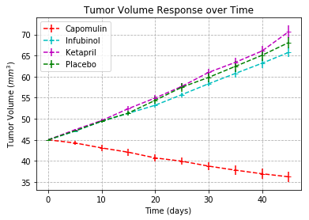
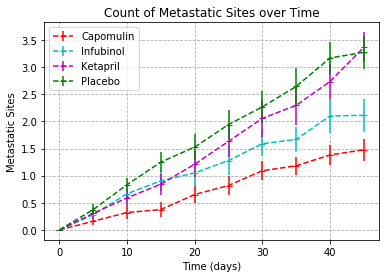
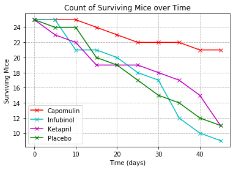
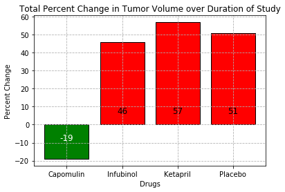

# Analysis
Trend 1: Capomulin decreases tumor size over time, much more so than the other tracked drugs and the placebo
Trend 2: Capomulin is associated with a higher survival rate than the other tracked drugs and the placebo
Trend 3: Ketrapril and Infubinol not only saw an increase in metastatic sites over the duration of the study,
         but they performed significantly worse than the Placebo
# Reading in Data and generating DataFrames


```python
import matplotlib.pyplot as plt
import pandas as pd
import numpy as np
import os
import seaborn as sns
```


```python
# Read in data from folder
clinical_trial_df = pd.read_csv(os.path.join('raw_data','clinicaltrial_data.csv'))
drug_data_df = pd.read_csv(os.path.join('raw_data','mouse_drug_data.csv'))

df = pd.merge(clinical_trial_df,drug_data_df,on='Mouse ID')
df.head()
```


<div>
<style>
    .dataframe thead tr:only-child th {
        text-align: right;
    }

    .dataframe thead th {
        text-align: left;
    }

    .dataframe tbody tr th {
        vertical-align: top;
    }
</style>
<table border="1" class="dataframe">
  <thead>
    <tr style="text-align: right;">
      <th></th>
      <th>Mouse ID</th>
      <th>Timepoint</th>
      <th>Tumor Volume (mm3)</th>
      <th>Metastatic Sites</th>
      <th>Drug</th>
    </tr>
  </thead>
  <tbody>
    <tr>
      <th>0</th>
      <td>b128</td>
      <td>0</td>
      <td>45.000000</td>
      <td>0</td>
      <td>Capomulin</td>
    </tr>
    <tr>
      <th>1</th>
      <td>b128</td>
      <td>5</td>
      <td>45.651331</td>
      <td>0</td>
      <td>Capomulin</td>
    </tr>
    <tr>
      <th>2</th>
      <td>b128</td>
      <td>10</td>
      <td>43.270852</td>
      <td>0</td>
      <td>Capomulin</td>
    </tr>
    <tr>
      <th>3</th>
      <td>b128</td>
      <td>15</td>
      <td>43.784893</td>
      <td>0</td>
      <td>Capomulin</td>
    </tr>
    <tr>
      <th>4</th>
      <td>b128</td>
      <td>20</td>
      <td>42.731552</td>
      <td>0</td>
      <td>Capomulin</td>
    </tr>
  </tbody>
</table>
</div>


```python
# Dropping data except for treatments to be tracked
tracked_drugs = ['Capomulin','Infubinol','Ketapril','Placebo']
treatment_df = df.loc[df['Drug'].isin(tracked_drugs)]

# Grouping by treatment
treatment_by_drug = treatment_df.groupby(by=['Drug','Timepoint'])
treatment_by_drug.mean().head()
```


<div>
<style>
    .dataframe thead tr:only-child th {
        text-align: right;
    }

    .dataframe thead th {
        text-align: left;
    }

    .dataframe tbody tr th {
        vertical-align: top;
    }
</style>
<table border="1" class="dataframe">
  <thead>
    <tr style="text-align: right;">
      <th></th>
      <th></th>
      <th>Tumor Volume (mm3)</th>
      <th>Metastatic Sites</th>
    </tr>
    <tr>
      <th>Drug</th>
      <th>Timepoint</th>
      <th></th>
      <th></th>
    </tr>
  </thead>
  <tbody>
    <tr>
      <th rowspan="5" valign="top">Capomulin</th>
      <th>0</th>
      <td>45.000000</td>
      <td>0.000000</td>
    </tr>
    <tr>
      <th>5</th>
      <td>44.266086</td>
      <td>0.160000</td>
    </tr>
    <tr>
      <th>10</th>
      <td>43.084291</td>
      <td>0.320000</td>
    </tr>
    <tr>
      <th>15</th>
      <td>42.064317</td>
      <td>0.375000</td>
    </tr>
    <tr>
      <th>20</th>
      <td>40.716325</td>
      <td>0.652174</td>
    </tr>
  </tbody>
</table>
</div>


# Tumor Volume Response


```python
# Calculating means
tumor_volume_mean_df = treatment_by_drug.mean()['Tumor Volume (mm3)'].unstack().transpose()
tumor_volume_mean_df.reset_index(inplace=True)
# Calculating standard errors
tumor_volume_se_df = treatment_by_drug.sem()['Tumor Volume (mm3)'].unstack().transpose()
tumor_volume_se_df.reset_index(inplace=True)

# Creating color dictionary, for viewing convenience
color_list = {'Capomulin':'r','Infubinol':'c','Ketapril':'m','Placebo':'g'}

for drug in tracked_drugs:
    plt.errorbar(x=tumor_volume_mean_df['Timepoint'],y=tumor_volume_mean_df[drug],yerr=tumor_volume_se_df[drug],linestyle='--',marker='_',color=color_list[drug])
plt.legend(tracked_drugs)
plt.xlabel('Time (days)')
plt.ylabel('Tumor Volume $(mm^3)$')
plt.grid(linestyle='--')
plt.title('Tumor Volume Response over Time')
plt.show()
```





# Metastatic Response


```python
# Calculating means
metastatic_site_mean_df = treatment_by_drug.mean()['Metastatic Sites'].unstack().transpose()
metastatic_site_mean_df.reset_index(inplace=True)
# Calculating standard errors
metastatic_site_se_df = treatment_by_drug.sem()['Metastatic Sites'].unstack().transpose()
metastatic_site_se_df.reset_index(inplace=True)

for drug in tracked_drugs:
    plt.errorbar(x=metastatic_site_mean_df['Timepoint'],y=metastatic_site_mean_df[drug],yerr=metastatic_site_se_df[drug],linestyle='--',marker='_',color=color_list[drug])
plt.legend(tracked_drugs)
plt.xlabel('Time (days)')
plt.ylabel('Metastatic Sites')
plt.grid(linestyle='--')
plt.title('Count of Metastatic Sites over Time')
plt.show()
```





# Survival Rate


```python
# Calculate number of surviving mice by timepoint
survivors_df = treatment_by_drug.count()['Mouse ID'].unstack().transpose()
survivors_df.reset_index(inplace=True)

for drug in tracked_drugs:
    plt.plot(survivors_df['Timepoint'],survivors_df[drug],color_list[drug]+'x-')
plt.legend(tracked_drugs)
plt.xlabel('Time (days)')
plt.ylabel('Surviving Mice')
plt.grid(linestyle='--')
plt.title('Count of Surviving Mice over Time')
plt.show()
```





# Total Tumor Volume Change


```python
# Generating all delta-volumes
delta_volume = list()
bar_color_list = list()
for drug in tracked_drugs:
    percent_change = round((tumor_volume_mean_df[drug][9]-tumor_volume_mean_df[drug][0])/tumor_volume_mean_df[drug][0]*100,0)
    delta_volume.append(percent_change)
    if percent_change < 0:
        bar_color_list.append('green')
    else:
        bar_color_list.append('red')
    
bars = plt.bar(x=range(len(delta_volume)),height=delta_volume,color=bar_color_list,tick_label=tracked_drugs,edgecolor=['black']*4,)
for bar in bars:
    if bar.get_height() < 0:
        plt.text(bar.get_x()+bar.get_width()/2,-5,'%d'%int(bar.get_height()),ha='center',va='top',color='w',fontsize=12)
    else:
        plt.text(bar.get_x()+bar.get_width()/2,5,'%d'%int(bar.get_height()),ha='center',va='bottom',color='k',fontsize=12)
plt.xlabel('Drugs')
plt.ylabel('Percent Change')
plt.title('Total Percent Change in Tumor Volume over Duration of Study')
plt.grid(linestyle='--')
plt.show()
```




