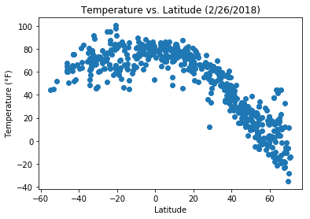
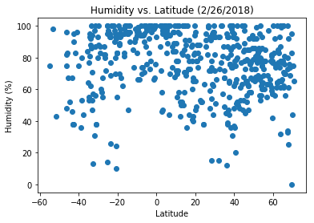

```python
import pandas as pd
import numpy as np
from citipy import citipy
import matplotlib.pyplot as plt
import json
import requests as req
from config import api_key as api_key

##### Remember to make a config file for keys
```

# Writeup
1) Temperature varies indirectly with latitude (as distance from the equator increases, temperature decreases)
2) Cities near the equator tend to have a higher humidity level, although that starts to drop off quickly as you move even
   10 degrees north or south
3) Wind speed generally stays at 20 mph or below, but there are outliers.  These outliers are all found at significant distances
   from the equator.
# Randomly generate a list of cities


```python
cities_list = []
while len(cities_list) < 600:
    rand_lat = np.random.randint(-7000,7001)/100
    rand_lng = np.random.randint(-18000,18001)/100
    city = citipy.nearest_city(latitude=rand_lat,longitude=rand_lng)
    if not city in cities_list:
        cities_list.append(city)
        
df = pd.DataFrame([i.city_name for i in cities_list])
df.rename(columns = {0:'City'},inplace=True)
print('Unique Cities: %d'%(len(cities_list)))
```

    Unique Cities: 600
    

# Get Weather data for cities


```python
url = "http://api.openweathermap.org/data/2.5/weather?"

query_url = url + "appid=" + api_key + '&units=imperial' +"&q="

weather_list = []
for city in cities_list:
    print('Adding city #%d City Name: %s url: %s'%(cities_list.index(city)+1,city.city_name,query_url+city.city_name))
    weather_list.append(req.get(query_url+city.city_name).json())

```

    Adding city #1 City Name: rikitea url: http://api.openweathermap.org/data/2.5/weather?appid=989ae00bb32567ce60a3d390e983acd3&units=imperial&q=rikitea
    Adding city #2 City Name: progreso url: http://api.openweathermap.org/data/2.5/weather?appid=989ae00bb32567ce60a3d390e983acd3&units=imperial&q=progreso
    Adding city #3 City Name: saint george url: http://api.openweathermap.org/data/2.5/weather?appid=989ae00bb32567ce60a3d390e983acd3&units=imperial&q=saint george
    Adding city #4 City Name: tasiilaq url: http://api.openweathermap.org/data/2.5/weather?appid=989ae00bb32567ce60a3d390e983acd3&units=imperial&q=tasiilaq
    Adding city #5 City Name: kloulklubed url: http://api.openweathermap.org/data/2.5/weather?appid=989ae00bb32567ce60a3d390e983acd3&units=imperial&q=kloulklubed
    Adding city #6 City Name: sitka url: http://api.openweathermap.org/data/2.5/weather?appid=989ae00bb32567ce60a3d390e983acd3&units=imperial&q=sitka
    Adding city #7 City Name: tessalit url: http://api.openweathermap.org/data/2.5/weather?appid=989ae00bb32567ce60a3d390e983acd3&units=imperial&q=tessalit
    Adding city #8 City Name: mandalgovi url: http://api.openweathermap.org/data/2.5/weather?appid=989ae00bb32567ce60a3d390e983acd3&units=imperial&q=mandalgovi
    Adding city #9 City Name: batagay-alyta url: http://api.openweathermap.org/data/2.5/weather?appid=989ae00bb32567ce60a3d390e983acd3&units=imperial&q=batagay-alyta
    Adding city #10 City Name: luderitz url: http://api.openweathermap.org/data/2.5/weather?appid=989ae00bb32567ce60a3d390e983acd3&units=imperial&q=luderitz
    Adding city #11 City Name: albany url: http://api.openweathermap.org/data/2.5/weather?appid=989ae00bb32567ce60a3d390e983acd3&units=imperial&q=albany
    Adding city #12 City Name: petropavlovsk-kamchatskiy url: http://api.openweathermap.org/data/2.5/weather?appid=989ae00bb32567ce60a3d390e983acd3&units=imperial&q=petropavlovsk-kamchatskiy
    Adding city #13 City Name: atuona url: http://api.openweathermap.org/data/2.5/weather?appid=989ae00bb32567ce60a3d390e983acd3&units=imperial&q=atuona
    Adding city #14 City Name: tsumeb url: http://api.openweathermap.org/data/2.5/weather?appid=989ae00bb32567ce60a3d390e983acd3&units=imperial&q=tsumeb
    Adding city #15 City Name: bloemfontein url: http://api.openweathermap.org/data/2.5/weather?appid=989ae00bb32567ce60a3d390e983acd3&units=imperial&q=bloemfontein
    Adding city #16 City Name: cape town url: http://api.openweathermap.org/data/2.5/weather?appid=989ae00bb32567ce60a3d390e983acd3&units=imperial&q=cape town
    Adding city #17 City Name: vaitape url: http://api.openweathermap.org/data/2.5/weather?appid=989ae00bb32567ce60a3d390e983acd3&units=imperial&q=vaitape
    Adding city #18 City Name: east wenatchee bench url: http://api.openweathermap.org/data/2.5/weather?appid=989ae00bb32567ce60a3d390e983acd3&units=imperial&q=east wenatchee bench
    Adding city #19 City Name: anadyr url: http://api.openweathermap.org/data/2.5/weather?appid=989ae00bb32567ce60a3d390e983acd3&units=imperial&q=anadyr
    Adding city #20 City Name: east london url: http://api.openweathermap.org/data/2.5/weather?appid=989ae00bb32567ce60a3d390e983acd3&units=imperial&q=east london
    Adding city #21 City Name: vestmanna url: http://api.openweathermap.org/data/2.5/weather?appid=989ae00bb32567ce60a3d390e983acd3&units=imperial&q=vestmanna
    Adding city #22 City Name: faanui url: http://api.openweathermap.org/data/2.5/weather?appid=989ae00bb32567ce60a3d390e983acd3&units=imperial&q=faanui
    Adding city #23 City Name: nizhniy odes url: http://api.openweathermap.org/data/2.5/weather?appid=989ae00bb32567ce60a3d390e983acd3&units=imperial&q=nizhniy odes
    Adding city #24 City Name: bengkulu url: http://api.openweathermap.org/data/2.5/weather?appid=989ae00bb32567ce60a3d390e983acd3&units=imperial&q=bengkulu
    Adding city #25 City Name: yumen url: http://api.openweathermap.org/data/2.5/weather?appid=989ae00bb32567ce60a3d390e983acd3&units=imperial&q=yumen
    Adding city #26 City Name: bokspits url: http://api.openweathermap.org/data/2.5/weather?appid=989ae00bb32567ce60a3d390e983acd3&units=imperial&q=bokspits
    Adding city #27 City Name: hereford url: http://api.openweathermap.org/data/2.5/weather?appid=989ae00bb32567ce60a3d390e983acd3&units=imperial&q=hereford
    Adding city #28 City Name: bathsheba url: http://api.openweathermap.org/data/2.5/weather?appid=989ae00bb32567ce60a3d390e983acd3&units=imperial&q=bathsheba
    Adding city #29 City Name: kapaa url: http://api.openweathermap.org/data/2.5/weather?appid=989ae00bb32567ce60a3d390e983acd3&units=imperial&q=kapaa
    Adding city #30 City Name: ushuaia url: http://api.openweathermap.org/data/2.5/weather?appid=989ae00bb32567ce60a3d390e983acd3&units=imperial&q=ushuaia
    Adding city #31 City Name: jamestown url: http://api.openweathermap.org/data/2.5/weather?appid=989ae00bb32567ce60a3d390e983acd3&units=imperial&q=jamestown
    Adding city #32 City Name: vaini url: http://api.openweathermap.org/data/2.5/weather?appid=989ae00bb32567ce60a3d390e983acd3&units=imperial&q=vaini
    Adding city #33 City Name: carnarvon url: http://api.openweathermap.org/data/2.5/weather?appid=989ae00bb32567ce60a3d390e983acd3&units=imperial&q=carnarvon
    Adding city #34 City Name: new norfolk url: http://api.openweathermap.org/data/2.5/weather?appid=989ae00bb32567ce60a3d390e983acd3&units=imperial&q=new norfolk
    Adding city #35 City Name: saleaula url: http://api.openweathermap.org/data/2.5/weather?appid=989ae00bb32567ce60a3d390e983acd3&units=imperial&q=saleaula
    Adding city #36 City Name: castro url: http://api.openweathermap.org/data/2.5/weather?appid=989ae00bb32567ce60a3d390e983acd3&units=imperial&q=castro
    Adding city #37 City Name: sioux lookout url: http://api.openweathermap.org/data/2.5/weather?appid=989ae00bb32567ce60a3d390e983acd3&units=imperial&q=sioux lookout
    Adding city #38 City Name: vila velha url: http://api.openweathermap.org/data/2.5/weather?appid=989ae00bb32567ce60a3d390e983acd3&units=imperial&q=vila velha
    Adding city #39 City Name: dunedin url: http://api.openweathermap.org/data/2.5/weather?appid=989ae00bb32567ce60a3d390e983acd3&units=imperial&q=dunedin
    Adding city #40 City Name: mvuma url: http://api.openweathermap.org/data/2.5/weather?appid=989ae00bb32567ce60a3d390e983acd3&units=imperial&q=mvuma
    Adding city #41 City Name: ola url: http://api.openweathermap.org/data/2.5/weather?appid=989ae00bb32567ce60a3d390e983acd3&units=imperial&q=ola
    Adding city #42 City Name: plouzane url: http://api.openweathermap.org/data/2.5/weather?appid=989ae00bb32567ce60a3d390e983acd3&units=imperial&q=plouzane
    Adding city #43 City Name: krasnokamensk url: http://api.openweathermap.org/data/2.5/weather?appid=989ae00bb32567ce60a3d390e983acd3&units=imperial&q=krasnokamensk
    Adding city #44 City Name: lima url: http://api.openweathermap.org/data/2.5/weather?appid=989ae00bb32567ce60a3d390e983acd3&units=imperial&q=lima
    Adding city #45 City Name: taolanaro url: http://api.openweathermap.org/data/2.5/weather?appid=989ae00bb32567ce60a3d390e983acd3&units=imperial&q=taolanaro
    Adding city #46 City Name: atar url: http://api.openweathermap.org/data/2.5/weather?appid=989ae00bb32567ce60a3d390e983acd3&units=imperial&q=atar
    Adding city #47 City Name: butaritari url: http://api.openweathermap.org/data/2.5/weather?appid=989ae00bb32567ce60a3d390e983acd3&units=imperial&q=butaritari
    Adding city #48 City Name: san patricio url: http://api.openweathermap.org/data/2.5/weather?appid=989ae00bb32567ce60a3d390e983acd3&units=imperial&q=san patricio
    Adding city #49 City Name: busselton url: http://api.openweathermap.org/data/2.5/weather?appid=989ae00bb32567ce60a3d390e983acd3&units=imperial&q=busselton
    Adding city #50 City Name: kalabo url: http://api.openweathermap.org/data/2.5/weather?appid=989ae00bb32567ce60a3d390e983acd3&units=imperial&q=kalabo
    Adding city #51 City Name: mataura url: http://api.openweathermap.org/data/2.5/weather?appid=989ae00bb32567ce60a3d390e983acd3&units=imperial&q=mataura
    Adding city #52 City Name: marcona url: http://api.openweathermap.org/data/2.5/weather?appid=989ae00bb32567ce60a3d390e983acd3&units=imperial&q=marcona
    Adding city #53 City Name: tornio url: http://api.openweathermap.org/data/2.5/weather?appid=989ae00bb32567ce60a3d390e983acd3&units=imperial&q=tornio
    Adding city #54 City Name: georgetown url: http://api.openweathermap.org/data/2.5/weather?appid=989ae00bb32567ce60a3d390e983acd3&units=imperial&q=georgetown
    Adding city #55 City Name: sao filipe url: http://api.openweathermap.org/data/2.5/weather?appid=989ae00bb32567ce60a3d390e983acd3&units=imperial&q=sao filipe
    Adding city #56 City Name: tiarei url: http://api.openweathermap.org/data/2.5/weather?appid=989ae00bb32567ce60a3d390e983acd3&units=imperial&q=tiarei
    Adding city #57 City Name: gadung url: http://api.openweathermap.org/data/2.5/weather?appid=989ae00bb32567ce60a3d390e983acd3&units=imperial&q=gadung
    Adding city #58 City Name: bluff url: http://api.openweathermap.org/data/2.5/weather?appid=989ae00bb32567ce60a3d390e983acd3&units=imperial&q=bluff
    Adding city #59 City Name: ponta do sol url: http://api.openweathermap.org/data/2.5/weather?appid=989ae00bb32567ce60a3d390e983acd3&units=imperial&q=ponta do sol
    Adding city #60 City Name: hilo url: http://api.openweathermap.org/data/2.5/weather?appid=989ae00bb32567ce60a3d390e983acd3&units=imperial&q=hilo
    Adding city #61 City Name: chuy url: http://api.openweathermap.org/data/2.5/weather?appid=989ae00bb32567ce60a3d390e983acd3&units=imperial&q=chuy
    Adding city #62 City Name: hithadhoo url: http://api.openweathermap.org/data/2.5/weather?appid=989ae00bb32567ce60a3d390e983acd3&units=imperial&q=hithadhoo
    Adding city #63 City Name: puerto colombia url: http://api.openweathermap.org/data/2.5/weather?appid=989ae00bb32567ce60a3d390e983acd3&units=imperial&q=puerto colombia
    Adding city #64 City Name: korla url: http://api.openweathermap.org/data/2.5/weather?appid=989ae00bb32567ce60a3d390e983acd3&units=imperial&q=korla
    Adding city #65 City Name: kingisepp url: http://api.openweathermap.org/data/2.5/weather?appid=989ae00bb32567ce60a3d390e983acd3&units=imperial&q=kingisepp
    Adding city #66 City Name: vaitupu url: http://api.openweathermap.org/data/2.5/weather?appid=989ae00bb32567ce60a3d390e983acd3&units=imperial&q=vaitupu
    Adding city #67 City Name: hamilton url: http://api.openweathermap.org/data/2.5/weather?appid=989ae00bb32567ce60a3d390e983acd3&units=imperial&q=hamilton
    Adding city #68 City Name: ahipara url: http://api.openweathermap.org/data/2.5/weather?appid=989ae00bb32567ce60a3d390e983acd3&units=imperial&q=ahipara
    Adding city #69 City Name: amapa url: http://api.openweathermap.org/data/2.5/weather?appid=989ae00bb32567ce60a3d390e983acd3&units=imperial&q=amapa
    Adding city #70 City Name: birao url: http://api.openweathermap.org/data/2.5/weather?appid=989ae00bb32567ce60a3d390e983acd3&units=imperial&q=birao
    Adding city #71 City Name: puerto ayora url: http://api.openweathermap.org/data/2.5/weather?appid=989ae00bb32567ce60a3d390e983acd3&units=imperial&q=puerto ayora
    Adding city #72 City Name: itarema url: http://api.openweathermap.org/data/2.5/weather?appid=989ae00bb32567ce60a3d390e983acd3&units=imperial&q=itarema
    Adding city #73 City Name: vega de alatorre url: http://api.openweathermap.org/data/2.5/weather?appid=989ae00bb32567ce60a3d390e983acd3&units=imperial&q=vega de alatorre
    Adding city #74 City Name: menongue url: http://api.openweathermap.org/data/2.5/weather?appid=989ae00bb32567ce60a3d390e983acd3&units=imperial&q=menongue
    Adding city #75 City Name: mazyr url: http://api.openweathermap.org/data/2.5/weather?appid=989ae00bb32567ce60a3d390e983acd3&units=imperial&q=mazyr
    Adding city #76 City Name: aykhal url: http://api.openweathermap.org/data/2.5/weather?appid=989ae00bb32567ce60a3d390e983acd3&units=imperial&q=aykhal
    Adding city #77 City Name: hovd url: http://api.openweathermap.org/data/2.5/weather?appid=989ae00bb32567ce60a3d390e983acd3&units=imperial&q=hovd
    Adding city #78 City Name: saint anthony url: http://api.openweathermap.org/data/2.5/weather?appid=989ae00bb32567ce60a3d390e983acd3&units=imperial&q=saint anthony
    Adding city #79 City Name: victoria url: http://api.openweathermap.org/data/2.5/weather?appid=989ae00bb32567ce60a3d390e983acd3&units=imperial&q=victoria
    Adding city #80 City Name: ribeira grande url: http://api.openweathermap.org/data/2.5/weather?appid=989ae00bb32567ce60a3d390e983acd3&units=imperial&q=ribeira grande
    Adding city #81 City Name: tuatapere url: http://api.openweathermap.org/data/2.5/weather?appid=989ae00bb32567ce60a3d390e983acd3&units=imperial&q=tuatapere
    Adding city #82 City Name: seymchan url: http://api.openweathermap.org/data/2.5/weather?appid=989ae00bb32567ce60a3d390e983acd3&units=imperial&q=seymchan
    Adding city #83 City Name: kodiak url: http://api.openweathermap.org/data/2.5/weather?appid=989ae00bb32567ce60a3d390e983acd3&units=imperial&q=kodiak
    Adding city #84 City Name: kavaratti url: http://api.openweathermap.org/data/2.5/weather?appid=989ae00bb32567ce60a3d390e983acd3&units=imperial&q=kavaratti
    Adding city #85 City Name: egvekinot url: http://api.openweathermap.org/data/2.5/weather?appid=989ae00bb32567ce60a3d390e983acd3&units=imperial&q=egvekinot
    Adding city #86 City Name: okhotsk url: http://api.openweathermap.org/data/2.5/weather?appid=989ae00bb32567ce60a3d390e983acd3&units=imperial&q=okhotsk
    Adding city #87 City Name: thompson url: http://api.openweathermap.org/data/2.5/weather?appid=989ae00bb32567ce60a3d390e983acd3&units=imperial&q=thompson
    Adding city #88 City Name: jiayuguan url: http://api.openweathermap.org/data/2.5/weather?appid=989ae00bb32567ce60a3d390e983acd3&units=imperial&q=jiayuguan
    Adding city #89 City Name: nikolskoye url: http://api.openweathermap.org/data/2.5/weather?appid=989ae00bb32567ce60a3d390e983acd3&units=imperial&q=nikolskoye
    Adding city #90 City Name: hofn url: http://api.openweathermap.org/data/2.5/weather?appid=989ae00bb32567ce60a3d390e983acd3&units=imperial&q=hofn
    Adding city #91 City Name: valparaiso url: http://api.openweathermap.org/data/2.5/weather?appid=989ae00bb32567ce60a3d390e983acd3&units=imperial&q=valparaiso
    Adding city #92 City Name: misratah url: http://api.openweathermap.org/data/2.5/weather?appid=989ae00bb32567ce60a3d390e983acd3&units=imperial&q=misratah
    Adding city #93 City Name: burns lake url: http://api.openweathermap.org/data/2.5/weather?appid=989ae00bb32567ce60a3d390e983acd3&units=imperial&q=burns lake
    Adding city #94 City Name: san marcos url: http://api.openweathermap.org/data/2.5/weather?appid=989ae00bb32567ce60a3d390e983acd3&units=imperial&q=san marcos
    Adding city #95 City Name: los llanos de aridane url: http://api.openweathermap.org/data/2.5/weather?appid=989ae00bb32567ce60a3d390e983acd3&units=imperial&q=los llanos de aridane
    Adding city #96 City Name: gaoua url: http://api.openweathermap.org/data/2.5/weather?appid=989ae00bb32567ce60a3d390e983acd3&units=imperial&q=gaoua
    Adding city #97 City Name: khovu-aksy url: http://api.openweathermap.org/data/2.5/weather?appid=989ae00bb32567ce60a3d390e983acd3&units=imperial&q=khovu-aksy
    Adding city #98 City Name: port alfred url: http://api.openweathermap.org/data/2.5/weather?appid=989ae00bb32567ce60a3d390e983acd3&units=imperial&q=port alfred
    Adding city #99 City Name: rawson url: http://api.openweathermap.org/data/2.5/weather?appid=989ae00bb32567ce60a3d390e983acd3&units=imperial&q=rawson
    Adding city #100 City Name: cidreira url: http://api.openweathermap.org/data/2.5/weather?appid=989ae00bb32567ce60a3d390e983acd3&units=imperial&q=cidreira
    Adding city #101 City Name: souillac url: http://api.openweathermap.org/data/2.5/weather?appid=989ae00bb32567ce60a3d390e983acd3&units=imperial&q=souillac
    Adding city #102 City Name: vinkovci url: http://api.openweathermap.org/data/2.5/weather?appid=989ae00bb32567ce60a3d390e983acd3&units=imperial&q=vinkovci
    Adding city #103 City Name: auki url: http://api.openweathermap.org/data/2.5/weather?appid=989ae00bb32567ce60a3d390e983acd3&units=imperial&q=auki
    Adding city #104 City Name: dekoa url: http://api.openweathermap.org/data/2.5/weather?appid=989ae00bb32567ce60a3d390e983acd3&units=imperial&q=dekoa
    Adding city #105 City Name: safwah url: http://api.openweathermap.org/data/2.5/weather?appid=989ae00bb32567ce60a3d390e983acd3&units=imperial&q=safwah
    Adding city #106 City Name: zastron url: http://api.openweathermap.org/data/2.5/weather?appid=989ae00bb32567ce60a3d390e983acd3&units=imperial&q=zastron
    Adding city #107 City Name: dongsheng url: http://api.openweathermap.org/data/2.5/weather?appid=989ae00bb32567ce60a3d390e983acd3&units=imperial&q=dongsheng
    Adding city #108 City Name: uwayl url: http://api.openweathermap.org/data/2.5/weather?appid=989ae00bb32567ce60a3d390e983acd3&units=imperial&q=uwayl
    Adding city #109 City Name: grindavik url: http://api.openweathermap.org/data/2.5/weather?appid=989ae00bb32567ce60a3d390e983acd3&units=imperial&q=grindavik
    Adding city #110 City Name: batemans bay url: http://api.openweathermap.org/data/2.5/weather?appid=989ae00bb32567ce60a3d390e983acd3&units=imperial&q=batemans bay
    Adding city #111 City Name: maymanak url: http://api.openweathermap.org/data/2.5/weather?appid=989ae00bb32567ce60a3d390e983acd3&units=imperial&q=maymanak
    Adding city #112 City Name: fortuna url: http://api.openweathermap.org/data/2.5/weather?appid=989ae00bb32567ce60a3d390e983acd3&units=imperial&q=fortuna
    Adding city #113 City Name: neuquen url: http://api.openweathermap.org/data/2.5/weather?appid=989ae00bb32567ce60a3d390e983acd3&units=imperial&q=neuquen
    Adding city #114 City Name: mozarlandia url: http://api.openweathermap.org/data/2.5/weather?appid=989ae00bb32567ce60a3d390e983acd3&units=imperial&q=mozarlandia
    Adding city #115 City Name: grand-santi url: http://api.openweathermap.org/data/2.5/weather?appid=989ae00bb32567ce60a3d390e983acd3&units=imperial&q=grand-santi
    Adding city #116 City Name: ouro preto do oeste url: http://api.openweathermap.org/data/2.5/weather?appid=989ae00bb32567ce60a3d390e983acd3&units=imperial&q=ouro preto do oeste
    Adding city #117 City Name: dingle url: http://api.openweathermap.org/data/2.5/weather?appid=989ae00bb32567ce60a3d390e983acd3&units=imperial&q=dingle
    Adding city #118 City Name: kidal url: http://api.openweathermap.org/data/2.5/weather?appid=989ae00bb32567ce60a3d390e983acd3&units=imperial&q=kidal
    Adding city #119 City Name: vila franca do campo url: http://api.openweathermap.org/data/2.5/weather?appid=989ae00bb32567ce60a3d390e983acd3&units=imperial&q=vila franca do campo
    Adding city #120 City Name: mar del plata url: http://api.openweathermap.org/data/2.5/weather?appid=989ae00bb32567ce60a3d390e983acd3&units=imperial&q=mar del plata
    Adding city #121 City Name: guerrero negro url: http://api.openweathermap.org/data/2.5/weather?appid=989ae00bb32567ce60a3d390e983acd3&units=imperial&q=guerrero negro
    Adding city #122 City Name: fushe-kruje url: http://api.openweathermap.org/data/2.5/weather?appid=989ae00bb32567ce60a3d390e983acd3&units=imperial&q=fushe-kruje
    Adding city #123 City Name: sayville url: http://api.openweathermap.org/data/2.5/weather?appid=989ae00bb32567ce60a3d390e983acd3&units=imperial&q=sayville
    Adding city #124 City Name: cravo norte url: http://api.openweathermap.org/data/2.5/weather?appid=989ae00bb32567ce60a3d390e983acd3&units=imperial&q=cravo norte
    Adding city #125 City Name: evensk url: http://api.openweathermap.org/data/2.5/weather?appid=989ae00bb32567ce60a3d390e983acd3&units=imperial&q=evensk
    Adding city #126 City Name: huilong url: http://api.openweathermap.org/data/2.5/weather?appid=989ae00bb32567ce60a3d390e983acd3&units=imperial&q=huilong
    Adding city #127 City Name: saint-philippe url: http://api.openweathermap.org/data/2.5/weather?appid=989ae00bb32567ce60a3d390e983acd3&units=imperial&q=saint-philippe
    Adding city #128 City Name: haines junction url: http://api.openweathermap.org/data/2.5/weather?appid=989ae00bb32567ce60a3d390e983acd3&units=imperial&q=haines junction
    Adding city #129 City Name: pevek url: http://api.openweathermap.org/data/2.5/weather?appid=989ae00bb32567ce60a3d390e983acd3&units=imperial&q=pevek
    Adding city #130 City Name: along url: http://api.openweathermap.org/data/2.5/weather?appid=989ae00bb32567ce60a3d390e983acd3&units=imperial&q=along
    Adding city #131 City Name: bredasdorp url: http://api.openweathermap.org/data/2.5/weather?appid=989ae00bb32567ce60a3d390e983acd3&units=imperial&q=bredasdorp
    Adding city #132 City Name: hobart url: http://api.openweathermap.org/data/2.5/weather?appid=989ae00bb32567ce60a3d390e983acd3&units=imperial&q=hobart
    Adding city #133 City Name: gerash url: http://api.openweathermap.org/data/2.5/weather?appid=989ae00bb32567ce60a3d390e983acd3&units=imperial&q=gerash
    Adding city #134 City Name: bulaevo url: http://api.openweathermap.org/data/2.5/weather?appid=989ae00bb32567ce60a3d390e983acd3&units=imperial&q=bulaevo
    Adding city #135 City Name: beloha url: http://api.openweathermap.org/data/2.5/weather?appid=989ae00bb32567ce60a3d390e983acd3&units=imperial&q=beloha
    Adding city #136 City Name: samusu url: http://api.openweathermap.org/data/2.5/weather?appid=989ae00bb32567ce60a3d390e983acd3&units=imperial&q=samusu
    Adding city #137 City Name: sola url: http://api.openweathermap.org/data/2.5/weather?appid=989ae00bb32567ce60a3d390e983acd3&units=imperial&q=sola
    Adding city #138 City Name: punta arenas url: http://api.openweathermap.org/data/2.5/weather?appid=989ae00bb32567ce60a3d390e983acd3&units=imperial&q=punta arenas
    Adding city #139 City Name: harper url: http://api.openweathermap.org/data/2.5/weather?appid=989ae00bb32567ce60a3d390e983acd3&units=imperial&q=harper
    Adding city #140 City Name: mount gambier url: http://api.openweathermap.org/data/2.5/weather?appid=989ae00bb32567ce60a3d390e983acd3&units=imperial&q=mount gambier
    Adding city #141 City Name: iqaluit url: http://api.openweathermap.org/data/2.5/weather?appid=989ae00bb32567ce60a3d390e983acd3&units=imperial&q=iqaluit
    Adding city #142 City Name: attawapiskat url: http://api.openweathermap.org/data/2.5/weather?appid=989ae00bb32567ce60a3d390e983acd3&units=imperial&q=attawapiskat
    Adding city #143 City Name: sakakah url: http://api.openweathermap.org/data/2.5/weather?appid=989ae00bb32567ce60a3d390e983acd3&units=imperial&q=sakakah
    Adding city #144 City Name: port hedland url: http://api.openweathermap.org/data/2.5/weather?appid=989ae00bb32567ce60a3d390e983acd3&units=imperial&q=port hedland
    Adding city #145 City Name: caluquembe url: http://api.openweathermap.org/data/2.5/weather?appid=989ae00bb32567ce60a3d390e983acd3&units=imperial&q=caluquembe
    Adding city #146 City Name: port elizabeth url: http://api.openweathermap.org/data/2.5/weather?appid=989ae00bb32567ce60a3d390e983acd3&units=imperial&q=port elizabeth
    Adding city #147 City Name: imeni poliny osipenko url: http://api.openweathermap.org/data/2.5/weather?appid=989ae00bb32567ce60a3d390e983acd3&units=imperial&q=imeni poliny osipenko
    Adding city #148 City Name: college url: http://api.openweathermap.org/data/2.5/weather?appid=989ae00bb32567ce60a3d390e983acd3&units=imperial&q=college
    Adding city #149 City Name: avarua url: http://api.openweathermap.org/data/2.5/weather?appid=989ae00bb32567ce60a3d390e983acd3&units=imperial&q=avarua
    Adding city #150 City Name: saint-augustin url: http://api.openweathermap.org/data/2.5/weather?appid=989ae00bb32567ce60a3d390e983acd3&units=imperial&q=saint-augustin
    Adding city #151 City Name: mataram url: http://api.openweathermap.org/data/2.5/weather?appid=989ae00bb32567ce60a3d390e983acd3&units=imperial&q=mataram
    Adding city #152 City Name: arraial do cabo url: http://api.openweathermap.org/data/2.5/weather?appid=989ae00bb32567ce60a3d390e983acd3&units=imperial&q=arraial do cabo
    Adding city #153 City Name: kiunga url: http://api.openweathermap.org/data/2.5/weather?appid=989ae00bb32567ce60a3d390e983acd3&units=imperial&q=kiunga
    Adding city #154 City Name: zima url: http://api.openweathermap.org/data/2.5/weather?appid=989ae00bb32567ce60a3d390e983acd3&units=imperial&q=zima
    Adding city #155 City Name: carnarvon url: http://api.openweathermap.org/data/2.5/weather?appid=989ae00bb32567ce60a3d390e983acd3&units=imperial&q=carnarvon
    Adding city #156 City Name: ramgarh url: http://api.openweathermap.org/data/2.5/weather?appid=989ae00bb32567ce60a3d390e983acd3&units=imperial&q=ramgarh
    Adding city #157 City Name: codrington url: http://api.openweathermap.org/data/2.5/weather?appid=989ae00bb32567ce60a3d390e983acd3&units=imperial&q=codrington
    Adding city #158 City Name: kaitangata url: http://api.openweathermap.org/data/2.5/weather?appid=989ae00bb32567ce60a3d390e983acd3&units=imperial&q=kaitangata
    Adding city #159 City Name: krasnoselkup url: http://api.openweathermap.org/data/2.5/weather?appid=989ae00bb32567ce60a3d390e983acd3&units=imperial&q=krasnoselkup
    Adding city #160 City Name: bull savanna url: http://api.openweathermap.org/data/2.5/weather?appid=989ae00bb32567ce60a3d390e983acd3&units=imperial&q=bull savanna
    Adding city #161 City Name: sosua url: http://api.openweathermap.org/data/2.5/weather?appid=989ae00bb32567ce60a3d390e983acd3&units=imperial&q=sosua
    Adding city #162 City Name: mayumba url: http://api.openweathermap.org/data/2.5/weather?appid=989ae00bb32567ce60a3d390e983acd3&units=imperial&q=mayumba
    Adding city #163 City Name: senanga url: http://api.openweathermap.org/data/2.5/weather?appid=989ae00bb32567ce60a3d390e983acd3&units=imperial&q=senanga
    Adding city #164 City Name: pila url: http://api.openweathermap.org/data/2.5/weather?appid=989ae00bb32567ce60a3d390e983acd3&units=imperial&q=pila
    Adding city #165 City Name: teguise url: http://api.openweathermap.org/data/2.5/weather?appid=989ae00bb32567ce60a3d390e983acd3&units=imperial&q=teguise
    Adding city #166 City Name: zlobin url: http://api.openweathermap.org/data/2.5/weather?appid=989ae00bb32567ce60a3d390e983acd3&units=imperial&q=zlobin
    Adding city #167 City Name: fort nelson url: http://api.openweathermap.org/data/2.5/weather?appid=989ae00bb32567ce60a3d390e983acd3&units=imperial&q=fort nelson
    Adding city #168 City Name: anju url: http://api.openweathermap.org/data/2.5/weather?appid=989ae00bb32567ce60a3d390e983acd3&units=imperial&q=anju
    Adding city #169 City Name: provideniya url: http://api.openweathermap.org/data/2.5/weather?appid=989ae00bb32567ce60a3d390e983acd3&units=imperial&q=provideniya
    Adding city #170 City Name: arrifes url: http://api.openweathermap.org/data/2.5/weather?appid=989ae00bb32567ce60a3d390e983acd3&units=imperial&q=arrifes
    Adding city #171 City Name: kerewan url: http://api.openweathermap.org/data/2.5/weather?appid=989ae00bb32567ce60a3d390e983acd3&units=imperial&q=kerewan
    Adding city #172 City Name: nelson bay url: http://api.openweathermap.org/data/2.5/weather?appid=989ae00bb32567ce60a3d390e983acd3&units=imperial&q=nelson bay
    Adding city #173 City Name: seoul url: http://api.openweathermap.org/data/2.5/weather?appid=989ae00bb32567ce60a3d390e983acd3&units=imperial&q=seoul
    Adding city #174 City Name: vicuna url: http://api.openweathermap.org/data/2.5/weather?appid=989ae00bb32567ce60a3d390e983acd3&units=imperial&q=vicuna
    Adding city #175 City Name: nemuro url: http://api.openweathermap.org/data/2.5/weather?appid=989ae00bb32567ce60a3d390e983acd3&units=imperial&q=nemuro
    Adding city #176 City Name: sentyabrskiy url: http://api.openweathermap.org/data/2.5/weather?appid=989ae00bb32567ce60a3d390e983acd3&units=imperial&q=sentyabrskiy
    Adding city #177 City Name: lagoa url: http://api.openweathermap.org/data/2.5/weather?appid=989ae00bb32567ce60a3d390e983acd3&units=imperial&q=lagoa
    Adding city #178 City Name: plaster rock url: http://api.openweathermap.org/data/2.5/weather?appid=989ae00bb32567ce60a3d390e983acd3&units=imperial&q=plaster rock
    Adding city #179 City Name: shingu url: http://api.openweathermap.org/data/2.5/weather?appid=989ae00bb32567ce60a3d390e983acd3&units=imperial&q=shingu
    Adding city #180 City Name: ginda url: http://api.openweathermap.org/data/2.5/weather?appid=989ae00bb32567ce60a3d390e983acd3&units=imperial&q=ginda
    Adding city #181 City Name: atbasar url: http://api.openweathermap.org/data/2.5/weather?appid=989ae00bb32567ce60a3d390e983acd3&units=imperial&q=atbasar
    Adding city #182 City Name: west odessa url: http://api.openweathermap.org/data/2.5/weather?appid=989ae00bb32567ce60a3d390e983acd3&units=imperial&q=west odessa
    Adding city #183 City Name: kavieng url: http://api.openweathermap.org/data/2.5/weather?appid=989ae00bb32567ce60a3d390e983acd3&units=imperial&q=kavieng
    Adding city #184 City Name: palabuhanratu url: http://api.openweathermap.org/data/2.5/weather?appid=989ae00bb32567ce60a3d390e983acd3&units=imperial&q=palabuhanratu
    Adding city #185 City Name: hambantota url: http://api.openweathermap.org/data/2.5/weather?appid=989ae00bb32567ce60a3d390e983acd3&units=imperial&q=hambantota
    Adding city #186 City Name: illoqqortoormiut url: http://api.openweathermap.org/data/2.5/weather?appid=989ae00bb32567ce60a3d390e983acd3&units=imperial&q=illoqqortoormiut
    Adding city #187 City Name: pangody url: http://api.openweathermap.org/data/2.5/weather?appid=989ae00bb32567ce60a3d390e983acd3&units=imperial&q=pangody
    Adding city #188 City Name: pampierstad url: http://api.openweathermap.org/data/2.5/weather?appid=989ae00bb32567ce60a3d390e983acd3&units=imperial&q=pampierstad
    Adding city #189 City Name: mogadishu url: http://api.openweathermap.org/data/2.5/weather?appid=989ae00bb32567ce60a3d390e983acd3&units=imperial&q=mogadishu
    Adding city #190 City Name: alyangula url: http://api.openweathermap.org/data/2.5/weather?appid=989ae00bb32567ce60a3d390e983acd3&units=imperial&q=alyangula
    Adding city #191 City Name: manaure url: http://api.openweathermap.org/data/2.5/weather?appid=989ae00bb32567ce60a3d390e983acd3&units=imperial&q=manaure
    Adding city #192 City Name: ayagoz url: http://api.openweathermap.org/data/2.5/weather?appid=989ae00bb32567ce60a3d390e983acd3&units=imperial&q=ayagoz
    Adding city #193 City Name: gamba url: http://api.openweathermap.org/data/2.5/weather?appid=989ae00bb32567ce60a3d390e983acd3&units=imperial&q=gamba
    Adding city #194 City Name: sibolga url: http://api.openweathermap.org/data/2.5/weather?appid=989ae00bb32567ce60a3d390e983acd3&units=imperial&q=sibolga
    Adding city #195 City Name: pacific grove url: http://api.openweathermap.org/data/2.5/weather?appid=989ae00bb32567ce60a3d390e983acd3&units=imperial&q=pacific grove
    Adding city #196 City Name: limbuhan url: http://api.openweathermap.org/data/2.5/weather?appid=989ae00bb32567ce60a3d390e983acd3&units=imperial&q=limbuhan
    Adding city #197 City Name: nome url: http://api.openweathermap.org/data/2.5/weather?appid=989ae00bb32567ce60a3d390e983acd3&units=imperial&q=nome
    Adding city #198 City Name: ribeirao branco url: http://api.openweathermap.org/data/2.5/weather?appid=989ae00bb32567ce60a3d390e983acd3&units=imperial&q=ribeirao branco
    Adding city #199 City Name: dhidhdhoo url: http://api.openweathermap.org/data/2.5/weather?appid=989ae00bb32567ce60a3d390e983acd3&units=imperial&q=dhidhdhoo
    Adding city #200 City Name: acuitzio url: http://api.openweathermap.org/data/2.5/weather?appid=989ae00bb32567ce60a3d390e983acd3&units=imperial&q=acuitzio
    Adding city #201 City Name: urusha url: http://api.openweathermap.org/data/2.5/weather?appid=989ae00bb32567ce60a3d390e983acd3&units=imperial&q=urusha
    Adding city #202 City Name: fuerte olimpo url: http://api.openweathermap.org/data/2.5/weather?appid=989ae00bb32567ce60a3d390e983acd3&units=imperial&q=fuerte olimpo
    Adding city #203 City Name: moose factory url: http://api.openweathermap.org/data/2.5/weather?appid=989ae00bb32567ce60a3d390e983acd3&units=imperial&q=moose factory
    Adding city #204 City Name: dar es salaam url: http://api.openweathermap.org/data/2.5/weather?appid=989ae00bb32567ce60a3d390e983acd3&units=imperial&q=dar es salaam
    Adding city #205 City Name: superior url: http://api.openweathermap.org/data/2.5/weather?appid=989ae00bb32567ce60a3d390e983acd3&units=imperial&q=superior
    Adding city #206 City Name: umzimvubu url: http://api.openweathermap.org/data/2.5/weather?appid=989ae00bb32567ce60a3d390e983acd3&units=imperial&q=umzimvubu
    Adding city #207 City Name: cove url: http://api.openweathermap.org/data/2.5/weather?appid=989ae00bb32567ce60a3d390e983acd3&units=imperial&q=cove
    Adding city #208 City Name: winder url: http://api.openweathermap.org/data/2.5/weather?appid=989ae00bb32567ce60a3d390e983acd3&units=imperial&q=winder
    Adding city #209 City Name: rafaela url: http://api.openweathermap.org/data/2.5/weather?appid=989ae00bb32567ce60a3d390e983acd3&units=imperial&q=rafaela
    Adding city #210 City Name: raymondville url: http://api.openweathermap.org/data/2.5/weather?appid=989ae00bb32567ce60a3d390e983acd3&units=imperial&q=raymondville
    Adding city #211 City Name: barrow url: http://api.openweathermap.org/data/2.5/weather?appid=989ae00bb32567ce60a3d390e983acd3&units=imperial&q=barrow
    Adding city #212 City Name: muli url: http://api.openweathermap.org/data/2.5/weather?appid=989ae00bb32567ce60a3d390e983acd3&units=imperial&q=muli
    Adding city #213 City Name: ballina url: http://api.openweathermap.org/data/2.5/weather?appid=989ae00bb32567ce60a3d390e983acd3&units=imperial&q=ballina
    Adding city #214 City Name: mount isa url: http://api.openweathermap.org/data/2.5/weather?appid=989ae00bb32567ce60a3d390e983acd3&units=imperial&q=mount isa
    Adding city #215 City Name: half moon bay url: http://api.openweathermap.org/data/2.5/weather?appid=989ae00bb32567ce60a3d390e983acd3&units=imperial&q=half moon bay
    Adding city #216 City Name: grand river south east url: http://api.openweathermap.org/data/2.5/weather?appid=989ae00bb32567ce60a3d390e983acd3&units=imperial&q=grand river south east
    Adding city #217 City Name: zlocieniec url: http://api.openweathermap.org/data/2.5/weather?appid=989ae00bb32567ce60a3d390e983acd3&units=imperial&q=zlocieniec
    Adding city #218 City Name: jumla url: http://api.openweathermap.org/data/2.5/weather?appid=989ae00bb32567ce60a3d390e983acd3&units=imperial&q=jumla
    Adding city #219 City Name: saldanha url: http://api.openweathermap.org/data/2.5/weather?appid=989ae00bb32567ce60a3d390e983acd3&units=imperial&q=saldanha
    Adding city #220 City Name: kargasok url: http://api.openweathermap.org/data/2.5/weather?appid=989ae00bb32567ce60a3d390e983acd3&units=imperial&q=kargasok
    Adding city #221 City Name: antissa url: http://api.openweathermap.org/data/2.5/weather?appid=989ae00bb32567ce60a3d390e983acd3&units=imperial&q=antissa
    Adding city #222 City Name: mercedes url: http://api.openweathermap.org/data/2.5/weather?appid=989ae00bb32567ce60a3d390e983acd3&units=imperial&q=mercedes
    Adding city #223 City Name: jiaojiang url: http://api.openweathermap.org/data/2.5/weather?appid=989ae00bb32567ce60a3d390e983acd3&units=imperial&q=jiaojiang
    Adding city #224 City Name: meulaboh url: http://api.openweathermap.org/data/2.5/weather?appid=989ae00bb32567ce60a3d390e983acd3&units=imperial&q=meulaboh
    Adding city #225 City Name: sabang url: http://api.openweathermap.org/data/2.5/weather?appid=989ae00bb32567ce60a3d390e983acd3&units=imperial&q=sabang
    Adding city #226 City Name: lebu url: http://api.openweathermap.org/data/2.5/weather?appid=989ae00bb32567ce60a3d390e983acd3&units=imperial&q=lebu
    Adding city #227 City Name: kalianget url: http://api.openweathermap.org/data/2.5/weather?appid=989ae00bb32567ce60a3d390e983acd3&units=imperial&q=kalianget
    Adding city #228 City Name: geilo url: http://api.openweathermap.org/data/2.5/weather?appid=989ae00bb32567ce60a3d390e983acd3&units=imperial&q=geilo
    Adding city #229 City Name: shakawe url: http://api.openweathermap.org/data/2.5/weather?appid=989ae00bb32567ce60a3d390e983acd3&units=imperial&q=shakawe
    Adding city #230 City Name: chom bung url: http://api.openweathermap.org/data/2.5/weather?appid=989ae00bb32567ce60a3d390e983acd3&units=imperial&q=chom bung
    Adding city #231 City Name: liwale url: http://api.openweathermap.org/data/2.5/weather?appid=989ae00bb32567ce60a3d390e983acd3&units=imperial&q=liwale
    Adding city #232 City Name: yima url: http://api.openweathermap.org/data/2.5/weather?appid=989ae00bb32567ce60a3d390e983acd3&units=imperial&q=yima
    Adding city #233 City Name: zhangye url: http://api.openweathermap.org/data/2.5/weather?appid=989ae00bb32567ce60a3d390e983acd3&units=imperial&q=zhangye
    Adding city #234 City Name: bethel url: http://api.openweathermap.org/data/2.5/weather?appid=989ae00bb32567ce60a3d390e983acd3&units=imperial&q=bethel
    Adding city #235 City Name: doctor pedro p. pena url: http://api.openweathermap.org/data/2.5/weather?appid=989ae00bb32567ce60a3d390e983acd3&units=imperial&q=doctor pedro p. pena
    Adding city #236 City Name: guerrero url: http://api.openweathermap.org/data/2.5/weather?appid=989ae00bb32567ce60a3d390e983acd3&units=imperial&q=guerrero
    Adding city #237 City Name: avera url: http://api.openweathermap.org/data/2.5/weather?appid=989ae00bb32567ce60a3d390e983acd3&units=imperial&q=avera
    Adding city #238 City Name: pokaran url: http://api.openweathermap.org/data/2.5/weather?appid=989ae00bb32567ce60a3d390e983acd3&units=imperial&q=pokaran
    Adding city #239 City Name: coruripe url: http://api.openweathermap.org/data/2.5/weather?appid=989ae00bb32567ce60a3d390e983acd3&units=imperial&q=coruripe
    Adding city #240 City Name: pahrump url: http://api.openweathermap.org/data/2.5/weather?appid=989ae00bb32567ce60a3d390e983acd3&units=imperial&q=pahrump
    Adding city #241 City Name: rocha url: http://api.openweathermap.org/data/2.5/weather?appid=989ae00bb32567ce60a3d390e983acd3&units=imperial&q=rocha
    Adding city #242 City Name: bandarbeyla url: http://api.openweathermap.org/data/2.5/weather?appid=989ae00bb32567ce60a3d390e983acd3&units=imperial&q=bandarbeyla
    Adding city #243 City Name: cherskiy url: http://api.openweathermap.org/data/2.5/weather?appid=989ae00bb32567ce60a3d390e983acd3&units=imperial&q=cherskiy
    Adding city #244 City Name: carutapera url: http://api.openweathermap.org/data/2.5/weather?appid=989ae00bb32567ce60a3d390e983acd3&units=imperial&q=carutapera
    Adding city #245 City Name: torbay url: http://api.openweathermap.org/data/2.5/weather?appid=989ae00bb32567ce60a3d390e983acd3&units=imperial&q=torbay
    Adding city #246 City Name: kainantu url: http://api.openweathermap.org/data/2.5/weather?appid=989ae00bb32567ce60a3d390e983acd3&units=imperial&q=kainantu
    Adding city #247 City Name: sawakin url: http://api.openweathermap.org/data/2.5/weather?appid=989ae00bb32567ce60a3d390e983acd3&units=imperial&q=sawakin
    Adding city #248 City Name: port hardy url: http://api.openweathermap.org/data/2.5/weather?appid=989ae00bb32567ce60a3d390e983acd3&units=imperial&q=port hardy
    Adding city #249 City Name: bambous virieux url: http://api.openweathermap.org/data/2.5/weather?appid=989ae00bb32567ce60a3d390e983acd3&units=imperial&q=bambous virieux
    Adding city #250 City Name: daru url: http://api.openweathermap.org/data/2.5/weather?appid=989ae00bb32567ce60a3d390e983acd3&units=imperial&q=daru
    Adding city #251 City Name: boyabat url: http://api.openweathermap.org/data/2.5/weather?appid=989ae00bb32567ce60a3d390e983acd3&units=imperial&q=boyabat
    Adding city #252 City Name: la baule-escoublac url: http://api.openweathermap.org/data/2.5/weather?appid=989ae00bb32567ce60a3d390e983acd3&units=imperial&q=la baule-escoublac
    Adding city #253 City Name: bachaquero url: http://api.openweathermap.org/data/2.5/weather?appid=989ae00bb32567ce60a3d390e983acd3&units=imperial&q=bachaquero
    Adding city #254 City Name: santiago del estero url: http://api.openweathermap.org/data/2.5/weather?appid=989ae00bb32567ce60a3d390e983acd3&units=imperial&q=santiago del estero
    Adding city #255 City Name: kahului url: http://api.openweathermap.org/data/2.5/weather?appid=989ae00bb32567ce60a3d390e983acd3&units=imperial&q=kahului
    Adding city #256 City Name: agadez url: http://api.openweathermap.org/data/2.5/weather?appid=989ae00bb32567ce60a3d390e983acd3&units=imperial&q=agadez
    Adding city #257 City Name: nanortalik url: http://api.openweathermap.org/data/2.5/weather?appid=989ae00bb32567ce60a3d390e983acd3&units=imperial&q=nanortalik
    Adding city #258 City Name: margate url: http://api.openweathermap.org/data/2.5/weather?appid=989ae00bb32567ce60a3d390e983acd3&units=imperial&q=margate
    Adding city #259 City Name: pioner url: http://api.openweathermap.org/data/2.5/weather?appid=989ae00bb32567ce60a3d390e983acd3&units=imperial&q=pioner
    Adding city #260 City Name: brokopondo url: http://api.openweathermap.org/data/2.5/weather?appid=989ae00bb32567ce60a3d390e983acd3&units=imperial&q=brokopondo
    Adding city #261 City Name: lompoc url: http://api.openweathermap.org/data/2.5/weather?appid=989ae00bb32567ce60a3d390e983acd3&units=imperial&q=lompoc
    Adding city #262 City Name: madras url: http://api.openweathermap.org/data/2.5/weather?appid=989ae00bb32567ce60a3d390e983acd3&units=imperial&q=madras
    Adding city #263 City Name: buluang url: http://api.openweathermap.org/data/2.5/weather?appid=989ae00bb32567ce60a3d390e983acd3&units=imperial&q=buluang
    Adding city #264 City Name: hermanus url: http://api.openweathermap.org/data/2.5/weather?appid=989ae00bb32567ce60a3d390e983acd3&units=imperial&q=hermanus
    Adding city #265 City Name: fergus falls url: http://api.openweathermap.org/data/2.5/weather?appid=989ae00bb32567ce60a3d390e983acd3&units=imperial&q=fergus falls
    Adding city #266 City Name: bavly url: http://api.openweathermap.org/data/2.5/weather?appid=989ae00bb32567ce60a3d390e983acd3&units=imperial&q=bavly
    Adding city #267 City Name: anloga url: http://api.openweathermap.org/data/2.5/weather?appid=989ae00bb32567ce60a3d390e983acd3&units=imperial&q=anloga
    Adding city #268 City Name: zachagansk url: http://api.openweathermap.org/data/2.5/weather?appid=989ae00bb32567ce60a3d390e983acd3&units=imperial&q=zachagansk
    Adding city #269 City Name: takoradi url: http://api.openweathermap.org/data/2.5/weather?appid=989ae00bb32567ce60a3d390e983acd3&units=imperial&q=takoradi
    Adding city #270 City Name: vryburg url: http://api.openweathermap.org/data/2.5/weather?appid=989ae00bb32567ce60a3d390e983acd3&units=imperial&q=vryburg
    Adding city #271 City Name: shache url: http://api.openweathermap.org/data/2.5/weather?appid=989ae00bb32567ce60a3d390e983acd3&units=imperial&q=shache
    Adding city #272 City Name: crotone url: http://api.openweathermap.org/data/2.5/weather?appid=989ae00bb32567ce60a3d390e983acd3&units=imperial&q=crotone
    Adding city #273 City Name: santa marta url: http://api.openweathermap.org/data/2.5/weather?appid=989ae00bb32567ce60a3d390e983acd3&units=imperial&q=santa marta
    Adding city #274 City Name: ruatoria url: http://api.openweathermap.org/data/2.5/weather?appid=989ae00bb32567ce60a3d390e983acd3&units=imperial&q=ruatoria
    Adding city #275 City Name: kazerun url: http://api.openweathermap.org/data/2.5/weather?appid=989ae00bb32567ce60a3d390e983acd3&units=imperial&q=kazerun
    Adding city #276 City Name: esperance url: http://api.openweathermap.org/data/2.5/weather?appid=989ae00bb32567ce60a3d390e983acd3&units=imperial&q=esperance
    Adding city #277 City Name: bilma url: http://api.openweathermap.org/data/2.5/weather?appid=989ae00bb32567ce60a3d390e983acd3&units=imperial&q=bilma
    Adding city #278 City Name: west bay url: http://api.openweathermap.org/data/2.5/weather?appid=989ae00bb32567ce60a3d390e983acd3&units=imperial&q=west bay
    Adding city #279 City Name: arlit url: http://api.openweathermap.org/data/2.5/weather?appid=989ae00bb32567ce60a3d390e983acd3&units=imperial&q=arlit
    Adding city #280 City Name: dickinson url: http://api.openweathermap.org/data/2.5/weather?appid=989ae00bb32567ce60a3d390e983acd3&units=imperial&q=dickinson
    Adding city #281 City Name: broome url: http://api.openweathermap.org/data/2.5/weather?appid=989ae00bb32567ce60a3d390e983acd3&units=imperial&q=broome
    Adding city #282 City Name: cabo san lucas url: http://api.openweathermap.org/data/2.5/weather?appid=989ae00bb32567ce60a3d390e983acd3&units=imperial&q=cabo san lucas
    Adding city #283 City Name: teguldet url: http://api.openweathermap.org/data/2.5/weather?appid=989ae00bb32567ce60a3d390e983acd3&units=imperial&q=teguldet
    Adding city #284 City Name: maine-soroa url: http://api.openweathermap.org/data/2.5/weather?appid=989ae00bb32567ce60a3d390e983acd3&units=imperial&q=maine-soroa
    Adding city #285 City Name: freeport url: http://api.openweathermap.org/data/2.5/weather?appid=989ae00bb32567ce60a3d390e983acd3&units=imperial&q=freeport
    Adding city #286 City Name: honiara url: http://api.openweathermap.org/data/2.5/weather?appid=989ae00bb32567ce60a3d390e983acd3&units=imperial&q=honiara
    Adding city #287 City Name: coquimbo url: http://api.openweathermap.org/data/2.5/weather?appid=989ae00bb32567ce60a3d390e983acd3&units=imperial&q=coquimbo
    Adding city #288 City Name: warrenton url: http://api.openweathermap.org/data/2.5/weather?appid=989ae00bb32567ce60a3d390e983acd3&units=imperial&q=warrenton
    Adding city #289 City Name: hay river url: http://api.openweathermap.org/data/2.5/weather?appid=989ae00bb32567ce60a3d390e983acd3&units=imperial&q=hay river
    Adding city #290 City Name: mayo url: http://api.openweathermap.org/data/2.5/weather?appid=989ae00bb32567ce60a3d390e983acd3&units=imperial&q=mayo
    Adding city #291 City Name: rorvik url: http://api.openweathermap.org/data/2.5/weather?appid=989ae00bb32567ce60a3d390e983acd3&units=imperial&q=rorvik
    Adding city #292 City Name: ust-kamchatsk url: http://api.openweathermap.org/data/2.5/weather?appid=989ae00bb32567ce60a3d390e983acd3&units=imperial&q=ust-kamchatsk
    Adding city #293 City Name: eyrarbakki url: http://api.openweathermap.org/data/2.5/weather?appid=989ae00bb32567ce60a3d390e983acd3&units=imperial&q=eyrarbakki
    Adding city #294 City Name: karatuzskoye url: http://api.openweathermap.org/data/2.5/weather?appid=989ae00bb32567ce60a3d390e983acd3&units=imperial&q=karatuzskoye
    Adding city #295 City Name: lazaro cardenas url: http://api.openweathermap.org/data/2.5/weather?appid=989ae00bb32567ce60a3d390e983acd3&units=imperial&q=lazaro cardenas
    Adding city #296 City Name: saint-pierre url: http://api.openweathermap.org/data/2.5/weather?appid=989ae00bb32567ce60a3d390e983acd3&units=imperial&q=saint-pierre
    Adding city #297 City Name: yellowknife url: http://api.openweathermap.org/data/2.5/weather?appid=989ae00bb32567ce60a3d390e983acd3&units=imperial&q=yellowknife
    Adding city #298 City Name: luau url: http://api.openweathermap.org/data/2.5/weather?appid=989ae00bb32567ce60a3d390e983acd3&units=imperial&q=luau
    Adding city #299 City Name: ponta do sol url: http://api.openweathermap.org/data/2.5/weather?appid=989ae00bb32567ce60a3d390e983acd3&units=imperial&q=ponta do sol
    Adding city #300 City Name: san juan bautista url: http://api.openweathermap.org/data/2.5/weather?appid=989ae00bb32567ce60a3d390e983acd3&units=imperial&q=san juan bautista
    Adding city #301 City Name: coahuayana url: http://api.openweathermap.org/data/2.5/weather?appid=989ae00bb32567ce60a3d390e983acd3&units=imperial&q=coahuayana
    Adding city #302 City Name: sao joao da barra url: http://api.openweathermap.org/data/2.5/weather?appid=989ae00bb32567ce60a3d390e983acd3&units=imperial&q=sao joao da barra
    Adding city #303 City Name: hervey bay url: http://api.openweathermap.org/data/2.5/weather?appid=989ae00bb32567ce60a3d390e983acd3&units=imperial&q=hervey bay
    Adding city #304 City Name: envira url: http://api.openweathermap.org/data/2.5/weather?appid=989ae00bb32567ce60a3d390e983acd3&units=imperial&q=envira
    Adding city #305 City Name: gat url: http://api.openweathermap.org/data/2.5/weather?appid=989ae00bb32567ce60a3d390e983acd3&units=imperial&q=gat
    Adding city #306 City Name: tadine url: http://api.openweathermap.org/data/2.5/weather?appid=989ae00bb32567ce60a3d390e983acd3&units=imperial&q=tadine
    Adding city #307 City Name: businga url: http://api.openweathermap.org/data/2.5/weather?appid=989ae00bb32567ce60a3d390e983acd3&units=imperial&q=businga
    Adding city #308 City Name: olafsvik url: http://api.openweathermap.org/data/2.5/weather?appid=989ae00bb32567ce60a3d390e983acd3&units=imperial&q=olafsvik
    Adding city #309 City Name: carman url: http://api.openweathermap.org/data/2.5/weather?appid=989ae00bb32567ce60a3d390e983acd3&units=imperial&q=carman
    Adding city #310 City Name: fairhope url: http://api.openweathermap.org/data/2.5/weather?appid=989ae00bb32567ce60a3d390e983acd3&units=imperial&q=fairhope
    Adding city #311 City Name: kailua url: http://api.openweathermap.org/data/2.5/weather?appid=989ae00bb32567ce60a3d390e983acd3&units=imperial&q=kailua
    Adding city #312 City Name: svetlogorsk url: http://api.openweathermap.org/data/2.5/weather?appid=989ae00bb32567ce60a3d390e983acd3&units=imperial&q=svetlogorsk
    Adding city #313 City Name: kruisfontein url: http://api.openweathermap.org/data/2.5/weather?appid=989ae00bb32567ce60a3d390e983acd3&units=imperial&q=kruisfontein
    Adding city #314 City Name: tiznit url: http://api.openweathermap.org/data/2.5/weather?appid=989ae00bb32567ce60a3d390e983acd3&units=imperial&q=tiznit
    Adding city #315 City Name: satitoa url: http://api.openweathermap.org/data/2.5/weather?appid=989ae00bb32567ce60a3d390e983acd3&units=imperial&q=satitoa
    Adding city #316 City Name: flinders url: http://api.openweathermap.org/data/2.5/weather?appid=989ae00bb32567ce60a3d390e983acd3&units=imperial&q=flinders
    Adding city #317 City Name: nguruka url: http://api.openweathermap.org/data/2.5/weather?appid=989ae00bb32567ce60a3d390e983acd3&units=imperial&q=nguruka
    Adding city #318 City Name: barguzin url: http://api.openweathermap.org/data/2.5/weather?appid=989ae00bb32567ce60a3d390e983acd3&units=imperial&q=barguzin
    Adding city #319 City Name: akureyri url: http://api.openweathermap.org/data/2.5/weather?appid=989ae00bb32567ce60a3d390e983acd3&units=imperial&q=akureyri
    Adding city #320 City Name: rafai url: http://api.openweathermap.org/data/2.5/weather?appid=989ae00bb32567ce60a3d390e983acd3&units=imperial&q=rafai
    Adding city #321 City Name: high level url: http://api.openweathermap.org/data/2.5/weather?appid=989ae00bb32567ce60a3d390e983acd3&units=imperial&q=high level
    Adding city #322 City Name: khandyga url: http://api.openweathermap.org/data/2.5/weather?appid=989ae00bb32567ce60a3d390e983acd3&units=imperial&q=khandyga
    Adding city #323 City Name: basco url: http://api.openweathermap.org/data/2.5/weather?appid=989ae00bb32567ce60a3d390e983acd3&units=imperial&q=basco
    Adding city #324 City Name: hasaki url: http://api.openweathermap.org/data/2.5/weather?appid=989ae00bb32567ce60a3d390e983acd3&units=imperial&q=hasaki
    Adding city #325 City Name: emerald url: http://api.openweathermap.org/data/2.5/weather?appid=989ae00bb32567ce60a3d390e983acd3&units=imperial&q=emerald
    Adding city #326 City Name: yulara url: http://api.openweathermap.org/data/2.5/weather?appid=989ae00bb32567ce60a3d390e983acd3&units=imperial&q=yulara
    Adding city #327 City Name: hualmay url: http://api.openweathermap.org/data/2.5/weather?appid=989ae00bb32567ce60a3d390e983acd3&units=imperial&q=hualmay
    Adding city #328 City Name: marzuq url: http://api.openweathermap.org/data/2.5/weather?appid=989ae00bb32567ce60a3d390e983acd3&units=imperial&q=marzuq
    Adding city #329 City Name: mullaitivu url: http://api.openweathermap.org/data/2.5/weather?appid=989ae00bb32567ce60a3d390e983acd3&units=imperial&q=mullaitivu
    Adding city #330 City Name: liseleje url: http://api.openweathermap.org/data/2.5/weather?appid=989ae00bb32567ce60a3d390e983acd3&units=imperial&q=liseleje
    Adding city #331 City Name: gedo url: http://api.openweathermap.org/data/2.5/weather?appid=989ae00bb32567ce60a3d390e983acd3&units=imperial&q=gedo
    Adding city #332 City Name: pedernales url: http://api.openweathermap.org/data/2.5/weather?appid=989ae00bb32567ce60a3d390e983acd3&units=imperial&q=pedernales
    Adding city #333 City Name: asau url: http://api.openweathermap.org/data/2.5/weather?appid=989ae00bb32567ce60a3d390e983acd3&units=imperial&q=asau
    Adding city #334 City Name: mahebourg url: http://api.openweathermap.org/data/2.5/weather?appid=989ae00bb32567ce60a3d390e983acd3&units=imperial&q=mahebourg
    Adding city #335 City Name: yantal url: http://api.openweathermap.org/data/2.5/weather?appid=989ae00bb32567ce60a3d390e983acd3&units=imperial&q=yantal
    Adding city #336 City Name: lasa url: http://api.openweathermap.org/data/2.5/weather?appid=989ae00bb32567ce60a3d390e983acd3&units=imperial&q=lasa
    Adding city #337 City Name: nabire url: http://api.openweathermap.org/data/2.5/weather?appid=989ae00bb32567ce60a3d390e983acd3&units=imperial&q=nabire
    Adding city #338 City Name: san jose url: http://api.openweathermap.org/data/2.5/weather?appid=989ae00bb32567ce60a3d390e983acd3&units=imperial&q=san jose
    Adding city #339 City Name: kochki url: http://api.openweathermap.org/data/2.5/weather?appid=989ae00bb32567ce60a3d390e983acd3&units=imperial&q=kochki
    Adding city #340 City Name: jabiru url: http://api.openweathermap.org/data/2.5/weather?appid=989ae00bb32567ce60a3d390e983acd3&units=imperial&q=jabiru
    Adding city #341 City Name: bluefield url: http://api.openweathermap.org/data/2.5/weather?appid=989ae00bb32567ce60a3d390e983acd3&units=imperial&q=bluefield
    Adding city #342 City Name: ikalamavony url: http://api.openweathermap.org/data/2.5/weather?appid=989ae00bb32567ce60a3d390e983acd3&units=imperial&q=ikalamavony
    Adding city #343 City Name: luena url: http://api.openweathermap.org/data/2.5/weather?appid=989ae00bb32567ce60a3d390e983acd3&units=imperial&q=luena
    Adding city #344 City Name: porto seguro url: http://api.openweathermap.org/data/2.5/weather?appid=989ae00bb32567ce60a3d390e983acd3&units=imperial&q=porto seguro
    Adding city #345 City Name: trincomalee url: http://api.openweathermap.org/data/2.5/weather?appid=989ae00bb32567ce60a3d390e983acd3&units=imperial&q=trincomalee
    Adding city #346 City Name: skagastrond url: http://api.openweathermap.org/data/2.5/weather?appid=989ae00bb32567ce60a3d390e983acd3&units=imperial&q=skagastrond
    Adding city #347 City Name: peniche url: http://api.openweathermap.org/data/2.5/weather?appid=989ae00bb32567ce60a3d390e983acd3&units=imperial&q=peniche
    Adding city #348 City Name: leirvik url: http://api.openweathermap.org/data/2.5/weather?appid=989ae00bb32567ce60a3d390e983acd3&units=imperial&q=leirvik
    Adding city #349 City Name: kodinsk url: http://api.openweathermap.org/data/2.5/weather?appid=989ae00bb32567ce60a3d390e983acd3&units=imperial&q=kodinsk
    Adding city #350 City Name: fatsa url: http://api.openweathermap.org/data/2.5/weather?appid=989ae00bb32567ce60a3d390e983acd3&units=imperial&q=fatsa
    Adding city #351 City Name: alice springs url: http://api.openweathermap.org/data/2.5/weather?appid=989ae00bb32567ce60a3d390e983acd3&units=imperial&q=alice springs
    Adding city #352 City Name: sinnamary url: http://api.openweathermap.org/data/2.5/weather?appid=989ae00bb32567ce60a3d390e983acd3&units=imperial&q=sinnamary
    Adding city #353 City Name: ancud url: http://api.openweathermap.org/data/2.5/weather?appid=989ae00bb32567ce60a3d390e983acd3&units=imperial&q=ancud
    Adding city #354 City Name: bolshiye uki url: http://api.openweathermap.org/data/2.5/weather?appid=989ae00bb32567ce60a3d390e983acd3&units=imperial&q=bolshiye uki
    Adding city #355 City Name: knysna url: http://api.openweathermap.org/data/2.5/weather?appid=989ae00bb32567ce60a3d390e983acd3&units=imperial&q=knysna
    Adding city #356 City Name: arys url: http://api.openweathermap.org/data/2.5/weather?appid=989ae00bb32567ce60a3d390e983acd3&units=imperial&q=arys
    Adding city #357 City Name: bururi url: http://api.openweathermap.org/data/2.5/weather?appid=989ae00bb32567ce60a3d390e983acd3&units=imperial&q=bururi
    Adding city #358 City Name: warqla url: http://api.openweathermap.org/data/2.5/weather?appid=989ae00bb32567ce60a3d390e983acd3&units=imperial&q=warqla
    Adding city #359 City Name: calais url: http://api.openweathermap.org/data/2.5/weather?appid=989ae00bb32567ce60a3d390e983acd3&units=imperial&q=calais
    Adding city #360 City Name: zhuhai url: http://api.openweathermap.org/data/2.5/weather?appid=989ae00bb32567ce60a3d390e983acd3&units=imperial&q=zhuhai
    Adding city #361 City Name: nouadhibou url: http://api.openweathermap.org/data/2.5/weather?appid=989ae00bb32567ce60a3d390e983acd3&units=imperial&q=nouadhibou
    Adding city #362 City Name: kouango url: http://api.openweathermap.org/data/2.5/weather?appid=989ae00bb32567ce60a3d390e983acd3&units=imperial&q=kouango
    Adding city #363 City Name: tsihombe url: http://api.openweathermap.org/data/2.5/weather?appid=989ae00bb32567ce60a3d390e983acd3&units=imperial&q=tsihombe
    Adding city #364 City Name: laguna url: http://api.openweathermap.org/data/2.5/weather?appid=989ae00bb32567ce60a3d390e983acd3&units=imperial&q=laguna
    Adding city #365 City Name: onverwacht url: http://api.openweathermap.org/data/2.5/weather?appid=989ae00bb32567ce60a3d390e983acd3&units=imperial&q=onverwacht
    Adding city #366 City Name: ponta delgada url: http://api.openweathermap.org/data/2.5/weather?appid=989ae00bb32567ce60a3d390e983acd3&units=imperial&q=ponta delgada
    Adding city #367 City Name: viedma url: http://api.openweathermap.org/data/2.5/weather?appid=989ae00bb32567ce60a3d390e983acd3&units=imperial&q=viedma
    Adding city #368 City Name: sidi ali url: http://api.openweathermap.org/data/2.5/weather?appid=989ae00bb32567ce60a3d390e983acd3&units=imperial&q=sidi ali
    Adding city #369 City Name: barysh url: http://api.openweathermap.org/data/2.5/weather?appid=989ae00bb32567ce60a3d390e983acd3&units=imperial&q=barysh
    Adding city #370 City Name: komsomolskiy url: http://api.openweathermap.org/data/2.5/weather?appid=989ae00bb32567ce60a3d390e983acd3&units=imperial&q=komsomolskiy
    Adding city #371 City Name: tepeojuma url: http://api.openweathermap.org/data/2.5/weather?appid=989ae00bb32567ce60a3d390e983acd3&units=imperial&q=tepeojuma
    Adding city #372 City Name: tual url: http://api.openweathermap.org/data/2.5/weather?appid=989ae00bb32567ce60a3d390e983acd3&units=imperial&q=tual
    Adding city #373 City Name: tuktoyaktuk url: http://api.openweathermap.org/data/2.5/weather?appid=989ae00bb32567ce60a3d390e983acd3&units=imperial&q=tuktoyaktuk
    Adding city #374 City Name: coueron url: http://api.openweathermap.org/data/2.5/weather?appid=989ae00bb32567ce60a3d390e983acd3&units=imperial&q=coueron
    Adding city #375 City Name: constantine url: http://api.openweathermap.org/data/2.5/weather?appid=989ae00bb32567ce60a3d390e983acd3&units=imperial&q=constantine
    Adding city #376 City Name: ocampo url: http://api.openweathermap.org/data/2.5/weather?appid=989ae00bb32567ce60a3d390e983acd3&units=imperial&q=ocampo
    Adding city #377 City Name: careiro da varzea url: http://api.openweathermap.org/data/2.5/weather?appid=989ae00bb32567ce60a3d390e983acd3&units=imperial&q=careiro da varzea
    Adding city #378 City Name: suwalki url: http://api.openweathermap.org/data/2.5/weather?appid=989ae00bb32567ce60a3d390e983acd3&units=imperial&q=suwalki
    Adding city #379 City Name: mananjary url: http://api.openweathermap.org/data/2.5/weather?appid=989ae00bb32567ce60a3d390e983acd3&units=imperial&q=mananjary
    Adding city #380 City Name: pangnirtung url: http://api.openweathermap.org/data/2.5/weather?appid=989ae00bb32567ce60a3d390e983acd3&units=imperial&q=pangnirtung
    Adding city #381 City Name: beyneu url: http://api.openweathermap.org/data/2.5/weather?appid=989ae00bb32567ce60a3d390e983acd3&units=imperial&q=beyneu
    Adding city #382 City Name: jinchang url: http://api.openweathermap.org/data/2.5/weather?appid=989ae00bb32567ce60a3d390e983acd3&units=imperial&q=jinchang
    Adding city #383 City Name: rio grande url: http://api.openweathermap.org/data/2.5/weather?appid=989ae00bb32567ce60a3d390e983acd3&units=imperial&q=rio grande
    Adding city #384 City Name: xining url: http://api.openweathermap.org/data/2.5/weather?appid=989ae00bb32567ce60a3d390e983acd3&units=imperial&q=xining
    Adding city #385 City Name: boa vista url: http://api.openweathermap.org/data/2.5/weather?appid=989ae00bb32567ce60a3d390e983acd3&units=imperial&q=boa vista
    Adding city #386 City Name: pogranichnyy url: http://api.openweathermap.org/data/2.5/weather?appid=989ae00bb32567ce60a3d390e983acd3&units=imperial&q=pogranichnyy
    Adding city #387 City Name: maragogi url: http://api.openweathermap.org/data/2.5/weather?appid=989ae00bb32567ce60a3d390e983acd3&units=imperial&q=maragogi
    Adding city #388 City Name: clyde river url: http://api.openweathermap.org/data/2.5/weather?appid=989ae00bb32567ce60a3d390e983acd3&units=imperial&q=clyde river
    Adding city #389 City Name: derzhavinsk url: http://api.openweathermap.org/data/2.5/weather?appid=989ae00bb32567ce60a3d390e983acd3&units=imperial&q=derzhavinsk
    Adding city #390 City Name: tibati url: http://api.openweathermap.org/data/2.5/weather?appid=989ae00bb32567ce60a3d390e983acd3&units=imperial&q=tibati
    Adding city #391 City Name: goure url: http://api.openweathermap.org/data/2.5/weather?appid=989ae00bb32567ce60a3d390e983acd3&units=imperial&q=goure
    Adding city #392 City Name: tura url: http://api.openweathermap.org/data/2.5/weather?appid=989ae00bb32567ce60a3d390e983acd3&units=imperial&q=tura
    Adding city #393 City Name: gorno-chuyskiy url: http://api.openweathermap.org/data/2.5/weather?appid=989ae00bb32567ce60a3d390e983acd3&units=imperial&q=gorno-chuyskiy
    Adding city #394 City Name: sorong url: http://api.openweathermap.org/data/2.5/weather?appid=989ae00bb32567ce60a3d390e983acd3&units=imperial&q=sorong
    Adding city #395 City Name: ushtobe url: http://api.openweathermap.org/data/2.5/weather?appid=989ae00bb32567ce60a3d390e983acd3&units=imperial&q=ushtobe
    Adding city #396 City Name: xai-xai url: http://api.openweathermap.org/data/2.5/weather?appid=989ae00bb32567ce60a3d390e983acd3&units=imperial&q=xai-xai
    Adding city #397 City Name: qiyang url: http://api.openweathermap.org/data/2.5/weather?appid=989ae00bb32567ce60a3d390e983acd3&units=imperial&q=qiyang
    Adding city #398 City Name: banda aceh url: http://api.openweathermap.org/data/2.5/weather?appid=989ae00bb32567ce60a3d390e983acd3&units=imperial&q=banda aceh
    Adding city #399 City Name: wiarton url: http://api.openweathermap.org/data/2.5/weather?appid=989ae00bb32567ce60a3d390e983acd3&units=imperial&q=wiarton
    Adding city #400 City Name: lavrentiya url: http://api.openweathermap.org/data/2.5/weather?appid=989ae00bb32567ce60a3d390e983acd3&units=imperial&q=lavrentiya
    Adding city #401 City Name: bagamoyo url: http://api.openweathermap.org/data/2.5/weather?appid=989ae00bb32567ce60a3d390e983acd3&units=imperial&q=bagamoyo
    Adding city #402 City Name: novocheremshansk url: http://api.openweathermap.org/data/2.5/weather?appid=989ae00bb32567ce60a3d390e983acd3&units=imperial&q=novocheremshansk
    Adding city #403 City Name: parrita url: http://api.openweathermap.org/data/2.5/weather?appid=989ae00bb32567ce60a3d390e983acd3&units=imperial&q=parrita
    Adding city #404 City Name: necochea url: http://api.openweathermap.org/data/2.5/weather?appid=989ae00bb32567ce60a3d390e983acd3&units=imperial&q=necochea
    Adding city #405 City Name: smidovich url: http://api.openweathermap.org/data/2.5/weather?appid=989ae00bb32567ce60a3d390e983acd3&units=imperial&q=smidovich
    Adding city #406 City Name: bosaso url: http://api.openweathermap.org/data/2.5/weather?appid=989ae00bb32567ce60a3d390e983acd3&units=imperial&q=bosaso
    Adding city #407 City Name: tartki url: http://api.openweathermap.org/data/2.5/weather?appid=989ae00bb32567ce60a3d390e983acd3&units=imperial&q=tartki
    Adding city #408 City Name: tailai url: http://api.openweathermap.org/data/2.5/weather?appid=989ae00bb32567ce60a3d390e983acd3&units=imperial&q=tailai
    Adding city #409 City Name: port macquarie url: http://api.openweathermap.org/data/2.5/weather?appid=989ae00bb32567ce60a3d390e983acd3&units=imperial&q=port macquarie
    Adding city #410 City Name: namatanai url: http://api.openweathermap.org/data/2.5/weather?appid=989ae00bb32567ce60a3d390e983acd3&units=imperial&q=namatanai
    Adding city #411 City Name: alveringem url: http://api.openweathermap.org/data/2.5/weather?appid=989ae00bb32567ce60a3d390e983acd3&units=imperial&q=alveringem
    Adding city #412 City Name: igarka url: http://api.openweathermap.org/data/2.5/weather?appid=989ae00bb32567ce60a3d390e983acd3&units=imperial&q=igarka
    Adding city #413 City Name: yamada url: http://api.openweathermap.org/data/2.5/weather?appid=989ae00bb32567ce60a3d390e983acd3&units=imperial&q=yamada
    Adding city #414 City Name: yunjinghong url: http://api.openweathermap.org/data/2.5/weather?appid=989ae00bb32567ce60a3d390e983acd3&units=imperial&q=yunjinghong
    Adding city #415 City Name: wynyard url: http://api.openweathermap.org/data/2.5/weather?appid=989ae00bb32567ce60a3d390e983acd3&units=imperial&q=wynyard
    Adding city #416 City Name: touros url: http://api.openweathermap.org/data/2.5/weather?appid=989ae00bb32567ce60a3d390e983acd3&units=imperial&q=touros
    Adding city #417 City Name: tillabery url: http://api.openweathermap.org/data/2.5/weather?appid=989ae00bb32567ce60a3d390e983acd3&units=imperial&q=tillabery
    Adding city #418 City Name: nantucket url: http://api.openweathermap.org/data/2.5/weather?appid=989ae00bb32567ce60a3d390e983acd3&units=imperial&q=nantucket
    Adding city #419 City Name: henties bay url: http://api.openweathermap.org/data/2.5/weather?appid=989ae00bb32567ce60a3d390e983acd3&units=imperial&q=henties bay
    Adding city #420 City Name: padang url: http://api.openweathermap.org/data/2.5/weather?appid=989ae00bb32567ce60a3d390e983acd3&units=imperial&q=padang
    Adding city #421 City Name: araguari url: http://api.openweathermap.org/data/2.5/weather?appid=989ae00bb32567ce60a3d390e983acd3&units=imperial&q=araguari
    Adding city #422 City Name: praya url: http://api.openweathermap.org/data/2.5/weather?appid=989ae00bb32567ce60a3d390e983acd3&units=imperial&q=praya
    Adding city #423 City Name: alofi url: http://api.openweathermap.org/data/2.5/weather?appid=989ae00bb32567ce60a3d390e983acd3&units=imperial&q=alofi
    Adding city #424 City Name: klaksvik url: http://api.openweathermap.org/data/2.5/weather?appid=989ae00bb32567ce60a3d390e983acd3&units=imperial&q=klaksvik
    Adding city #425 City Name: kudahuvadhoo url: http://api.openweathermap.org/data/2.5/weather?appid=989ae00bb32567ce60a3d390e983acd3&units=imperial&q=kudahuvadhoo
    Adding city #426 City Name: conceicao do araguaia url: http://api.openweathermap.org/data/2.5/weather?appid=989ae00bb32567ce60a3d390e983acd3&units=imperial&q=conceicao do araguaia
    Adding city #427 City Name: quatre cocos url: http://api.openweathermap.org/data/2.5/weather?appid=989ae00bb32567ce60a3d390e983acd3&units=imperial&q=quatre cocos
    Adding city #428 City Name: rapid valley url: http://api.openweathermap.org/data/2.5/weather?appid=989ae00bb32567ce60a3d390e983acd3&units=imperial&q=rapid valley
    Adding city #429 City Name: chulman url: http://api.openweathermap.org/data/2.5/weather?appid=989ae00bb32567ce60a3d390e983acd3&units=imperial&q=chulman
    Adding city #430 City Name: savannakhet url: http://api.openweathermap.org/data/2.5/weather?appid=989ae00bb32567ce60a3d390e983acd3&units=imperial&q=savannakhet
    Adding city #431 City Name: anuradhapura url: http://api.openweathermap.org/data/2.5/weather?appid=989ae00bb32567ce60a3d390e983acd3&units=imperial&q=anuradhapura
    Adding city #432 City Name: bara url: http://api.openweathermap.org/data/2.5/weather?appid=989ae00bb32567ce60a3d390e983acd3&units=imperial&q=bara
    Adding city #433 City Name: yusva url: http://api.openweathermap.org/data/2.5/weather?appid=989ae00bb32567ce60a3d390e983acd3&units=imperial&q=yusva
    Adding city #434 City Name: seybaplaya url: http://api.openweathermap.org/data/2.5/weather?appid=989ae00bb32567ce60a3d390e983acd3&units=imperial&q=seybaplaya
    Adding city #435 City Name: waipawa url: http://api.openweathermap.org/data/2.5/weather?appid=989ae00bb32567ce60a3d390e983acd3&units=imperial&q=waipawa
    Adding city #436 City Name: la ronge url: http://api.openweathermap.org/data/2.5/weather?appid=989ae00bb32567ce60a3d390e983acd3&units=imperial&q=la ronge
    Adding city #437 City Name: tsiroanomandidy url: http://api.openweathermap.org/data/2.5/weather?appid=989ae00bb32567ce60a3d390e983acd3&units=imperial&q=tsiroanomandidy
    Adding city #438 City Name: port augusta url: http://api.openweathermap.org/data/2.5/weather?appid=989ae00bb32567ce60a3d390e983acd3&units=imperial&q=port augusta
    Adding city #439 City Name: husavik url: http://api.openweathermap.org/data/2.5/weather?appid=989ae00bb32567ce60a3d390e983acd3&units=imperial&q=husavik
    Adding city #440 City Name: cheney url: http://api.openweathermap.org/data/2.5/weather?appid=989ae00bb32567ce60a3d390e983acd3&units=imperial&q=cheney
    Adding city #441 City Name: tankhoy url: http://api.openweathermap.org/data/2.5/weather?appid=989ae00bb32567ce60a3d390e983acd3&units=imperial&q=tankhoy
    Adding city #442 City Name: staryy nadym url: http://api.openweathermap.org/data/2.5/weather?appid=989ae00bb32567ce60a3d390e983acd3&units=imperial&q=staryy nadym
    Adding city #443 City Name: puerto baquerizo moreno url: http://api.openweathermap.org/data/2.5/weather?appid=989ae00bb32567ce60a3d390e983acd3&units=imperial&q=puerto baquerizo moreno
    Adding city #444 City Name: puri url: http://api.openweathermap.org/data/2.5/weather?appid=989ae00bb32567ce60a3d390e983acd3&units=imperial&q=puri
    Adding city #445 City Name: ust-kuyga url: http://api.openweathermap.org/data/2.5/weather?appid=989ae00bb32567ce60a3d390e983acd3&units=imperial&q=ust-kuyga
    Adding city #446 City Name: jawhar url: http://api.openweathermap.org/data/2.5/weather?appid=989ae00bb32567ce60a3d390e983acd3&units=imperial&q=jawhar
    Adding city #447 City Name: batken url: http://api.openweathermap.org/data/2.5/weather?appid=989ae00bb32567ce60a3d390e983acd3&units=imperial&q=batken
    Adding city #448 City Name: arvika url: http://api.openweathermap.org/data/2.5/weather?appid=989ae00bb32567ce60a3d390e983acd3&units=imperial&q=arvika
    Adding city #449 City Name: matara url: http://api.openweathermap.org/data/2.5/weather?appid=989ae00bb32567ce60a3d390e983acd3&units=imperial&q=matara
    Adding city #450 City Name: senneterre url: http://api.openweathermap.org/data/2.5/weather?appid=989ae00bb32567ce60a3d390e983acd3&units=imperial&q=senneterre
    Adding city #451 City Name: rio branco url: http://api.openweathermap.org/data/2.5/weather?appid=989ae00bb32567ce60a3d390e983acd3&units=imperial&q=rio branco
    Adding city #452 City Name: lethem url: http://api.openweathermap.org/data/2.5/weather?appid=989ae00bb32567ce60a3d390e983acd3&units=imperial&q=lethem
    Adding city #453 City Name: mpanda url: http://api.openweathermap.org/data/2.5/weather?appid=989ae00bb32567ce60a3d390e983acd3&units=imperial&q=mpanda
    Adding city #454 City Name: novobelokatay url: http://api.openweathermap.org/data/2.5/weather?appid=989ae00bb32567ce60a3d390e983acd3&units=imperial&q=novobelokatay
    Adding city #455 City Name: hailar url: http://api.openweathermap.org/data/2.5/weather?appid=989ae00bb32567ce60a3d390e983acd3&units=imperial&q=hailar
    Adding city #456 City Name: gemena url: http://api.openweathermap.org/data/2.5/weather?appid=989ae00bb32567ce60a3d390e983acd3&units=imperial&q=gemena
    Adding city #457 City Name: port lincoln url: http://api.openweathermap.org/data/2.5/weather?appid=989ae00bb32567ce60a3d390e983acd3&units=imperial&q=port lincoln
    Adding city #458 City Name: drayton valley url: http://api.openweathermap.org/data/2.5/weather?appid=989ae00bb32567ce60a3d390e983acd3&units=imperial&q=drayton valley
    Adding city #459 City Name: shalakusha url: http://api.openweathermap.org/data/2.5/weather?appid=989ae00bb32567ce60a3d390e983acd3&units=imperial&q=shalakusha
    Adding city #460 City Name: sorland url: http://api.openweathermap.org/data/2.5/weather?appid=989ae00bb32567ce60a3d390e983acd3&units=imperial&q=sorland
    Adding city #461 City Name: vestmannaeyjar url: http://api.openweathermap.org/data/2.5/weather?appid=989ae00bb32567ce60a3d390e983acd3&units=imperial&q=vestmannaeyjar
    Adding city #462 City Name: bubaque url: http://api.openweathermap.org/data/2.5/weather?appid=989ae00bb32567ce60a3d390e983acd3&units=imperial&q=bubaque
    Adding city #463 City Name: raga url: http://api.openweathermap.org/data/2.5/weather?appid=989ae00bb32567ce60a3d390e983acd3&units=imperial&q=raga
    Adding city #464 City Name: jaque url: http://api.openweathermap.org/data/2.5/weather?appid=989ae00bb32567ce60a3d390e983acd3&units=imperial&q=jaque
    Adding city #465 City Name: mykhaylivka url: http://api.openweathermap.org/data/2.5/weather?appid=989ae00bb32567ce60a3d390e983acd3&units=imperial&q=mykhaylivka
    Adding city #466 City Name: katsuura url: http://api.openweathermap.org/data/2.5/weather?appid=989ae00bb32567ce60a3d390e983acd3&units=imperial&q=katsuura
    Adding city #467 City Name: rungata url: http://api.openweathermap.org/data/2.5/weather?appid=989ae00bb32567ce60a3d390e983acd3&units=imperial&q=rungata
    Adding city #468 City Name: russell url: http://api.openweathermap.org/data/2.5/weather?appid=989ae00bb32567ce60a3d390e983acd3&units=imperial&q=russell
    Adding city #469 City Name: ellisras url: http://api.openweathermap.org/data/2.5/weather?appid=989ae00bb32567ce60a3d390e983acd3&units=imperial&q=ellisras
    Adding city #470 City Name: nyurba url: http://api.openweathermap.org/data/2.5/weather?appid=989ae00bb32567ce60a3d390e983acd3&units=imperial&q=nyurba
    Adding city #471 City Name: chernyshkovskiy url: http://api.openweathermap.org/data/2.5/weather?appid=989ae00bb32567ce60a3d390e983acd3&units=imperial&q=chernyshkovskiy
    Adding city #472 City Name: douentza url: http://api.openweathermap.org/data/2.5/weather?appid=989ae00bb32567ce60a3d390e983acd3&units=imperial&q=douentza
    Adding city #473 City Name: ust-shonosha url: http://api.openweathermap.org/data/2.5/weather?appid=989ae00bb32567ce60a3d390e983acd3&units=imperial&q=ust-shonosha
    Adding city #474 City Name: santa maria url: http://api.openweathermap.org/data/2.5/weather?appid=989ae00bb32567ce60a3d390e983acd3&units=imperial&q=santa maria
    Adding city #475 City Name: opuwo url: http://api.openweathermap.org/data/2.5/weather?appid=989ae00bb32567ce60a3d390e983acd3&units=imperial&q=opuwo
    Adding city #476 City Name: sirur url: http://api.openweathermap.org/data/2.5/weather?appid=989ae00bb32567ce60a3d390e983acd3&units=imperial&q=sirur
    Adding city #477 City Name: namibe url: http://api.openweathermap.org/data/2.5/weather?appid=989ae00bb32567ce60a3d390e983acd3&units=imperial&q=namibe
    Adding city #478 City Name: palu url: http://api.openweathermap.org/data/2.5/weather?appid=989ae00bb32567ce60a3d390e983acd3&units=imperial&q=palu
    Adding city #479 City Name: puerto concordia url: http://api.openweathermap.org/data/2.5/weather?appid=989ae00bb32567ce60a3d390e983acd3&units=imperial&q=puerto concordia
    Adding city #480 City Name: artyom url: http://api.openweathermap.org/data/2.5/weather?appid=989ae00bb32567ce60a3d390e983acd3&units=imperial&q=artyom
    Adding city #481 City Name: makakilo city url: http://api.openweathermap.org/data/2.5/weather?appid=989ae00bb32567ce60a3d390e983acd3&units=imperial&q=makakilo city
    Adding city #482 City Name: chilmari url: http://api.openweathermap.org/data/2.5/weather?appid=989ae00bb32567ce60a3d390e983acd3&units=imperial&q=chilmari
    Adding city #483 City Name: bada url: http://api.openweathermap.org/data/2.5/weather?appid=989ae00bb32567ce60a3d390e983acd3&units=imperial&q=bada
    Adding city #484 City Name: wanaka url: http://api.openweathermap.org/data/2.5/weather?appid=989ae00bb32567ce60a3d390e983acd3&units=imperial&q=wanaka
    Adding city #485 City Name: sept-iles url: http://api.openweathermap.org/data/2.5/weather?appid=989ae00bb32567ce60a3d390e983acd3&units=imperial&q=sept-iles
    Adding city #486 City Name: sasykoli url: http://api.openweathermap.org/data/2.5/weather?appid=989ae00bb32567ce60a3d390e983acd3&units=imperial&q=sasykoli
    Adding city #487 City Name: broken hill url: http://api.openweathermap.org/data/2.5/weather?appid=989ae00bb32567ce60a3d390e983acd3&units=imperial&q=broken hill
    Adding city #488 City Name: belaya gora url: http://api.openweathermap.org/data/2.5/weather?appid=989ae00bb32567ce60a3d390e983acd3&units=imperial&q=belaya gora
    Adding city #489 City Name: chapais url: http://api.openweathermap.org/data/2.5/weather?appid=989ae00bb32567ce60a3d390e983acd3&units=imperial&q=chapais
    Adding city #490 City Name: upington url: http://api.openweathermap.org/data/2.5/weather?appid=989ae00bb32567ce60a3d390e983acd3&units=imperial&q=upington
    Adding city #491 City Name: phulpur url: http://api.openweathermap.org/data/2.5/weather?appid=989ae00bb32567ce60a3d390e983acd3&units=imperial&q=phulpur
    Adding city #492 City Name: one hundred mile house url: http://api.openweathermap.org/data/2.5/weather?appid=989ae00bb32567ce60a3d390e983acd3&units=imperial&q=one hundred mile house
    Adding city #493 City Name: marquette url: http://api.openweathermap.org/data/2.5/weather?appid=989ae00bb32567ce60a3d390e983acd3&units=imperial&q=marquette
    Adding city #494 City Name: ascope url: http://api.openweathermap.org/data/2.5/weather?appid=989ae00bb32567ce60a3d390e983acd3&units=imperial&q=ascope
    Adding city #495 City Name: verkhoyansk url: http://api.openweathermap.org/data/2.5/weather?appid=989ae00bb32567ce60a3d390e983acd3&units=imperial&q=verkhoyansk
    Adding city #496 City Name: poum url: http://api.openweathermap.org/data/2.5/weather?appid=989ae00bb32567ce60a3d390e983acd3&units=imperial&q=poum
    Adding city #497 City Name: taltal url: http://api.openweathermap.org/data/2.5/weather?appid=989ae00bb32567ce60a3d390e983acd3&units=imperial&q=taltal
    Adding city #498 City Name: san cristobal url: http://api.openweathermap.org/data/2.5/weather?appid=989ae00bb32567ce60a3d390e983acd3&units=imperial&q=san cristobal
    Adding city #499 City Name: salalah url: http://api.openweathermap.org/data/2.5/weather?appid=989ae00bb32567ce60a3d390e983acd3&units=imperial&q=salalah
    Adding city #500 City Name: el alto url: http://api.openweathermap.org/data/2.5/weather?appid=989ae00bb32567ce60a3d390e983acd3&units=imperial&q=el alto
    Adding city #501 City Name: morehead url: http://api.openweathermap.org/data/2.5/weather?appid=989ae00bb32567ce60a3d390e983acd3&units=imperial&q=morehead
    Adding city #502 City Name: rio gallegos url: http://api.openweathermap.org/data/2.5/weather?appid=989ae00bb32567ce60a3d390e983acd3&units=imperial&q=rio gallegos
    Adding city #503 City Name: fairbanks url: http://api.openweathermap.org/data/2.5/weather?appid=989ae00bb32567ce60a3d390e983acd3&units=imperial&q=fairbanks
    Adding city #504 City Name: arua url: http://api.openweathermap.org/data/2.5/weather?appid=989ae00bb32567ce60a3d390e983acd3&units=imperial&q=arua
    Adding city #505 City Name: beyla url: http://api.openweathermap.org/data/2.5/weather?appid=989ae00bb32567ce60a3d390e983acd3&units=imperial&q=beyla
    Adding city #506 City Name: riyadh url: http://api.openweathermap.org/data/2.5/weather?appid=989ae00bb32567ce60a3d390e983acd3&units=imperial&q=riyadh
    Adding city #507 City Name: alihe url: http://api.openweathermap.org/data/2.5/weather?appid=989ae00bb32567ce60a3d390e983acd3&units=imperial&q=alihe
    Adding city #508 City Name: fukue url: http://api.openweathermap.org/data/2.5/weather?appid=989ae00bb32567ce60a3d390e983acd3&units=imperial&q=fukue
    Adding city #509 City Name: frontera url: http://api.openweathermap.org/data/2.5/weather?appid=989ae00bb32567ce60a3d390e983acd3&units=imperial&q=frontera
    Adding city #510 City Name: kysyl-syr url: http://api.openweathermap.org/data/2.5/weather?appid=989ae00bb32567ce60a3d390e983acd3&units=imperial&q=kysyl-syr
    Adding city #511 City Name: aklavik url: http://api.openweathermap.org/data/2.5/weather?appid=989ae00bb32567ce60a3d390e983acd3&units=imperial&q=aklavik
    Adding city #512 City Name: svetlyy url: http://api.openweathermap.org/data/2.5/weather?appid=989ae00bb32567ce60a3d390e983acd3&units=imperial&q=svetlyy
    Adding city #513 City Name: sobolevo url: http://api.openweathermap.org/data/2.5/weather?appid=989ae00bb32567ce60a3d390e983acd3&units=imperial&q=sobolevo
    Adding city #514 City Name: dudinka url: http://api.openweathermap.org/data/2.5/weather?appid=989ae00bb32567ce60a3d390e983acd3&units=imperial&q=dudinka
    Adding city #515 City Name: huarmey url: http://api.openweathermap.org/data/2.5/weather?appid=989ae00bb32567ce60a3d390e983acd3&units=imperial&q=huarmey
    Adding city #516 City Name: balikpapan url: http://api.openweathermap.org/data/2.5/weather?appid=989ae00bb32567ce60a3d390e983acd3&units=imperial&q=balikpapan
    Adding city #517 City Name: naugarzan url: http://api.openweathermap.org/data/2.5/weather?appid=989ae00bb32567ce60a3d390e983acd3&units=imperial&q=naugarzan
    Adding city #518 City Name: concordia url: http://api.openweathermap.org/data/2.5/weather?appid=989ae00bb32567ce60a3d390e983acd3&units=imperial&q=concordia
    Adding city #519 City Name: cuamba url: http://api.openweathermap.org/data/2.5/weather?appid=989ae00bb32567ce60a3d390e983acd3&units=imperial&q=cuamba
    Adding city #520 City Name: scottsburgh url: http://api.openweathermap.org/data/2.5/weather?appid=989ae00bb32567ce60a3d390e983acd3&units=imperial&q=scottsburgh
    Adding city #521 City Name: norman wells url: http://api.openweathermap.org/data/2.5/weather?appid=989ae00bb32567ce60a3d390e983acd3&units=imperial&q=norman wells
    Adding city #522 City Name: centralia url: http://api.openweathermap.org/data/2.5/weather?appid=989ae00bb32567ce60a3d390e983acd3&units=imperial&q=centralia
    Adding city #523 City Name: taoudenni url: http://api.openweathermap.org/data/2.5/weather?appid=989ae00bb32567ce60a3d390e983acd3&units=imperial&q=taoudenni
    Adding city #524 City Name: acapulco url: http://api.openweathermap.org/data/2.5/weather?appid=989ae00bb32567ce60a3d390e983acd3&units=imperial&q=acapulco
    Adding city #525 City Name: batagay url: http://api.openweathermap.org/data/2.5/weather?appid=989ae00bb32567ce60a3d390e983acd3&units=imperial&q=batagay
    Adding city #526 City Name: naze url: http://api.openweathermap.org/data/2.5/weather?appid=989ae00bb32567ce60a3d390e983acd3&units=imperial&q=naze
    Adding city #527 City Name: geraldton url: http://api.openweathermap.org/data/2.5/weather?appid=989ae00bb32567ce60a3d390e983acd3&units=imperial&q=geraldton
    Adding city #528 City Name: shellbrook url: http://api.openweathermap.org/data/2.5/weather?appid=989ae00bb32567ce60a3d390e983acd3&units=imperial&q=shellbrook
    Adding city #529 City Name: vao url: http://api.openweathermap.org/data/2.5/weather?appid=989ae00bb32567ce60a3d390e983acd3&units=imperial&q=vao
    Adding city #530 City Name: hokitika url: http://api.openweathermap.org/data/2.5/weather?appid=989ae00bb32567ce60a3d390e983acd3&units=imperial&q=hokitika
    Adding city #531 City Name: tumannyy url: http://api.openweathermap.org/data/2.5/weather?appid=989ae00bb32567ce60a3d390e983acd3&units=imperial&q=tumannyy
    Adding city #532 City Name: waddan url: http://api.openweathermap.org/data/2.5/weather?appid=989ae00bb32567ce60a3d390e983acd3&units=imperial&q=waddan
    Adding city #533 City Name: sibut url: http://api.openweathermap.org/data/2.5/weather?appid=989ae00bb32567ce60a3d390e983acd3&units=imperial&q=sibut
    Adding city #534 City Name: wilmington island url: http://api.openweathermap.org/data/2.5/weather?appid=989ae00bb32567ce60a3d390e983acd3&units=imperial&q=wilmington island
    Adding city #535 City Name: buchanan url: http://api.openweathermap.org/data/2.5/weather?appid=989ae00bb32567ce60a3d390e983acd3&units=imperial&q=buchanan
    Adding city #536 City Name: afyonkarahisar url: http://api.openweathermap.org/data/2.5/weather?appid=989ae00bb32567ce60a3d390e983acd3&units=imperial&q=afyonkarahisar
    Adding city #537 City Name: kadyy url: http://api.openweathermap.org/data/2.5/weather?appid=989ae00bb32567ce60a3d390e983acd3&units=imperial&q=kadyy
    Adding city #538 City Name: gravdal url: http://api.openweathermap.org/data/2.5/weather?appid=989ae00bb32567ce60a3d390e983acd3&units=imperial&q=gravdal
    Adding city #539 City Name: la macarena url: http://api.openweathermap.org/data/2.5/weather?appid=989ae00bb32567ce60a3d390e983acd3&units=imperial&q=la macarena
    Adding city #540 City Name: katiola url: http://api.openweathermap.org/data/2.5/weather?appid=989ae00bb32567ce60a3d390e983acd3&units=imperial&q=katiola
    Adding city #541 City Name: constitucion url: http://api.openweathermap.org/data/2.5/weather?appid=989ae00bb32567ce60a3d390e983acd3&units=imperial&q=constitucion
    Adding city #542 City Name: keith url: http://api.openweathermap.org/data/2.5/weather?appid=989ae00bb32567ce60a3d390e983acd3&units=imperial&q=keith
    Adding city #543 City Name: vostok url: http://api.openweathermap.org/data/2.5/weather?appid=989ae00bb32567ce60a3d390e983acd3&units=imperial&q=vostok
    Adding city #544 City Name: smithers url: http://api.openweathermap.org/data/2.5/weather?appid=989ae00bb32567ce60a3d390e983acd3&units=imperial&q=smithers
    Adding city #545 City Name: coihaique url: http://api.openweathermap.org/data/2.5/weather?appid=989ae00bb32567ce60a3d390e983acd3&units=imperial&q=coihaique
    Adding city #546 City Name: puerto escondido url: http://api.openweathermap.org/data/2.5/weather?appid=989ae00bb32567ce60a3d390e983acd3&units=imperial&q=puerto escondido
    Adding city #547 City Name: tenenkou url: http://api.openweathermap.org/data/2.5/weather?appid=989ae00bb32567ce60a3d390e983acd3&units=imperial&q=tenenkou
    Adding city #548 City Name: shalinskoye url: http://api.openweathermap.org/data/2.5/weather?appid=989ae00bb32567ce60a3d390e983acd3&units=imperial&q=shalinskoye
    Adding city #549 City Name: saint-prosper url: http://api.openweathermap.org/data/2.5/weather?appid=989ae00bb32567ce60a3d390e983acd3&units=imperial&q=saint-prosper
    Adding city #550 City Name: corinto url: http://api.openweathermap.org/data/2.5/weather?appid=989ae00bb32567ce60a3d390e983acd3&units=imperial&q=corinto
    Adding city #551 City Name: kiruna url: http://api.openweathermap.org/data/2.5/weather?appid=989ae00bb32567ce60a3d390e983acd3&units=imperial&q=kiruna
    Adding city #552 City Name: ratnagiri url: http://api.openweathermap.org/data/2.5/weather?appid=989ae00bb32567ce60a3d390e983acd3&units=imperial&q=ratnagiri
    Adding city #553 City Name: scarborough url: http://api.openweathermap.org/data/2.5/weather?appid=989ae00bb32567ce60a3d390e983acd3&units=imperial&q=scarborough
    Adding city #554 City Name: sofiysk url: http://api.openweathermap.org/data/2.5/weather?appid=989ae00bb32567ce60a3d390e983acd3&units=imperial&q=sofiysk
    Adding city #555 City Name: christchurch url: http://api.openweathermap.org/data/2.5/weather?appid=989ae00bb32567ce60a3d390e983acd3&units=imperial&q=christchurch
    Adding city #556 City Name: natalinsk url: http://api.openweathermap.org/data/2.5/weather?appid=989ae00bb32567ce60a3d390e983acd3&units=imperial&q=natalinsk
    Adding city #557 City Name: harnosand url: http://api.openweathermap.org/data/2.5/weather?appid=989ae00bb32567ce60a3d390e983acd3&units=imperial&q=harnosand
    Adding city #558 City Name: kaura namoda url: http://api.openweathermap.org/data/2.5/weather?appid=989ae00bb32567ce60a3d390e983acd3&units=imperial&q=kaura namoda
    Adding city #559 City Name: kieta url: http://api.openweathermap.org/data/2.5/weather?appid=989ae00bb32567ce60a3d390e983acd3&units=imperial&q=kieta
    Adding city #560 City Name: camacha url: http://api.openweathermap.org/data/2.5/weather?appid=989ae00bb32567ce60a3d390e983acd3&units=imperial&q=camacha
    Adding city #561 City Name: el mahalla el kubra url: http://api.openweathermap.org/data/2.5/weather?appid=989ae00bb32567ce60a3d390e983acd3&units=imperial&q=el mahalla el kubra
    Adding city #562 City Name: baykit url: http://api.openweathermap.org/data/2.5/weather?appid=989ae00bb32567ce60a3d390e983acd3&units=imperial&q=baykit
    Adding city #563 City Name: bismil url: http://api.openweathermap.org/data/2.5/weather?appid=989ae00bb32567ce60a3d390e983acd3&units=imperial&q=bismil
    Adding city #564 City Name: tabiauea url: http://api.openweathermap.org/data/2.5/weather?appid=989ae00bb32567ce60a3d390e983acd3&units=imperial&q=tabiauea
    Adding city #565 City Name: raozan url: http://api.openweathermap.org/data/2.5/weather?appid=989ae00bb32567ce60a3d390e983acd3&units=imperial&q=raozan
    Adding city #566 City Name: winnemucca url: http://api.openweathermap.org/data/2.5/weather?appid=989ae00bb32567ce60a3d390e983acd3&units=imperial&q=winnemucca
    Adding city #567 City Name: khandbari url: http://api.openweathermap.org/data/2.5/weather?appid=989ae00bb32567ce60a3d390e983acd3&units=imperial&q=khandbari
    Adding city #568 City Name: goderich url: http://api.openweathermap.org/data/2.5/weather?appid=989ae00bb32567ce60a3d390e983acd3&units=imperial&q=goderich
    Adding city #569 City Name: demirci url: http://api.openweathermap.org/data/2.5/weather?appid=989ae00bb32567ce60a3d390e983acd3&units=imperial&q=demirci
    Adding city #570 City Name: isangel url: http://api.openweathermap.org/data/2.5/weather?appid=989ae00bb32567ce60a3d390e983acd3&units=imperial&q=isangel
    Adding city #571 City Name: kipini url: http://api.openweathermap.org/data/2.5/weather?appid=989ae00bb32567ce60a3d390e983acd3&units=imperial&q=kipini
    Adding city #572 City Name: eureka url: http://api.openweathermap.org/data/2.5/weather?appid=989ae00bb32567ce60a3d390e983acd3&units=imperial&q=eureka
    Adding city #573 City Name: katobu url: http://api.openweathermap.org/data/2.5/weather?appid=989ae00bb32567ce60a3d390e983acd3&units=imperial&q=katobu
    Adding city #574 City Name: markova url: http://api.openweathermap.org/data/2.5/weather?appid=989ae00bb32567ce60a3d390e983acd3&units=imperial&q=markova
    Adding city #575 City Name: phonhong url: http://api.openweathermap.org/data/2.5/weather?appid=989ae00bb32567ce60a3d390e983acd3&units=imperial&q=phonhong
    Adding city #576 City Name: todos santos url: http://api.openweathermap.org/data/2.5/weather?appid=989ae00bb32567ce60a3d390e983acd3&units=imperial&q=todos santos
    Adding city #577 City Name: leeuwarden url: http://api.openweathermap.org/data/2.5/weather?appid=989ae00bb32567ce60a3d390e983acd3&units=imperial&q=leeuwarden
    Adding city #578 City Name: aguimes url: http://api.openweathermap.org/data/2.5/weather?appid=989ae00bb32567ce60a3d390e983acd3&units=imperial&q=aguimes
    Adding city #579 City Name: port-gentil url: http://api.openweathermap.org/data/2.5/weather?appid=989ae00bb32567ce60a3d390e983acd3&units=imperial&q=port-gentil
    Adding city #580 City Name: bystrice nad pernstejnem url: http://api.openweathermap.org/data/2.5/weather?appid=989ae00bb32567ce60a3d390e983acd3&units=imperial&q=bystrice nad pernstejnem
    Adding city #581 City Name: constitucion url: http://api.openweathermap.org/data/2.5/weather?appid=989ae00bb32567ce60a3d390e983acd3&units=imperial&q=constitucion
    Adding city #582 City Name: lolua url: http://api.openweathermap.org/data/2.5/weather?appid=989ae00bb32567ce60a3d390e983acd3&units=imperial&q=lolua
    Adding city #583 City Name: manbij url: http://api.openweathermap.org/data/2.5/weather?appid=989ae00bb32567ce60a3d390e983acd3&units=imperial&q=manbij
    Adding city #584 City Name: chokurdakh url: http://api.openweathermap.org/data/2.5/weather?appid=989ae00bb32567ce60a3d390e983acd3&units=imperial&q=chokurdakh
    Adding city #585 City Name: bilibino url: http://api.openweathermap.org/data/2.5/weather?appid=989ae00bb32567ce60a3d390e983acd3&units=imperial&q=bilibino
    Adding city #586 City Name: emba url: http://api.openweathermap.org/data/2.5/weather?appid=989ae00bb32567ce60a3d390e983acd3&units=imperial&q=emba
    Adding city #587 City Name: nuuk url: http://api.openweathermap.org/data/2.5/weather?appid=989ae00bb32567ce60a3d390e983acd3&units=imperial&q=nuuk
    Adding city #588 City Name: okakarara url: http://api.openweathermap.org/data/2.5/weather?appid=989ae00bb32567ce60a3d390e983acd3&units=imperial&q=okakarara
    Adding city #589 City Name: sharlyk url: http://api.openweathermap.org/data/2.5/weather?appid=989ae00bb32567ce60a3d390e983acd3&units=imperial&q=sharlyk
    Adding city #590 City Name: kilindoni url: http://api.openweathermap.org/data/2.5/weather?appid=989ae00bb32567ce60a3d390e983acd3&units=imperial&q=kilindoni
    Adding city #591 City Name: hakodate url: http://api.openweathermap.org/data/2.5/weather?appid=989ae00bb32567ce60a3d390e983acd3&units=imperial&q=hakodate
    Adding city #592 City Name: urumqi url: http://api.openweathermap.org/data/2.5/weather?appid=989ae00bb32567ce60a3d390e983acd3&units=imperial&q=urumqi
    Adding city #593 City Name: arteaga url: http://api.openweathermap.org/data/2.5/weather?appid=989ae00bb32567ce60a3d390e983acd3&units=imperial&q=arteaga
    Adding city #594 City Name: solnechnyy url: http://api.openweathermap.org/data/2.5/weather?appid=989ae00bb32567ce60a3d390e983acd3&units=imperial&q=solnechnyy
    Adding city #595 City Name: ekhabi url: http://api.openweathermap.org/data/2.5/weather?appid=989ae00bb32567ce60a3d390e983acd3&units=imperial&q=ekhabi
    Adding city #596 City Name: mula url: http://api.openweathermap.org/data/2.5/weather?appid=989ae00bb32567ce60a3d390e983acd3&units=imperial&q=mula
    Adding city #597 City Name: karratha url: http://api.openweathermap.org/data/2.5/weather?appid=989ae00bb32567ce60a3d390e983acd3&units=imperial&q=karratha
    Adding city #598 City Name: meyungs url: http://api.openweathermap.org/data/2.5/weather?appid=989ae00bb32567ce60a3d390e983acd3&units=imperial&q=meyungs
    Adding city #599 City Name: sambava url: http://api.openweathermap.org/data/2.5/weather?appid=989ae00bb32567ce60a3d390e983acd3&units=imperial&q=sambava
    Adding city #600 City Name: mnogovershinnyy url: http://api.openweathermap.org/data/2.5/weather?appid=989ae00bb32567ce60a3d390e983acd3&units=imperial&q=mnogovershinnyy
    

# Populate DataFrame with all relevant data


```python
# Method of populating dataframe, works but cannot handle 404 errors
#df['Temperature'] = [i['main']['temp'] for i in weather_list]
#df['Latitude'] = [i['coord']['lat'] for i in weather_list]
#df['Humidity'] = [i['main']['humidity'] for i in weather_list]
#df['Cloudiness'] = [i['clouds']['all'] for i in weather_list]
#df['Wind Speed'] = [i['wind']['speed'] for i in weather_list]


df['Temperature'] = ''
df['Latitude'] = ''
df['Humidity'] = ''
df['Cloudiness'] = ''
df['Wind Speed'] = ''

for i in range(len(weather_list)):
    if weather_list[i]['cod']!='404':
        df.set_value(i,'Temperature', weather_list[i]['main']['temp'])
        df.set_value(i,'Latitude', weather_list[i]['coord']['lat'])
        df.set_value(i,'Humidity', weather_list[i]['main']['humidity'])
        df.set_value(i,'Cloudiness', weather_list[i]['clouds']['all'])
        df.set_value(i,'Wind Speed', weather_list[i]['wind']['speed'])
    else:
        df.set_value(i,'Temperature', None)
        df.set_value(i,'Latitude', None)
        df.set_value(i,'Humidity', None)
        df.set_value(i,'Cloudiness', None)
        df.set_value(i,'Wind Speed', None)

df = df.dropna()
print(len(df['City']))
df.head()
```

    541
    


<div>
<style>
    .dataframe thead tr:only-child th {
        text-align: right;
    }

    .dataframe thead th {
        text-align: left;
    }

    .dataframe tbody tr th {
        vertical-align: top;
    }
</style>
<table border="1" class="dataframe">
  <thead>
    <tr style="text-align: right;">
      <th></th>
      <th>City</th>
      <th>Temperature</th>
      <th>Latitude</th>
      <th>Humidity</th>
      <th>Cloudiness</th>
      <th>Wind Speed</th>
    </tr>
  </thead>
  <tbody>
    <tr>
      <th>0</th>
      <td>rikitea</td>
      <td>79.3</td>
      <td>-23.12</td>
      <td>100</td>
      <td>20</td>
      <td>14.23</td>
    </tr>
    <tr>
      <th>1</th>
      <td>progreso</td>
      <td>68.99</td>
      <td>-34.68</td>
      <td>77</td>
      <td>32</td>
      <td>14.45</td>
    </tr>
    <tr>
      <th>2</th>
      <td>saint george</td>
      <td>44.6</td>
      <td>39.45</td>
      <td>87</td>
      <td>75</td>
      <td>2.93</td>
    </tr>
    <tr>
      <th>3</th>
      <td>tasiilaq</td>
      <td>23</td>
      <td>65.61</td>
      <td>62</td>
      <td>80</td>
      <td>6.93</td>
    </tr>
    <tr>
      <th>4</th>
      <td>kloulklubed</td>
      <td>85.91</td>
      <td>7.04</td>
      <td>70</td>
      <td>75</td>
      <td>12.75</td>
    </tr>
  </tbody>
</table>
</div>


# Plotting Data


```python
plt.scatter(df['Latitude'],df['Temperature'])
plt.title('Temperature vs. Latitude (2/26/2018)')
plt.xlabel('Latitude')
plt.ylabel('Temperature (F)')
plt.show()
```





```python
plt.scatter(df['Latitude'],df['Humidity'])
plt.title('Humidity vs. Latitude (2/26/2018)')
plt.xlabel('Latitude')
plt.ylabel('Humidity (%)')
plt.show()
```





```python
plt.scatter(df['Latitude'],df['Cloudiness'])
plt.title('Cloudiness vs. Latitude (2/26/2018)')
plt.xlabel('Latitude')
plt.ylabel('Cloudiness (%)')
plt.show()
```


```python
plt.scatter(df['Latitude'],df['Wind Speed'])
plt.title('Wind Speed vs. Latitude (2/26/2018)')
plt.xlabel('Latitude')
plt.ylabel('Wind Speed (mph)')
plt.show()
```


# Saving data as csv


```python
df.to_csv('output.csv')
```
