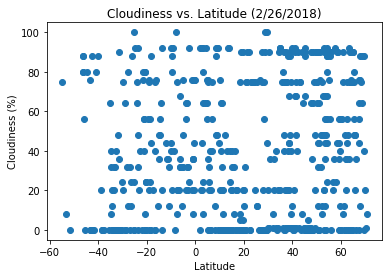
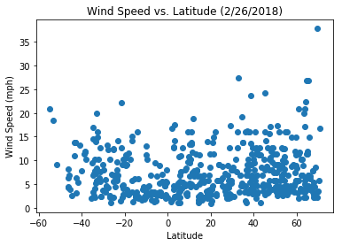

```python
import pandas as pd
import numpy as np
from citipy import citipy
import matplotlib.pyplot as plt
import json
import requests as req
from config import api_key as api_key

##### Remember to make a config file for keys
```

# Writeup
1) Temperature varies indirectly with latitude (as distance from the equator increases, temperature decreases)
2) Cities near the equator tend to have a higher humidity level, although that starts to drop off quickly as you move even
   10 degrees north or south
3) Wind speed generally stays at 20 mph or below, but there are outliers.  These outliers are all found at significant distances
   from the equator.
# Randomly generate a list of cities


```python
cities_list = []
while len(cities_list) < 600:
    rand_lat = np.random.randint(-7000,7001)/100
    rand_lng = np.random.randint(-18000,18001)/100
    city = citipy.nearest_city(latitude=rand_lat,longitude=rand_lng)
    if not city in cities_list:
        cities_list.append(city)
        
df = pd.DataFrame([i.city_name for i in cities_list])
df.rename(columns = {0:'City'},inplace=True)
print('Unique Cities: %d'%(len(cities_list)))
```

    Unique Cities: 600
    

# Get Weather data for cities


```python
url = "http://api.openweathermap.org/data/2.5/weather?"

query_url = url + "appid=" + api_key + '&units=imperial' +"&q="

weather_list = []
for city in cities_list:
    print('Adding city #%d City Name: %s url: %s'%(cities_list.index(city)+1,city.city_name,query_url+city.city_name))
    weather_list.append(req.get(query_url+city.city_name).json())

```

    Adding city #1 City Name: pemangkat url: http://api.openweathermap.org/data/2.5/weather?appid=989ae00bb32567ce60a3d390e983acd3&units=imperial&q=pemangkat
    Adding city #2 City Name: puerto ayora url: http://api.openweathermap.org/data/2.5/weather?appid=989ae00bb32567ce60a3d390e983acd3&units=imperial&q=puerto ayora
    Adding city #3 City Name: camapua url: http://api.openweathermap.org/data/2.5/weather?appid=989ae00bb32567ce60a3d390e983acd3&units=imperial&q=camapua
    Adding city #4 City Name: thompson url: http://api.openweathermap.org/data/2.5/weather?appid=989ae00bb32567ce60a3d390e983acd3&units=imperial&q=thompson
    Adding city #5 City Name: hilo url: http://api.openweathermap.org/data/2.5/weather?appid=989ae00bb32567ce60a3d390e983acd3&units=imperial&q=hilo
    Adding city #6 City Name: vaini url: http://api.openweathermap.org/data/2.5/weather?appid=989ae00bb32567ce60a3d390e983acd3&units=imperial&q=vaini
    Adding city #7 City Name: kitui url: http://api.openweathermap.org/data/2.5/weather?appid=989ae00bb32567ce60a3d390e983acd3&units=imperial&q=kitui
    Adding city #8 City Name: lasa url: http://api.openweathermap.org/data/2.5/weather?appid=989ae00bb32567ce60a3d390e983acd3&units=imperial&q=lasa
    Adding city #9 City Name: attawapiskat url: http://api.openweathermap.org/data/2.5/weather?appid=989ae00bb32567ce60a3d390e983acd3&units=imperial&q=attawapiskat
    Adding city #10 City Name: punta arenas url: http://api.openweathermap.org/data/2.5/weather?appid=989ae00bb32567ce60a3d390e983acd3&units=imperial&q=punta arenas
    Adding city #11 City Name: butaritari url: http://api.openweathermap.org/data/2.5/weather?appid=989ae00bb32567ce60a3d390e983acd3&units=imperial&q=butaritari
    Adding city #12 City Name: richards bay url: http://api.openweathermap.org/data/2.5/weather?appid=989ae00bb32567ce60a3d390e983acd3&units=imperial&q=richards bay
    Adding city #13 City Name: gevrai url: http://api.openweathermap.org/data/2.5/weather?appid=989ae00bb32567ce60a3d390e983acd3&units=imperial&q=gevrai
    Adding city #14 City Name: kruisfontein url: http://api.openweathermap.org/data/2.5/weather?appid=989ae00bb32567ce60a3d390e983acd3&units=imperial&q=kruisfontein
    Adding city #15 City Name: codrington url: http://api.openweathermap.org/data/2.5/weather?appid=989ae00bb32567ce60a3d390e983acd3&units=imperial&q=codrington
    Adding city #16 City Name: kigorobya url: http://api.openweathermap.org/data/2.5/weather?appid=989ae00bb32567ce60a3d390e983acd3&units=imperial&q=kigorobya
    Adding city #17 City Name: katakwi url: http://api.openweathermap.org/data/2.5/weather?appid=989ae00bb32567ce60a3d390e983acd3&units=imperial&q=katakwi
    Adding city #18 City Name: anage url: http://api.openweathermap.org/data/2.5/weather?appid=989ae00bb32567ce60a3d390e983acd3&units=imperial&q=anage
    Adding city #19 City Name: payo url: http://api.openweathermap.org/data/2.5/weather?appid=989ae00bb32567ce60a3d390e983acd3&units=imperial&q=payo
    Adding city #20 City Name: fort nelson url: http://api.openweathermap.org/data/2.5/weather?appid=989ae00bb32567ce60a3d390e983acd3&units=imperial&q=fort nelson
    Adding city #21 City Name: davila url: http://api.openweathermap.org/data/2.5/weather?appid=989ae00bb32567ce60a3d390e983acd3&units=imperial&q=davila
    Adding city #22 City Name: laguna url: http://api.openweathermap.org/data/2.5/weather?appid=989ae00bb32567ce60a3d390e983acd3&units=imperial&q=laguna
    Adding city #23 City Name: arona url: http://api.openweathermap.org/data/2.5/weather?appid=989ae00bb32567ce60a3d390e983acd3&units=imperial&q=arona
    Adding city #24 City Name: vuktyl url: http://api.openweathermap.org/data/2.5/weather?appid=989ae00bb32567ce60a3d390e983acd3&units=imperial&q=vuktyl
    Adding city #25 City Name: metro url: http://api.openweathermap.org/data/2.5/weather?appid=989ae00bb32567ce60a3d390e983acd3&units=imperial&q=metro
    Adding city #26 City Name: atuona url: http://api.openweathermap.org/data/2.5/weather?appid=989ae00bb32567ce60a3d390e983acd3&units=imperial&q=atuona
    Adding city #27 City Name: bur gabo url: http://api.openweathermap.org/data/2.5/weather?appid=989ae00bb32567ce60a3d390e983acd3&units=imperial&q=bur gabo
    Adding city #28 City Name: pisco url: http://api.openweathermap.org/data/2.5/weather?appid=989ae00bb32567ce60a3d390e983acd3&units=imperial&q=pisco
    Adding city #29 City Name: nanortalik url: http://api.openweathermap.org/data/2.5/weather?appid=989ae00bb32567ce60a3d390e983acd3&units=imperial&q=nanortalik
    Adding city #30 City Name: chuy url: http://api.openweathermap.org/data/2.5/weather?appid=989ae00bb32567ce60a3d390e983acd3&units=imperial&q=chuy
    Adding city #31 City Name: tasiilaq url: http://api.openweathermap.org/data/2.5/weather?appid=989ae00bb32567ce60a3d390e983acd3&units=imperial&q=tasiilaq
    Adding city #32 City Name: cape town url: http://api.openweathermap.org/data/2.5/weather?appid=989ae00bb32567ce60a3d390e983acd3&units=imperial&q=cape town
    Adding city #33 City Name: busselton url: http://api.openweathermap.org/data/2.5/weather?appid=989ae00bb32567ce60a3d390e983acd3&units=imperial&q=busselton
    Adding city #34 City Name: lebu url: http://api.openweathermap.org/data/2.5/weather?appid=989ae00bb32567ce60a3d390e983acd3&units=imperial&q=lebu
    Adding city #35 City Name: novonikolayevskiy url: http://api.openweathermap.org/data/2.5/weather?appid=989ae00bb32567ce60a3d390e983acd3&units=imperial&q=novonikolayevskiy
    Adding city #36 City Name: bahir dar url: http://api.openweathermap.org/data/2.5/weather?appid=989ae00bb32567ce60a3d390e983acd3&units=imperial&q=bahir dar
    Adding city #37 City Name: fortuna url: http://api.openweathermap.org/data/2.5/weather?appid=989ae00bb32567ce60a3d390e983acd3&units=imperial&q=fortuna
    Adding city #38 City Name: ancud url: http://api.openweathermap.org/data/2.5/weather?appid=989ae00bb32567ce60a3d390e983acd3&units=imperial&q=ancud
    Adding city #39 City Name: coihaique url: http://api.openweathermap.org/data/2.5/weather?appid=989ae00bb32567ce60a3d390e983acd3&units=imperial&q=coihaique
    Adding city #40 City Name: bemidji url: http://api.openweathermap.org/data/2.5/weather?appid=989ae00bb32567ce60a3d390e983acd3&units=imperial&q=bemidji
    Adding city #41 City Name: castro url: http://api.openweathermap.org/data/2.5/weather?appid=989ae00bb32567ce60a3d390e983acd3&units=imperial&q=castro
    Adding city #42 City Name: korla url: http://api.openweathermap.org/data/2.5/weather?appid=989ae00bb32567ce60a3d390e983acd3&units=imperial&q=korla
    Adding city #43 City Name: ketchikan url: http://api.openweathermap.org/data/2.5/weather?appid=989ae00bb32567ce60a3d390e983acd3&units=imperial&q=ketchikan
    Adding city #44 City Name: sentyabrskiy url: http://api.openweathermap.org/data/2.5/weather?appid=989ae00bb32567ce60a3d390e983acd3&units=imperial&q=sentyabrskiy
    Adding city #45 City Name: rungata url: http://api.openweathermap.org/data/2.5/weather?appid=989ae00bb32567ce60a3d390e983acd3&units=imperial&q=rungata
    Adding city #46 City Name: roela url: http://api.openweathermap.org/data/2.5/weather?appid=989ae00bb32567ce60a3d390e983acd3&units=imperial&q=roela
    Adding city #47 City Name: mataura url: http://api.openweathermap.org/data/2.5/weather?appid=989ae00bb32567ce60a3d390e983acd3&units=imperial&q=mataura
    Adding city #48 City Name: albany url: http://api.openweathermap.org/data/2.5/weather?appid=989ae00bb32567ce60a3d390e983acd3&units=imperial&q=albany
    Adding city #49 City Name: juan lacaze url: http://api.openweathermap.org/data/2.5/weather?appid=989ae00bb32567ce60a3d390e983acd3&units=imperial&q=juan lacaze
    Adding city #50 City Name: kapaa url: http://api.openweathermap.org/data/2.5/weather?appid=989ae00bb32567ce60a3d390e983acd3&units=imperial&q=kapaa
    Adding city #51 City Name: clyde river url: http://api.openweathermap.org/data/2.5/weather?appid=989ae00bb32567ce60a3d390e983acd3&units=imperial&q=clyde river
    Adding city #52 City Name: las tunas url: http://api.openweathermap.org/data/2.5/weather?appid=989ae00bb32567ce60a3d390e983acd3&units=imperial&q=las tunas
    Adding city #53 City Name: umzimvubu url: http://api.openweathermap.org/data/2.5/weather?appid=989ae00bb32567ce60a3d390e983acd3&units=imperial&q=umzimvubu
    Adding city #54 City Name: yulara url: http://api.openweathermap.org/data/2.5/weather?appid=989ae00bb32567ce60a3d390e983acd3&units=imperial&q=yulara
    Adding city #55 City Name: hasaki url: http://api.openweathermap.org/data/2.5/weather?appid=989ae00bb32567ce60a3d390e983acd3&units=imperial&q=hasaki
    Adding city #56 City Name: bilma url: http://api.openweathermap.org/data/2.5/weather?appid=989ae00bb32567ce60a3d390e983acd3&units=imperial&q=bilma
    Adding city #57 City Name: bengkulu url: http://api.openweathermap.org/data/2.5/weather?appid=989ae00bb32567ce60a3d390e983acd3&units=imperial&q=bengkulu
    Adding city #58 City Name: cockburn town url: http://api.openweathermap.org/data/2.5/weather?appid=989ae00bb32567ce60a3d390e983acd3&units=imperial&q=cockburn town
    Adding city #59 City Name: ternate url: http://api.openweathermap.org/data/2.5/weather?appid=989ae00bb32567ce60a3d390e983acd3&units=imperial&q=ternate
    Adding city #60 City Name: taunggyi url: http://api.openweathermap.org/data/2.5/weather?appid=989ae00bb32567ce60a3d390e983acd3&units=imperial&q=taunggyi
    Adding city #61 City Name: san quintin url: http://api.openweathermap.org/data/2.5/weather?appid=989ae00bb32567ce60a3d390e983acd3&units=imperial&q=san quintin
    Adding city #62 City Name: esperance url: http://api.openweathermap.org/data/2.5/weather?appid=989ae00bb32567ce60a3d390e983acd3&units=imperial&q=esperance
    Adding city #63 City Name: avarua url: http://api.openweathermap.org/data/2.5/weather?appid=989ae00bb32567ce60a3d390e983acd3&units=imperial&q=avarua
    Adding city #64 City Name: bluff url: http://api.openweathermap.org/data/2.5/weather?appid=989ae00bb32567ce60a3d390e983acd3&units=imperial&q=bluff
    Adding city #65 City Name: victoria url: http://api.openweathermap.org/data/2.5/weather?appid=989ae00bb32567ce60a3d390e983acd3&units=imperial&q=victoria
    Adding city #66 City Name: saint petersburg url: http://api.openweathermap.org/data/2.5/weather?appid=989ae00bb32567ce60a3d390e983acd3&units=imperial&q=saint petersburg
    Adding city #67 City Name: myitkyina url: http://api.openweathermap.org/data/2.5/weather?appid=989ae00bb32567ce60a3d390e983acd3&units=imperial&q=myitkyina
    Adding city #68 City Name: sulangan url: http://api.openweathermap.org/data/2.5/weather?appid=989ae00bb32567ce60a3d390e983acd3&units=imperial&q=sulangan
    Adding city #69 City Name: semey url: http://api.openweathermap.org/data/2.5/weather?appid=989ae00bb32567ce60a3d390e983acd3&units=imperial&q=semey
    Adding city #70 City Name: san pedro url: http://api.openweathermap.org/data/2.5/weather?appid=989ae00bb32567ce60a3d390e983acd3&units=imperial&q=san pedro
    Adding city #71 City Name: pandan url: http://api.openweathermap.org/data/2.5/weather?appid=989ae00bb32567ce60a3d390e983acd3&units=imperial&q=pandan
    Adding city #72 City Name: rio grande url: http://api.openweathermap.org/data/2.5/weather?appid=989ae00bb32567ce60a3d390e983acd3&units=imperial&q=rio grande
    Adding city #73 City Name: yellowknife url: http://api.openweathermap.org/data/2.5/weather?appid=989ae00bb32567ce60a3d390e983acd3&units=imperial&q=yellowknife
    Adding city #74 City Name: ponta do sol url: http://api.openweathermap.org/data/2.5/weather?appid=989ae00bb32567ce60a3d390e983acd3&units=imperial&q=ponta do sol
    Adding city #75 City Name: panaba url: http://api.openweathermap.org/data/2.5/weather?appid=989ae00bb32567ce60a3d390e983acd3&units=imperial&q=panaba
    Adding city #76 City Name: teknaf url: http://api.openweathermap.org/data/2.5/weather?appid=989ae00bb32567ce60a3d390e983acd3&units=imperial&q=teknaf
    Adding city #77 City Name: trelew url: http://api.openweathermap.org/data/2.5/weather?appid=989ae00bb32567ce60a3d390e983acd3&units=imperial&q=trelew
    Adding city #78 City Name: sao filipe url: http://api.openweathermap.org/data/2.5/weather?appid=989ae00bb32567ce60a3d390e983acd3&units=imperial&q=sao filipe
    Adding city #79 City Name: fostoria url: http://api.openweathermap.org/data/2.5/weather?appid=989ae00bb32567ce60a3d390e983acd3&units=imperial&q=fostoria
    Adding city #80 City Name: hobart url: http://api.openweathermap.org/data/2.5/weather?appid=989ae00bb32567ce60a3d390e983acd3&units=imperial&q=hobart
    Adding city #81 City Name: port alfred url: http://api.openweathermap.org/data/2.5/weather?appid=989ae00bb32567ce60a3d390e983acd3&units=imperial&q=port alfred
    Adding city #82 City Name: saint george url: http://api.openweathermap.org/data/2.5/weather?appid=989ae00bb32567ce60a3d390e983acd3&units=imperial&q=saint george
    Adding city #83 City Name: ilo url: http://api.openweathermap.org/data/2.5/weather?appid=989ae00bb32567ce60a3d390e983acd3&units=imperial&q=ilo
    Adding city #84 City Name: ngukurr url: http://api.openweathermap.org/data/2.5/weather?appid=989ae00bb32567ce60a3d390e983acd3&units=imperial&q=ngukurr
    Adding city #85 City Name: cururupu url: http://api.openweathermap.org/data/2.5/weather?appid=989ae00bb32567ce60a3d390e983acd3&units=imperial&q=cururupu
    Adding city #86 City Name: taolanaro url: http://api.openweathermap.org/data/2.5/weather?appid=989ae00bb32567ce60a3d390e983acd3&units=imperial&q=taolanaro
    Adding city #87 City Name: livingston url: http://api.openweathermap.org/data/2.5/weather?appid=989ae00bb32567ce60a3d390e983acd3&units=imperial&q=livingston
    Adding city #88 City Name: kodiak url: http://api.openweathermap.org/data/2.5/weather?appid=989ae00bb32567ce60a3d390e983acd3&units=imperial&q=kodiak
    Adding city #89 City Name: saint-philippe url: http://api.openweathermap.org/data/2.5/weather?appid=989ae00bb32567ce60a3d390e983acd3&units=imperial&q=saint-philippe
    Adding city #90 City Name: dingle url: http://api.openweathermap.org/data/2.5/weather?appid=989ae00bb32567ce60a3d390e983acd3&units=imperial&q=dingle
    Adding city #91 City Name: mar del plata url: http://api.openweathermap.org/data/2.5/weather?appid=989ae00bb32567ce60a3d390e983acd3&units=imperial&q=mar del plata
    Adding city #92 City Name: kasongo-lunda url: http://api.openweathermap.org/data/2.5/weather?appid=989ae00bb32567ce60a3d390e983acd3&units=imperial&q=kasongo-lunda
    Adding city #93 City Name: contamana url: http://api.openweathermap.org/data/2.5/weather?appid=989ae00bb32567ce60a3d390e983acd3&units=imperial&q=contamana
    Adding city #94 City Name: hithadhoo url: http://api.openweathermap.org/data/2.5/weather?appid=989ae00bb32567ce60a3d390e983acd3&units=imperial&q=hithadhoo
    Adding city #95 City Name: dong xoai url: http://api.openweathermap.org/data/2.5/weather?appid=989ae00bb32567ce60a3d390e983acd3&units=imperial&q=dong xoai
    Adding city #96 City Name: bambous virieux url: http://api.openweathermap.org/data/2.5/weather?appid=989ae00bb32567ce60a3d390e983acd3&units=imperial&q=bambous virieux
    Adding city #97 City Name: muros url: http://api.openweathermap.org/data/2.5/weather?appid=989ae00bb32567ce60a3d390e983acd3&units=imperial&q=muros
    Adding city #98 City Name: te anau url: http://api.openweathermap.org/data/2.5/weather?appid=989ae00bb32567ce60a3d390e983acd3&units=imperial&q=te anau
    Adding city #99 City Name: maria la baja url: http://api.openweathermap.org/data/2.5/weather?appid=989ae00bb32567ce60a3d390e983acd3&units=imperial&q=maria la baja
    Adding city #100 City Name: byron bay url: http://api.openweathermap.org/data/2.5/weather?appid=989ae00bb32567ce60a3d390e983acd3&units=imperial&q=byron bay
    Adding city #101 City Name: iracoubo url: http://api.openweathermap.org/data/2.5/weather?appid=989ae00bb32567ce60a3d390e983acd3&units=imperial&q=iracoubo
    Adding city #102 City Name: salalah url: http://api.openweathermap.org/data/2.5/weather?appid=989ae00bb32567ce60a3d390e983acd3&units=imperial&q=salalah
    Adding city #103 City Name: marzuq url: http://api.openweathermap.org/data/2.5/weather?appid=989ae00bb32567ce60a3d390e983acd3&units=imperial&q=marzuq
    Adding city #104 City Name: calatayud url: http://api.openweathermap.org/data/2.5/weather?appid=989ae00bb32567ce60a3d390e983acd3&units=imperial&q=calatayud
    Adding city #105 City Name: pasighat url: http://api.openweathermap.org/data/2.5/weather?appid=989ae00bb32567ce60a3d390e983acd3&units=imperial&q=pasighat
    Adding city #106 City Name: rikitea url: http://api.openweathermap.org/data/2.5/weather?appid=989ae00bb32567ce60a3d390e983acd3&units=imperial&q=rikitea
    Adding city #107 City Name: coquimbo url: http://api.openweathermap.org/data/2.5/weather?appid=989ae00bb32567ce60a3d390e983acd3&units=imperial&q=coquimbo
    Adding city #108 City Name: chitral url: http://api.openweathermap.org/data/2.5/weather?appid=989ae00bb32567ce60a3d390e983acd3&units=imperial&q=chitral
    Adding city #109 City Name: saldanha url: http://api.openweathermap.org/data/2.5/weather?appid=989ae00bb32567ce60a3d390e983acd3&units=imperial&q=saldanha
    Adding city #110 City Name: jinchang url: http://api.openweathermap.org/data/2.5/weather?appid=989ae00bb32567ce60a3d390e983acd3&units=imperial&q=jinchang
    Adding city #111 City Name: hanmer springs url: http://api.openweathermap.org/data/2.5/weather?appid=989ae00bb32567ce60a3d390e983acd3&units=imperial&q=hanmer springs
    Adding city #112 City Name: pulgaon url: http://api.openweathermap.org/data/2.5/weather?appid=989ae00bb32567ce60a3d390e983acd3&units=imperial&q=pulgaon
    Adding city #113 City Name: madaoua url: http://api.openweathermap.org/data/2.5/weather?appid=989ae00bb32567ce60a3d390e983acd3&units=imperial&q=madaoua
    Adding city #114 City Name: kurilsk url: http://api.openweathermap.org/data/2.5/weather?appid=989ae00bb32567ce60a3d390e983acd3&units=imperial&q=kurilsk
    Adding city #115 City Name: anqing url: http://api.openweathermap.org/data/2.5/weather?appid=989ae00bb32567ce60a3d390e983acd3&units=imperial&q=anqing
    Adding city #116 City Name: provideniya url: http://api.openweathermap.org/data/2.5/weather?appid=989ae00bb32567ce60a3d390e983acd3&units=imperial&q=provideniya
    Adding city #117 City Name: lorengau url: http://api.openweathermap.org/data/2.5/weather?appid=989ae00bb32567ce60a3d390e983acd3&units=imperial&q=lorengau
    Adding city #118 City Name: svetlyy url: http://api.openweathermap.org/data/2.5/weather?appid=989ae00bb32567ce60a3d390e983acd3&units=imperial&q=svetlyy
    Adding city #119 City Name: barrow url: http://api.openweathermap.org/data/2.5/weather?appid=989ae00bb32567ce60a3d390e983acd3&units=imperial&q=barrow
    Adding city #120 City Name: gebre guracha url: http://api.openweathermap.org/data/2.5/weather?appid=989ae00bb32567ce60a3d390e983acd3&units=imperial&q=gebre guracha
    Adding city #121 City Name: asau url: http://api.openweathermap.org/data/2.5/weather?appid=989ae00bb32567ce60a3d390e983acd3&units=imperial&q=asau
    Adding city #122 City Name: pozo colorado url: http://api.openweathermap.org/data/2.5/weather?appid=989ae00bb32567ce60a3d390e983acd3&units=imperial&q=pozo colorado
    Adding city #123 City Name: jamestown url: http://api.openweathermap.org/data/2.5/weather?appid=989ae00bb32567ce60a3d390e983acd3&units=imperial&q=jamestown
    Adding city #124 City Name: rafaela url: http://api.openweathermap.org/data/2.5/weather?appid=989ae00bb32567ce60a3d390e983acd3&units=imperial&q=rafaela
    Adding city #125 City Name: inirida url: http://api.openweathermap.org/data/2.5/weather?appid=989ae00bb32567ce60a3d390e983acd3&units=imperial&q=inirida
    Adding city #126 City Name: tsihombe url: http://api.openweathermap.org/data/2.5/weather?appid=989ae00bb32567ce60a3d390e983acd3&units=imperial&q=tsihombe
    Adding city #127 City Name: rocha url: http://api.openweathermap.org/data/2.5/weather?appid=989ae00bb32567ce60a3d390e983acd3&units=imperial&q=rocha
    Adding city #128 City Name: gurgan url: http://api.openweathermap.org/data/2.5/weather?appid=989ae00bb32567ce60a3d390e983acd3&units=imperial&q=gurgan
    Adding city #129 City Name: foki url: http://api.openweathermap.org/data/2.5/weather?appid=989ae00bb32567ce60a3d390e983acd3&units=imperial&q=foki
    Adding city #130 City Name: halalo url: http://api.openweathermap.org/data/2.5/weather?appid=989ae00bb32567ce60a3d390e983acd3&units=imperial&q=halalo
    Adding city #131 City Name: ulladulla url: http://api.openweathermap.org/data/2.5/weather?appid=989ae00bb32567ce60a3d390e983acd3&units=imperial&q=ulladulla
    Adding city #132 City Name: nome url: http://api.openweathermap.org/data/2.5/weather?appid=989ae00bb32567ce60a3d390e983acd3&units=imperial&q=nome
    Adding city #133 City Name: guerrero negro url: http://api.openweathermap.org/data/2.5/weather?appid=989ae00bb32567ce60a3d390e983acd3&units=imperial&q=guerrero negro
    Adding city #134 City Name: krasnoselkup url: http://api.openweathermap.org/data/2.5/weather?appid=989ae00bb32567ce60a3d390e983acd3&units=imperial&q=krasnoselkup
    Adding city #135 City Name: arraial do cabo url: http://api.openweathermap.org/data/2.5/weather?appid=989ae00bb32567ce60a3d390e983acd3&units=imperial&q=arraial do cabo
    Adding city #136 City Name: iralaya url: http://api.openweathermap.org/data/2.5/weather?appid=989ae00bb32567ce60a3d390e983acd3&units=imperial&q=iralaya
    Adding city #137 City Name: eskil url: http://api.openweathermap.org/data/2.5/weather?appid=989ae00bb32567ce60a3d390e983acd3&units=imperial&q=eskil
    Adding city #138 City Name: kuminskiy url: http://api.openweathermap.org/data/2.5/weather?appid=989ae00bb32567ce60a3d390e983acd3&units=imperial&q=kuminskiy
    Adding city #139 City Name: meylan url: http://api.openweathermap.org/data/2.5/weather?appid=989ae00bb32567ce60a3d390e983acd3&units=imperial&q=meylan
    Adding city #140 City Name: aden url: http://api.openweathermap.org/data/2.5/weather?appid=989ae00bb32567ce60a3d390e983acd3&units=imperial&q=aden
    Adding city #141 City Name: acapulco url: http://api.openweathermap.org/data/2.5/weather?appid=989ae00bb32567ce60a3d390e983acd3&units=imperial&q=acapulco
    Adding city #142 City Name: bridlington url: http://api.openweathermap.org/data/2.5/weather?appid=989ae00bb32567ce60a3d390e983acd3&units=imperial&q=bridlington
    Adding city #143 City Name: rio de janeiro url: http://api.openweathermap.org/data/2.5/weather?appid=989ae00bb32567ce60a3d390e983acd3&units=imperial&q=rio de janeiro
    Adding city #144 City Name: san cristobal url: http://api.openweathermap.org/data/2.5/weather?appid=989ae00bb32567ce60a3d390e983acd3&units=imperial&q=san cristobal
    Adding city #145 City Name: clonakilty url: http://api.openweathermap.org/data/2.5/weather?appid=989ae00bb32567ce60a3d390e983acd3&units=imperial&q=clonakilty
    Adding city #146 City Name: tarko-sale url: http://api.openweathermap.org/data/2.5/weather?appid=989ae00bb32567ce60a3d390e983acd3&units=imperial&q=tarko-sale
    Adding city #147 City Name: pontes e lacerda url: http://api.openweathermap.org/data/2.5/weather?appid=989ae00bb32567ce60a3d390e983acd3&units=imperial&q=pontes e lacerda
    Adding city #148 City Name: meulaboh url: http://api.openweathermap.org/data/2.5/weather?appid=989ae00bb32567ce60a3d390e983acd3&units=imperial&q=meulaboh
    Adding city #149 City Name: novyy urgal url: http://api.openweathermap.org/data/2.5/weather?appid=989ae00bb32567ce60a3d390e983acd3&units=imperial&q=novyy urgal
    Adding city #150 City Name: barreirinhas url: http://api.openweathermap.org/data/2.5/weather?appid=989ae00bb32567ce60a3d390e983acd3&units=imperial&q=barreirinhas
    Adding city #151 City Name: klaksvik url: http://api.openweathermap.org/data/2.5/weather?appid=989ae00bb32567ce60a3d390e983acd3&units=imperial&q=klaksvik
    Adding city #152 City Name: cayenne url: http://api.openweathermap.org/data/2.5/weather?appid=989ae00bb32567ce60a3d390e983acd3&units=imperial&q=cayenne
    Adding city #153 City Name: muisne url: http://api.openweathermap.org/data/2.5/weather?appid=989ae00bb32567ce60a3d390e983acd3&units=imperial&q=muisne
    Adding city #154 City Name: new norfolk url: http://api.openweathermap.org/data/2.5/weather?appid=989ae00bb32567ce60a3d390e983acd3&units=imperial&q=new norfolk
    Adding city #155 City Name: ewa beach url: http://api.openweathermap.org/data/2.5/weather?appid=989ae00bb32567ce60a3d390e983acd3&units=imperial&q=ewa beach
    Adding city #156 City Name: lufilufi url: http://api.openweathermap.org/data/2.5/weather?appid=989ae00bb32567ce60a3d390e983acd3&units=imperial&q=lufilufi
    Adding city #157 City Name: georgetown url: http://api.openweathermap.org/data/2.5/weather?appid=989ae00bb32567ce60a3d390e983acd3&units=imperial&q=georgetown
    Adding city #158 City Name: codajas url: http://api.openweathermap.org/data/2.5/weather?appid=989ae00bb32567ce60a3d390e983acd3&units=imperial&q=codajas
    Adding city #159 City Name: kyra url: http://api.openweathermap.org/data/2.5/weather?appid=989ae00bb32567ce60a3d390e983acd3&units=imperial&q=kyra
    Adding city #160 City Name: grindavik url: http://api.openweathermap.org/data/2.5/weather?appid=989ae00bb32567ce60a3d390e983acd3&units=imperial&q=grindavik
    Adding city #161 City Name: lukulu url: http://api.openweathermap.org/data/2.5/weather?appid=989ae00bb32567ce60a3d390e983acd3&units=imperial&q=lukulu
    Adding city #162 City Name: sabha url: http://api.openweathermap.org/data/2.5/weather?appid=989ae00bb32567ce60a3d390e983acd3&units=imperial&q=sabha
    Adding city #163 City Name: broken hill url: http://api.openweathermap.org/data/2.5/weather?appid=989ae00bb32567ce60a3d390e983acd3&units=imperial&q=broken hill
    Adding city #164 City Name: beloha url: http://api.openweathermap.org/data/2.5/weather?appid=989ae00bb32567ce60a3d390e983acd3&units=imperial&q=beloha
    Adding city #165 City Name: tamandare url: http://api.openweathermap.org/data/2.5/weather?appid=989ae00bb32567ce60a3d390e983acd3&units=imperial&q=tamandare
    Adding city #166 City Name: antalaha url: http://api.openweathermap.org/data/2.5/weather?appid=989ae00bb32567ce60a3d390e983acd3&units=imperial&q=antalaha
    Adding city #167 City Name: baft url: http://api.openweathermap.org/data/2.5/weather?appid=989ae00bb32567ce60a3d390e983acd3&units=imperial&q=baft
    Adding city #168 City Name: huilong url: http://api.openweathermap.org/data/2.5/weather?appid=989ae00bb32567ce60a3d390e983acd3&units=imperial&q=huilong
    Adding city #169 City Name: lompoc url: http://api.openweathermap.org/data/2.5/weather?appid=989ae00bb32567ce60a3d390e983acd3&units=imperial&q=lompoc
    Adding city #170 City Name: nishihara url: http://api.openweathermap.org/data/2.5/weather?appid=989ae00bb32567ce60a3d390e983acd3&units=imperial&q=nishihara
    Adding city #171 City Name: batagay url: http://api.openweathermap.org/data/2.5/weather?appid=989ae00bb32567ce60a3d390e983acd3&units=imperial&q=batagay
    Adding city #172 City Name: souillac url: http://api.openweathermap.org/data/2.5/weather?appid=989ae00bb32567ce60a3d390e983acd3&units=imperial&q=souillac
    Adding city #173 City Name: santa cruz de la palma url: http://api.openweathermap.org/data/2.5/weather?appid=989ae00bb32567ce60a3d390e983acd3&units=imperial&q=santa cruz de la palma
    Adding city #174 City Name: visby url: http://api.openweathermap.org/data/2.5/weather?appid=989ae00bb32567ce60a3d390e983acd3&units=imperial&q=visby
    Adding city #175 City Name: severo-kurilsk url: http://api.openweathermap.org/data/2.5/weather?appid=989ae00bb32567ce60a3d390e983acd3&units=imperial&q=severo-kurilsk
    Adding city #176 City Name: woodward url: http://api.openweathermap.org/data/2.5/weather?appid=989ae00bb32567ce60a3d390e983acd3&units=imperial&q=woodward
    Adding city #177 City Name: palabuhanratu url: http://api.openweathermap.org/data/2.5/weather?appid=989ae00bb32567ce60a3d390e983acd3&units=imperial&q=palabuhanratu
    Adding city #178 City Name: vaitupu url: http://api.openweathermap.org/data/2.5/weather?appid=989ae00bb32567ce60a3d390e983acd3&units=imperial&q=vaitupu
    Adding city #179 City Name: kavaratti url: http://api.openweathermap.org/data/2.5/weather?appid=989ae00bb32567ce60a3d390e983acd3&units=imperial&q=kavaratti
    Adding city #180 City Name: linqing url: http://api.openweathermap.org/data/2.5/weather?appid=989ae00bb32567ce60a3d390e983acd3&units=imperial&q=linqing
    Adding city #181 City Name: katangli url: http://api.openweathermap.org/data/2.5/weather?appid=989ae00bb32567ce60a3d390e983acd3&units=imperial&q=katangli
    Adding city #182 City Name: touros url: http://api.openweathermap.org/data/2.5/weather?appid=989ae00bb32567ce60a3d390e983acd3&units=imperial&q=touros
    Adding city #183 City Name: las vegas url: http://api.openweathermap.org/data/2.5/weather?appid=989ae00bb32567ce60a3d390e983acd3&units=imperial&q=las vegas
    Adding city #184 City Name: sola url: http://api.openweathermap.org/data/2.5/weather?appid=989ae00bb32567ce60a3d390e983acd3&units=imperial&q=sola
    Adding city #185 City Name: nizhniy kuranakh url: http://api.openweathermap.org/data/2.5/weather?appid=989ae00bb32567ce60a3d390e983acd3&units=imperial&q=nizhniy kuranakh
    Adding city #186 City Name: puerto baquerizo moreno url: http://api.openweathermap.org/data/2.5/weather?appid=989ae00bb32567ce60a3d390e983acd3&units=imperial&q=puerto baquerizo moreno
    Adding city #187 City Name: inhambane url: http://api.openweathermap.org/data/2.5/weather?appid=989ae00bb32567ce60a3d390e983acd3&units=imperial&q=inhambane
    Adding city #188 City Name: hermanus url: http://api.openweathermap.org/data/2.5/weather?appid=989ae00bb32567ce60a3d390e983acd3&units=imperial&q=hermanus
    Adding city #189 City Name: ferrol url: http://api.openweathermap.org/data/2.5/weather?appid=989ae00bb32567ce60a3d390e983acd3&units=imperial&q=ferrol
    Adding city #190 City Name: jablanica url: http://api.openweathermap.org/data/2.5/weather?appid=989ae00bb32567ce60a3d390e983acd3&units=imperial&q=jablanica
    Adding city #191 City Name: alyangula url: http://api.openweathermap.org/data/2.5/weather?appid=989ae00bb32567ce60a3d390e983acd3&units=imperial&q=alyangula
    Adding city #192 City Name: mahebourg url: http://api.openweathermap.org/data/2.5/weather?appid=989ae00bb32567ce60a3d390e983acd3&units=imperial&q=mahebourg
    Adding city #193 City Name: winslow url: http://api.openweathermap.org/data/2.5/weather?appid=989ae00bb32567ce60a3d390e983acd3&units=imperial&q=winslow
    Adding city #194 City Name: saint-pierre url: http://api.openweathermap.org/data/2.5/weather?appid=989ae00bb32567ce60a3d390e983acd3&units=imperial&q=saint-pierre
    Adding city #195 City Name: kaitangata url: http://api.openweathermap.org/data/2.5/weather?appid=989ae00bb32567ce60a3d390e983acd3&units=imperial&q=kaitangata
    Adding city #196 City Name: olinda url: http://api.openweathermap.org/data/2.5/weather?appid=989ae00bb32567ce60a3d390e983acd3&units=imperial&q=olinda
    Adding city #197 City Name: skibbereen url: http://api.openweathermap.org/data/2.5/weather?appid=989ae00bb32567ce60a3d390e983acd3&units=imperial&q=skibbereen
    Adding city #198 City Name: amapa url: http://api.openweathermap.org/data/2.5/weather?appid=989ae00bb32567ce60a3d390e983acd3&units=imperial&q=amapa
    Adding city #199 City Name: itarema url: http://api.openweathermap.org/data/2.5/weather?appid=989ae00bb32567ce60a3d390e983acd3&units=imperial&q=itarema
    Adding city #200 City Name: bowen url: http://api.openweathermap.org/data/2.5/weather?appid=989ae00bb32567ce60a3d390e983acd3&units=imperial&q=bowen
    Adding city #201 City Name: lolua url: http://api.openweathermap.org/data/2.5/weather?appid=989ae00bb32567ce60a3d390e983acd3&units=imperial&q=lolua
    Adding city #202 City Name: sechura url: http://api.openweathermap.org/data/2.5/weather?appid=989ae00bb32567ce60a3d390e983acd3&units=imperial&q=sechura
    Adding city #203 City Name: tsagan aman url: http://api.openweathermap.org/data/2.5/weather?appid=989ae00bb32567ce60a3d390e983acd3&units=imperial&q=tsagan aman
    Adding city #204 City Name: itoigawa url: http://api.openweathermap.org/data/2.5/weather?appid=989ae00bb32567ce60a3d390e983acd3&units=imperial&q=itoigawa
    Adding city #205 City Name: fort-shevchenko url: http://api.openweathermap.org/data/2.5/weather?appid=989ae00bb32567ce60a3d390e983acd3&units=imperial&q=fort-shevchenko
    Adding city #206 City Name: vilhena url: http://api.openweathermap.org/data/2.5/weather?appid=989ae00bb32567ce60a3d390e983acd3&units=imperial&q=vilhena
    Adding city #207 City Name: fulton url: http://api.openweathermap.org/data/2.5/weather?appid=989ae00bb32567ce60a3d390e983acd3&units=imperial&q=fulton
    Adding city #208 City Name: homer url: http://api.openweathermap.org/data/2.5/weather?appid=989ae00bb32567ce60a3d390e983acd3&units=imperial&q=homer
    Adding city #209 City Name: sehithwa url: http://api.openweathermap.org/data/2.5/weather?appid=989ae00bb32567ce60a3d390e983acd3&units=imperial&q=sehithwa
    Adding city #210 City Name: xichang url: http://api.openweathermap.org/data/2.5/weather?appid=989ae00bb32567ce60a3d390e983acd3&units=imperial&q=xichang
    Adding city #211 City Name: tiznit url: http://api.openweathermap.org/data/2.5/weather?appid=989ae00bb32567ce60a3d390e983acd3&units=imperial&q=tiznit
    Adding city #212 City Name: brake url: http://api.openweathermap.org/data/2.5/weather?appid=989ae00bb32567ce60a3d390e983acd3&units=imperial&q=brake
    Adding city #213 City Name: safwah url: http://api.openweathermap.org/data/2.5/weather?appid=989ae00bb32567ce60a3d390e983acd3&units=imperial&q=safwah
    Adding city #214 City Name: alekseyevsk url: http://api.openweathermap.org/data/2.5/weather?appid=989ae00bb32567ce60a3d390e983acd3&units=imperial&q=alekseyevsk
    Adding city #215 City Name: palmer url: http://api.openweathermap.org/data/2.5/weather?appid=989ae00bb32567ce60a3d390e983acd3&units=imperial&q=palmer
    Adding city #216 City Name: sidi ali url: http://api.openweathermap.org/data/2.5/weather?appid=989ae00bb32567ce60a3d390e983acd3&units=imperial&q=sidi ali
    Adding city #217 City Name: carnarvon url: http://api.openweathermap.org/data/2.5/weather?appid=989ae00bb32567ce60a3d390e983acd3&units=imperial&q=carnarvon
    Adding city #218 City Name: lata url: http://api.openweathermap.org/data/2.5/weather?appid=989ae00bb32567ce60a3d390e983acd3&units=imperial&q=lata
    Adding city #219 City Name: kristiansund url: http://api.openweathermap.org/data/2.5/weather?appid=989ae00bb32567ce60a3d390e983acd3&units=imperial&q=kristiansund
    Adding city #220 City Name: cidreira url: http://api.openweathermap.org/data/2.5/weather?appid=989ae00bb32567ce60a3d390e983acd3&units=imperial&q=cidreira
    Adding city #221 City Name: hamilton url: http://api.openweathermap.org/data/2.5/weather?appid=989ae00bb32567ce60a3d390e983acd3&units=imperial&q=hamilton
    Adding city #222 City Name: severodvinsk url: http://api.openweathermap.org/data/2.5/weather?appid=989ae00bb32567ce60a3d390e983acd3&units=imperial&q=severodvinsk
    Adding city #223 City Name: mount gambier url: http://api.openweathermap.org/data/2.5/weather?appid=989ae00bb32567ce60a3d390e983acd3&units=imperial&q=mount gambier
    Adding city #224 City Name: ushuaia url: http://api.openweathermap.org/data/2.5/weather?appid=989ae00bb32567ce60a3d390e983acd3&units=imperial&q=ushuaia
    Adding city #225 City Name: port lincoln url: http://api.openweathermap.org/data/2.5/weather?appid=989ae00bb32567ce60a3d390e983acd3&units=imperial&q=port lincoln
    Adding city #226 City Name: ribeira grande url: http://api.openweathermap.org/data/2.5/weather?appid=989ae00bb32567ce60a3d390e983acd3&units=imperial&q=ribeira grande
    Adding city #227 City Name: nouadhibou url: http://api.openweathermap.org/data/2.5/weather?appid=989ae00bb32567ce60a3d390e983acd3&units=imperial&q=nouadhibou
    Adding city #228 City Name: vila franca do campo url: http://api.openweathermap.org/data/2.5/weather?appid=989ae00bb32567ce60a3d390e983acd3&units=imperial&q=vila franca do campo
    Adding city #229 City Name: saint-georges url: http://api.openweathermap.org/data/2.5/weather?appid=989ae00bb32567ce60a3d390e983acd3&units=imperial&q=saint-georges
    Adding city #230 City Name: cabo san lucas url: http://api.openweathermap.org/data/2.5/weather?appid=989ae00bb32567ce60a3d390e983acd3&units=imperial&q=cabo san lucas
    Adding city #231 City Name: bandarbeyla url: http://api.openweathermap.org/data/2.5/weather?appid=989ae00bb32567ce60a3d390e983acd3&units=imperial&q=bandarbeyla
    Adding city #232 City Name: paita url: http://api.openweathermap.org/data/2.5/weather?appid=989ae00bb32567ce60a3d390e983acd3&units=imperial&q=paita
    Adding city #233 City Name: galiwinku url: http://api.openweathermap.org/data/2.5/weather?appid=989ae00bb32567ce60a3d390e983acd3&units=imperial&q=galiwinku
    Adding city #234 City Name: mantua url: http://api.openweathermap.org/data/2.5/weather?appid=989ae00bb32567ce60a3d390e983acd3&units=imperial&q=mantua
    Adding city #235 City Name: kavieng url: http://api.openweathermap.org/data/2.5/weather?appid=989ae00bb32567ce60a3d390e983acd3&units=imperial&q=kavieng
    Adding city #236 City Name: zhangzhou url: http://api.openweathermap.org/data/2.5/weather?appid=989ae00bb32567ce60a3d390e983acd3&units=imperial&q=zhangzhou
    Adding city #237 City Name: sataua url: http://api.openweathermap.org/data/2.5/weather?appid=989ae00bb32567ce60a3d390e983acd3&units=imperial&q=sataua
    Adding city #238 City Name: emba url: http://api.openweathermap.org/data/2.5/weather?appid=989ae00bb32567ce60a3d390e983acd3&units=imperial&q=emba
    Adding city #239 City Name: saleaula url: http://api.openweathermap.org/data/2.5/weather?appid=989ae00bb32567ce60a3d390e983acd3&units=imperial&q=saleaula
    Adding city #240 City Name: grand river south east url: http://api.openweathermap.org/data/2.5/weather?appid=989ae00bb32567ce60a3d390e983acd3&units=imperial&q=grand river south east
    Adding city #241 City Name: santa cruz url: http://api.openweathermap.org/data/2.5/weather?appid=989ae00bb32567ce60a3d390e983acd3&units=imperial&q=santa cruz
    Adding city #242 City Name: moose factory url: http://api.openweathermap.org/data/2.5/weather?appid=989ae00bb32567ce60a3d390e983acd3&units=imperial&q=moose factory
    Adding city #243 City Name: boa vista url: http://api.openweathermap.org/data/2.5/weather?appid=989ae00bb32567ce60a3d390e983acd3&units=imperial&q=boa vista
    Adding city #244 City Name: luderitz url: http://api.openweathermap.org/data/2.5/weather?appid=989ae00bb32567ce60a3d390e983acd3&units=imperial&q=luderitz
    Adding city #245 City Name: bairiki url: http://api.openweathermap.org/data/2.5/weather?appid=989ae00bb32567ce60a3d390e983acd3&units=imperial&q=bairiki
    Adding city #246 City Name: assiniboia url: http://api.openweathermap.org/data/2.5/weather?appid=989ae00bb32567ce60a3d390e983acd3&units=imperial&q=assiniboia
    Adding city #247 City Name: paamiut url: http://api.openweathermap.org/data/2.5/weather?appid=989ae00bb32567ce60a3d390e983acd3&units=imperial&q=paamiut
    Adding city #248 City Name: samusu url: http://api.openweathermap.org/data/2.5/weather?appid=989ae00bb32567ce60a3d390e983acd3&units=imperial&q=samusu
    Adding city #249 City Name: muli url: http://api.openweathermap.org/data/2.5/weather?appid=989ae00bb32567ce60a3d390e983acd3&units=imperial&q=muli
    Adding city #250 City Name: los llanos de aridane url: http://api.openweathermap.org/data/2.5/weather?appid=989ae00bb32567ce60a3d390e983acd3&units=imperial&q=los llanos de aridane
    Adding city #251 City Name: muroto url: http://api.openweathermap.org/data/2.5/weather?appid=989ae00bb32567ce60a3d390e983acd3&units=imperial&q=muroto
    Adding city #252 City Name: valea nucarilor url: http://api.openweathermap.org/data/2.5/weather?appid=989ae00bb32567ce60a3d390e983acd3&units=imperial&q=valea nucarilor
    Adding city #253 City Name: airai url: http://api.openweathermap.org/data/2.5/weather?appid=989ae00bb32567ce60a3d390e983acd3&units=imperial&q=airai
    Adding city #254 City Name: arman url: http://api.openweathermap.org/data/2.5/weather?appid=989ae00bb32567ce60a3d390e983acd3&units=imperial&q=arman
    Adding city #255 City Name: danane url: http://api.openweathermap.org/data/2.5/weather?appid=989ae00bb32567ce60a3d390e983acd3&units=imperial&q=danane
    Adding city #256 City Name: rio gallegos url: http://api.openweathermap.org/data/2.5/weather?appid=989ae00bb32567ce60a3d390e983acd3&units=imperial&q=rio gallegos
    Adding city #257 City Name: quatre cocos url: http://api.openweathermap.org/data/2.5/weather?appid=989ae00bb32567ce60a3d390e983acd3&units=imperial&q=quatre cocos
    Adding city #258 City Name: pevek url: http://api.openweathermap.org/data/2.5/weather?appid=989ae00bb32567ce60a3d390e983acd3&units=imperial&q=pevek
    Adding city #259 City Name: totness url: http://api.openweathermap.org/data/2.5/weather?appid=989ae00bb32567ce60a3d390e983acd3&units=imperial&q=totness
    Adding city #260 City Name: torbay url: http://api.openweathermap.org/data/2.5/weather?appid=989ae00bb32567ce60a3d390e983acd3&units=imperial&q=torbay
    Adding city #261 City Name: axim url: http://api.openweathermap.org/data/2.5/weather?appid=989ae00bb32567ce60a3d390e983acd3&units=imperial&q=axim
    Adding city #262 City Name: cap malheureux url: http://api.openweathermap.org/data/2.5/weather?appid=989ae00bb32567ce60a3d390e983acd3&units=imperial&q=cap malheureux
    Adding city #263 City Name: fuxin url: http://api.openweathermap.org/data/2.5/weather?appid=989ae00bb32567ce60a3d390e983acd3&units=imperial&q=fuxin
    Adding city #264 City Name: viedma url: http://api.openweathermap.org/data/2.5/weather?appid=989ae00bb32567ce60a3d390e983acd3&units=imperial&q=viedma
    Adding city #265 City Name: aklavik url: http://api.openweathermap.org/data/2.5/weather?appid=989ae00bb32567ce60a3d390e983acd3&units=imperial&q=aklavik
    Adding city #266 City Name: tuatapere url: http://api.openweathermap.org/data/2.5/weather?appid=989ae00bb32567ce60a3d390e983acd3&units=imperial&q=tuatapere
    Adding city #267 City Name: kanniyakumari url: http://api.openweathermap.org/data/2.5/weather?appid=989ae00bb32567ce60a3d390e983acd3&units=imperial&q=kanniyakumari
    Adding city #268 City Name: roswell url: http://api.openweathermap.org/data/2.5/weather?appid=989ae00bb32567ce60a3d390e983acd3&units=imperial&q=roswell
    Adding city #269 City Name: carnarvon url: http://api.openweathermap.org/data/2.5/weather?appid=989ae00bb32567ce60a3d390e983acd3&units=imperial&q=carnarvon
    Adding city #270 City Name: kirakira url: http://api.openweathermap.org/data/2.5/weather?appid=989ae00bb32567ce60a3d390e983acd3&units=imperial&q=kirakira
    Adding city #271 City Name: ouahigouya url: http://api.openweathermap.org/data/2.5/weather?appid=989ae00bb32567ce60a3d390e983acd3&units=imperial&q=ouahigouya
    Adding city #272 City Name: verkhnevilyuysk url: http://api.openweathermap.org/data/2.5/weather?appid=989ae00bb32567ce60a3d390e983acd3&units=imperial&q=verkhnevilyuysk
    Adding city #273 City Name: woodstock url: http://api.openweathermap.org/data/2.5/weather?appid=989ae00bb32567ce60a3d390e983acd3&units=imperial&q=woodstock
    Adding city #274 City Name: flinders url: http://api.openweathermap.org/data/2.5/weather?appid=989ae00bb32567ce60a3d390e983acd3&units=imperial&q=flinders
    Adding city #275 City Name: pilar url: http://api.openweathermap.org/data/2.5/weather?appid=989ae00bb32567ce60a3d390e983acd3&units=imperial&q=pilar
    Adding city #276 City Name: narrabri url: http://api.openweathermap.org/data/2.5/weather?appid=989ae00bb32567ce60a3d390e983acd3&units=imperial&q=narrabri
    Adding city #277 City Name: fairbanks url: http://api.openweathermap.org/data/2.5/weather?appid=989ae00bb32567ce60a3d390e983acd3&units=imperial&q=fairbanks
    Adding city #278 City Name: ruatoria url: http://api.openweathermap.org/data/2.5/weather?appid=989ae00bb32567ce60a3d390e983acd3&units=imperial&q=ruatoria
    Adding city #279 City Name: ouranopolis url: http://api.openweathermap.org/data/2.5/weather?appid=989ae00bb32567ce60a3d390e983acd3&units=imperial&q=ouranopolis
    Adding city #280 City Name: chicama url: http://api.openweathermap.org/data/2.5/weather?appid=989ae00bb32567ce60a3d390e983acd3&units=imperial&q=chicama
    Adding city #281 City Name: honiara url: http://api.openweathermap.org/data/2.5/weather?appid=989ae00bb32567ce60a3d390e983acd3&units=imperial&q=honiara
    Adding city #282 City Name: komatipoort url: http://api.openweathermap.org/data/2.5/weather?appid=989ae00bb32567ce60a3d390e983acd3&units=imperial&q=komatipoort
    Adding city #283 City Name: morro bay url: http://api.openweathermap.org/data/2.5/weather?appid=989ae00bb32567ce60a3d390e983acd3&units=imperial&q=morro bay
    Adding city #284 City Name: constitucion url: http://api.openweathermap.org/data/2.5/weather?appid=989ae00bb32567ce60a3d390e983acd3&units=imperial&q=constitucion
    Adding city #285 City Name: carutapera url: http://api.openweathermap.org/data/2.5/weather?appid=989ae00bb32567ce60a3d390e983acd3&units=imperial&q=carutapera
    Adding city #286 City Name: esso url: http://api.openweathermap.org/data/2.5/weather?appid=989ae00bb32567ce60a3d390e983acd3&units=imperial&q=esso
    Adding city #287 City Name: marsta url: http://api.openweathermap.org/data/2.5/weather?appid=989ae00bb32567ce60a3d390e983acd3&units=imperial&q=marsta
    Adding city #288 City Name: namibe url: http://api.openweathermap.org/data/2.5/weather?appid=989ae00bb32567ce60a3d390e983acd3&units=imperial&q=namibe
    Adding city #289 City Name: hanyang url: http://api.openweathermap.org/data/2.5/weather?appid=989ae00bb32567ce60a3d390e983acd3&units=imperial&q=hanyang
    Adding city #290 City Name: nelson bay url: http://api.openweathermap.org/data/2.5/weather?appid=989ae00bb32567ce60a3d390e983acd3&units=imperial&q=nelson bay
    Adding city #291 City Name: jiroft url: http://api.openweathermap.org/data/2.5/weather?appid=989ae00bb32567ce60a3d390e983acd3&units=imperial&q=jiroft
    Adding city #292 City Name: nikolskoye url: http://api.openweathermap.org/data/2.5/weather?appid=989ae00bb32567ce60a3d390e983acd3&units=imperial&q=nikolskoye
    Adding city #293 City Name: maunabo url: http://api.openweathermap.org/data/2.5/weather?appid=989ae00bb32567ce60a3d390e983acd3&units=imperial&q=maunabo
    Adding city #294 City Name: mayumba url: http://api.openweathermap.org/data/2.5/weather?appid=989ae00bb32567ce60a3d390e983acd3&units=imperial&q=mayumba
    Adding city #295 City Name: iqaluit url: http://api.openweathermap.org/data/2.5/weather?appid=989ae00bb32567ce60a3d390e983acd3&units=imperial&q=iqaluit
    Adding city #296 City Name: bethel url: http://api.openweathermap.org/data/2.5/weather?appid=989ae00bb32567ce60a3d390e983acd3&units=imperial&q=bethel
    Adding city #297 City Name: saint-joseph url: http://api.openweathermap.org/data/2.5/weather?appid=989ae00bb32567ce60a3d390e983acd3&units=imperial&q=saint-joseph
    Adding city #298 City Name: belaya gora url: http://api.openweathermap.org/data/2.5/weather?appid=989ae00bb32567ce60a3d390e983acd3&units=imperial&q=belaya gora
    Adding city #299 City Name: geraldton url: http://api.openweathermap.org/data/2.5/weather?appid=989ae00bb32567ce60a3d390e983acd3&units=imperial&q=geraldton
    Adding city #300 City Name: carndonagh url: http://api.openweathermap.org/data/2.5/weather?appid=989ae00bb32567ce60a3d390e983acd3&units=imperial&q=carndonagh
    Adding city #301 City Name: takoradi url: http://api.openweathermap.org/data/2.5/weather?appid=989ae00bb32567ce60a3d390e983acd3&units=imperial&q=takoradi
    Adding city #302 City Name: minas url: http://api.openweathermap.org/data/2.5/weather?appid=989ae00bb32567ce60a3d390e983acd3&units=imperial&q=minas
    Adding city #303 City Name: buchanan url: http://api.openweathermap.org/data/2.5/weather?appid=989ae00bb32567ce60a3d390e983acd3&units=imperial&q=buchanan
    Adding city #304 City Name: sao geraldo do araguaia url: http://api.openweathermap.org/data/2.5/weather?appid=989ae00bb32567ce60a3d390e983acd3&units=imperial&q=sao geraldo do araguaia
    Adding city #305 City Name: alto araguaia url: http://api.openweathermap.org/data/2.5/weather?appid=989ae00bb32567ce60a3d390e983acd3&units=imperial&q=alto araguaia
    Adding city #306 City Name: meadow lake url: http://api.openweathermap.org/data/2.5/weather?appid=989ae00bb32567ce60a3d390e983acd3&units=imperial&q=meadow lake
    Adding city #307 City Name: russell url: http://api.openweathermap.org/data/2.5/weather?appid=989ae00bb32567ce60a3d390e983acd3&units=imperial&q=russell
    Adding city #308 City Name: prestea url: http://api.openweathermap.org/data/2.5/weather?appid=989ae00bb32567ce60a3d390e983acd3&units=imperial&q=prestea
    Adding city #309 City Name: puerto el triunfo url: http://api.openweathermap.org/data/2.5/weather?appid=989ae00bb32567ce60a3d390e983acd3&units=imperial&q=puerto el triunfo
    Adding city #310 City Name: abha url: http://api.openweathermap.org/data/2.5/weather?appid=989ae00bb32567ce60a3d390e983acd3&units=imperial&q=abha
    Adding city #311 City Name: faanui url: http://api.openweathermap.org/data/2.5/weather?appid=989ae00bb32567ce60a3d390e983acd3&units=imperial&q=faanui
    Adding city #312 City Name: kyshtovka url: http://api.openweathermap.org/data/2.5/weather?appid=989ae00bb32567ce60a3d390e983acd3&units=imperial&q=kyshtovka
    Adding city #313 City Name: tiruchchendur url: http://api.openweathermap.org/data/2.5/weather?appid=989ae00bb32567ce60a3d390e983acd3&units=imperial&q=tiruchchendur
    Adding city #314 City Name: altamont url: http://api.openweathermap.org/data/2.5/weather?appid=989ae00bb32567ce60a3d390e983acd3&units=imperial&q=altamont
    Adding city #315 City Name: awjilah url: http://api.openweathermap.org/data/2.5/weather?appid=989ae00bb32567ce60a3d390e983acd3&units=imperial&q=awjilah
    Adding city #316 City Name: aksarka url: http://api.openweathermap.org/data/2.5/weather?appid=989ae00bb32567ce60a3d390e983acd3&units=imperial&q=aksarka
    Adding city #317 City Name: atamanovka url: http://api.openweathermap.org/data/2.5/weather?appid=989ae00bb32567ce60a3d390e983acd3&units=imperial&q=atamanovka
    Adding city #318 City Name: vanavara url: http://api.openweathermap.org/data/2.5/weather?appid=989ae00bb32567ce60a3d390e983acd3&units=imperial&q=vanavara
    Adding city #319 City Name: karratha url: http://api.openweathermap.org/data/2.5/weather?appid=989ae00bb32567ce60a3d390e983acd3&units=imperial&q=karratha
    Adding city #320 City Name: campbell river url: http://api.openweathermap.org/data/2.5/weather?appid=989ae00bb32567ce60a3d390e983acd3&units=imperial&q=campbell river
    Adding city #321 City Name: jaciara url: http://api.openweathermap.org/data/2.5/weather?appid=989ae00bb32567ce60a3d390e983acd3&units=imperial&q=jaciara
    Adding city #322 City Name: vila velha url: http://api.openweathermap.org/data/2.5/weather?appid=989ae00bb32567ce60a3d390e983acd3&units=imperial&q=vila velha
    Adding city #323 City Name: san lazaro url: http://api.openweathermap.org/data/2.5/weather?appid=989ae00bb32567ce60a3d390e983acd3&units=imperial&q=san lazaro
    Adding city #324 City Name: quilmana url: http://api.openweathermap.org/data/2.5/weather?appid=989ae00bb32567ce60a3d390e983acd3&units=imperial&q=quilmana
    Adding city #325 City Name: brookings url: http://api.openweathermap.org/data/2.5/weather?appid=989ae00bb32567ce60a3d390e983acd3&units=imperial&q=brookings
    Adding city #326 City Name: dasoguz url: http://api.openweathermap.org/data/2.5/weather?appid=989ae00bb32567ce60a3d390e983acd3&units=imperial&q=dasoguz
    Adding city #327 City Name: sahuaripa url: http://api.openweathermap.org/data/2.5/weather?appid=989ae00bb32567ce60a3d390e983acd3&units=imperial&q=sahuaripa
    Adding city #328 City Name: najran url: http://api.openweathermap.org/data/2.5/weather?appid=989ae00bb32567ce60a3d390e983acd3&units=imperial&q=najran
    Adding city #329 City Name: rawson url: http://api.openweathermap.org/data/2.5/weather?appid=989ae00bb32567ce60a3d390e983acd3&units=imperial&q=rawson
    Adding city #330 City Name: bargal url: http://api.openweathermap.org/data/2.5/weather?appid=989ae00bb32567ce60a3d390e983acd3&units=imperial&q=bargal
    Adding city #331 City Name: the pas url: http://api.openweathermap.org/data/2.5/weather?appid=989ae00bb32567ce60a3d390e983acd3&units=imperial&q=the pas
    Adding city #332 City Name: westport url: http://api.openweathermap.org/data/2.5/weather?appid=989ae00bb32567ce60a3d390e983acd3&units=imperial&q=westport
    Adding city #333 City Name: komsomolskiy url: http://api.openweathermap.org/data/2.5/weather?appid=989ae00bb32567ce60a3d390e983acd3&units=imperial&q=komsomolskiy
    Adding city #334 City Name: weihe url: http://api.openweathermap.org/data/2.5/weather?appid=989ae00bb32567ce60a3d390e983acd3&units=imperial&q=weihe
    Adding city #335 City Name: grajewo url: http://api.openweathermap.org/data/2.5/weather?appid=989ae00bb32567ce60a3d390e983acd3&units=imperial&q=grajewo
    Adding city #336 City Name: vestmannaeyjar url: http://api.openweathermap.org/data/2.5/weather?appid=989ae00bb32567ce60a3d390e983acd3&units=imperial&q=vestmannaeyjar
    Adding city #337 City Name: havre-saint-pierre url: http://api.openweathermap.org/data/2.5/weather?appid=989ae00bb32567ce60a3d390e983acd3&units=imperial&q=havre-saint-pierre
    Adding city #338 City Name: cairns url: http://api.openweathermap.org/data/2.5/weather?appid=989ae00bb32567ce60a3d390e983acd3&units=imperial&q=cairns
    Adding city #339 City Name: jalu url: http://api.openweathermap.org/data/2.5/weather?appid=989ae00bb32567ce60a3d390e983acd3&units=imperial&q=jalu
    Adding city #340 City Name: tilichiki url: http://api.openweathermap.org/data/2.5/weather?appid=989ae00bb32567ce60a3d390e983acd3&units=imperial&q=tilichiki
    Adding city #341 City Name: nhulunbuy url: http://api.openweathermap.org/data/2.5/weather?appid=989ae00bb32567ce60a3d390e983acd3&units=imperial&q=nhulunbuy
    Adding city #342 City Name: srednekolymsk url: http://api.openweathermap.org/data/2.5/weather?appid=989ae00bb32567ce60a3d390e983acd3&units=imperial&q=srednekolymsk
    Adding city #343 City Name: kantang url: http://api.openweathermap.org/data/2.5/weather?appid=989ae00bb32567ce60a3d390e983acd3&units=imperial&q=kantang
    Adding city #344 City Name: saint anthony url: http://api.openweathermap.org/data/2.5/weather?appid=989ae00bb32567ce60a3d390e983acd3&units=imperial&q=saint anthony
    Adding city #345 City Name: charters towers url: http://api.openweathermap.org/data/2.5/weather?appid=989ae00bb32567ce60a3d390e983acd3&units=imperial&q=charters towers
    Adding city #346 City Name: santa flavia url: http://api.openweathermap.org/data/2.5/weather?appid=989ae00bb32567ce60a3d390e983acd3&units=imperial&q=santa flavia
    Adding city #347 City Name: aurad url: http://api.openweathermap.org/data/2.5/weather?appid=989ae00bb32567ce60a3d390e983acd3&units=imperial&q=aurad
    Adding city #348 City Name: blythe url: http://api.openweathermap.org/data/2.5/weather?appid=989ae00bb32567ce60a3d390e983acd3&units=imperial&q=blythe
    Adding city #349 City Name: missouri city url: http://api.openweathermap.org/data/2.5/weather?appid=989ae00bb32567ce60a3d390e983acd3&units=imperial&q=missouri city
    Adding city #350 City Name: thessalon url: http://api.openweathermap.org/data/2.5/weather?appid=989ae00bb32567ce60a3d390e983acd3&units=imperial&q=thessalon
    Adding city #351 City Name: samarai url: http://api.openweathermap.org/data/2.5/weather?appid=989ae00bb32567ce60a3d390e983acd3&units=imperial&q=samarai
    Adding city #352 City Name: shimoda url: http://api.openweathermap.org/data/2.5/weather?appid=989ae00bb32567ce60a3d390e983acd3&units=imperial&q=shimoda
    Adding city #353 City Name: jaral del progreso url: http://api.openweathermap.org/data/2.5/weather?appid=989ae00bb32567ce60a3d390e983acd3&units=imperial&q=jaral del progreso
    Adding city #354 City Name: diamantino url: http://api.openweathermap.org/data/2.5/weather?appid=989ae00bb32567ce60a3d390e983acd3&units=imperial&q=diamantino
    Adding city #355 City Name: alice springs url: http://api.openweathermap.org/data/2.5/weather?appid=989ae00bb32567ce60a3d390e983acd3&units=imperial&q=alice springs
    Adding city #356 City Name: bathsheba url: http://api.openweathermap.org/data/2.5/weather?appid=989ae00bb32567ce60a3d390e983acd3&units=imperial&q=bathsheba
    Adding city #357 City Name: amuntai url: http://api.openweathermap.org/data/2.5/weather?appid=989ae00bb32567ce60a3d390e983acd3&units=imperial&q=amuntai
    Adding city #358 City Name: margate url: http://api.openweathermap.org/data/2.5/weather?appid=989ae00bb32567ce60a3d390e983acd3&units=imperial&q=margate
    Adding city #359 City Name: haibowan url: http://api.openweathermap.org/data/2.5/weather?appid=989ae00bb32567ce60a3d390e983acd3&units=imperial&q=haibowan
    Adding city #360 City Name: cabinda url: http://api.openweathermap.org/data/2.5/weather?appid=989ae00bb32567ce60a3d390e983acd3&units=imperial&q=cabinda
    Adding city #361 City Name: kieta url: http://api.openweathermap.org/data/2.5/weather?appid=989ae00bb32567ce60a3d390e983acd3&units=imperial&q=kieta
    Adding city #362 City Name: catamarca url: http://api.openweathermap.org/data/2.5/weather?appid=989ae00bb32567ce60a3d390e983acd3&units=imperial&q=catamarca
    Adding city #363 City Name: yuzhno-yeniseyskiy url: http://api.openweathermap.org/data/2.5/weather?appid=989ae00bb32567ce60a3d390e983acd3&units=imperial&q=yuzhno-yeniseyskiy
    Adding city #364 City Name: nehe url: http://api.openweathermap.org/data/2.5/weather?appid=989ae00bb32567ce60a3d390e983acd3&units=imperial&q=nehe
    Adding city #365 City Name: khushab url: http://api.openweathermap.org/data/2.5/weather?appid=989ae00bb32567ce60a3d390e983acd3&units=imperial&q=khushab
    Adding city #366 City Name: champerico url: http://api.openweathermap.org/data/2.5/weather?appid=989ae00bb32567ce60a3d390e983acd3&units=imperial&q=champerico
    Adding city #367 City Name: lagoa url: http://api.openweathermap.org/data/2.5/weather?appid=989ae00bb32567ce60a3d390e983acd3&units=imperial&q=lagoa
    Adding city #368 City Name: chimala url: http://api.openweathermap.org/data/2.5/weather?appid=989ae00bb32567ce60a3d390e983acd3&units=imperial&q=chimala
    Adding city #369 City Name: magistralnyy url: http://api.openweathermap.org/data/2.5/weather?appid=989ae00bb32567ce60a3d390e983acd3&units=imperial&q=magistralnyy
    Adding city #370 City Name: kapuskasing url: http://api.openweathermap.org/data/2.5/weather?appid=989ae00bb32567ce60a3d390e983acd3&units=imperial&q=kapuskasing
    Adding city #371 City Name: meyungs url: http://api.openweathermap.org/data/2.5/weather?appid=989ae00bb32567ce60a3d390e983acd3&units=imperial&q=meyungs
    Adding city #372 City Name: jawhar url: http://api.openweathermap.org/data/2.5/weather?appid=989ae00bb32567ce60a3d390e983acd3&units=imperial&q=jawhar
    Adding city #373 City Name: dvinskoy url: http://api.openweathermap.org/data/2.5/weather?appid=989ae00bb32567ce60a3d390e983acd3&units=imperial&q=dvinskoy
    Adding city #374 City Name: huangnihe url: http://api.openweathermap.org/data/2.5/weather?appid=989ae00bb32567ce60a3d390e983acd3&units=imperial&q=huangnihe
    Adding city #375 City Name: namatanai url: http://api.openweathermap.org/data/2.5/weather?appid=989ae00bb32567ce60a3d390e983acd3&units=imperial&q=namatanai
    Adding city #376 City Name: ust-kamchatsk url: http://api.openweathermap.org/data/2.5/weather?appid=989ae00bb32567ce60a3d390e983acd3&units=imperial&q=ust-kamchatsk
    Adding city #377 City Name: reshetylivka url: http://api.openweathermap.org/data/2.5/weather?appid=989ae00bb32567ce60a3d390e983acd3&units=imperial&q=reshetylivka
    Adding city #378 City Name: tateyama url: http://api.openweathermap.org/data/2.5/weather?appid=989ae00bb32567ce60a3d390e983acd3&units=imperial&q=tateyama
    Adding city #379 City Name: porto-vecchio url: http://api.openweathermap.org/data/2.5/weather?appid=989ae00bb32567ce60a3d390e983acd3&units=imperial&q=porto-vecchio
    Adding city #380 City Name: andra url: http://api.openweathermap.org/data/2.5/weather?appid=989ae00bb32567ce60a3d390e983acd3&units=imperial&q=andra
    Adding city #381 City Name: yazoo city url: http://api.openweathermap.org/data/2.5/weather?appid=989ae00bb32567ce60a3d390e983acd3&units=imperial&q=yazoo city
    Adding city #382 City Name: livingston url: http://api.openweathermap.org/data/2.5/weather?appid=989ae00bb32567ce60a3d390e983acd3&units=imperial&q=livingston
    Adding city #383 City Name: khovu-aksy url: http://api.openweathermap.org/data/2.5/weather?appid=989ae00bb32567ce60a3d390e983acd3&units=imperial&q=khovu-aksy
    Adding city #384 City Name: chagda url: http://api.openweathermap.org/data/2.5/weather?appid=989ae00bb32567ce60a3d390e983acd3&units=imperial&q=chagda
    Adding city #385 City Name: ahipara url: http://api.openweathermap.org/data/2.5/weather?appid=989ae00bb32567ce60a3d390e983acd3&units=imperial&q=ahipara
    Adding city #386 City Name: mwense url: http://api.openweathermap.org/data/2.5/weather?appid=989ae00bb32567ce60a3d390e983acd3&units=imperial&q=mwense
    Adding city #387 City Name: hofn url: http://api.openweathermap.org/data/2.5/weather?appid=989ae00bb32567ce60a3d390e983acd3&units=imperial&q=hofn
    Adding city #388 City Name: chalus url: http://api.openweathermap.org/data/2.5/weather?appid=989ae00bb32567ce60a3d390e983acd3&units=imperial&q=chalus
    Adding city #389 City Name: yushala url: http://api.openweathermap.org/data/2.5/weather?appid=989ae00bb32567ce60a3d390e983acd3&units=imperial&q=yushala
    Adding city #390 City Name: carberry url: http://api.openweathermap.org/data/2.5/weather?appid=989ae00bb32567ce60a3d390e983acd3&units=imperial&q=carberry
    Adding city #391 City Name: elizabeth city url: http://api.openweathermap.org/data/2.5/weather?appid=989ae00bb32567ce60a3d390e983acd3&units=imperial&q=elizabeth city
    Adding city #392 City Name: leningradskiy url: http://api.openweathermap.org/data/2.5/weather?appid=989ae00bb32567ce60a3d390e983acd3&units=imperial&q=leningradskiy
    Adding city #393 City Name: mattru url: http://api.openweathermap.org/data/2.5/weather?appid=989ae00bb32567ce60a3d390e983acd3&units=imperial&q=mattru
    Adding city #394 City Name: xuchang url: http://api.openweathermap.org/data/2.5/weather?appid=989ae00bb32567ce60a3d390e983acd3&units=imperial&q=xuchang
    Adding city #395 City Name: trapani url: http://api.openweathermap.org/data/2.5/weather?appid=989ae00bb32567ce60a3d390e983acd3&units=imperial&q=trapani
    Adding city #396 City Name: gizo url: http://api.openweathermap.org/data/2.5/weather?appid=989ae00bb32567ce60a3d390e983acd3&units=imperial&q=gizo
    Adding city #397 City Name: dunedin url: http://api.openweathermap.org/data/2.5/weather?appid=989ae00bb32567ce60a3d390e983acd3&units=imperial&q=dunedin
    Adding city #398 City Name: gat url: http://api.openweathermap.org/data/2.5/weather?appid=989ae00bb32567ce60a3d390e983acd3&units=imperial&q=gat
    Adding city #399 City Name: la ronge url: http://api.openweathermap.org/data/2.5/weather?appid=989ae00bb32567ce60a3d390e983acd3&units=imperial&q=la ronge
    Adding city #400 City Name: bluefield url: http://api.openweathermap.org/data/2.5/weather?appid=989ae00bb32567ce60a3d390e983acd3&units=imperial&q=bluefield
    Adding city #401 City Name: banda aceh url: http://api.openweathermap.org/data/2.5/weather?appid=989ae00bb32567ce60a3d390e983acd3&units=imperial&q=banda aceh
    Adding city #402 City Name: matagami url: http://api.openweathermap.org/data/2.5/weather?appid=989ae00bb32567ce60a3d390e983acd3&units=imperial&q=matagami
    Adding city #403 City Name: leshukonskoye url: http://api.openweathermap.org/data/2.5/weather?appid=989ae00bb32567ce60a3d390e983acd3&units=imperial&q=leshukonskoye
    Adding city #404 City Name: ondorhaan url: http://api.openweathermap.org/data/2.5/weather?appid=989ae00bb32567ce60a3d390e983acd3&units=imperial&q=ondorhaan
    Adding city #405 City Name: nuuk url: http://api.openweathermap.org/data/2.5/weather?appid=989ae00bb32567ce60a3d390e983acd3&units=imperial&q=nuuk
    Adding city #406 City Name: providencia url: http://api.openweathermap.org/data/2.5/weather?appid=989ae00bb32567ce60a3d390e983acd3&units=imperial&q=providencia
    Adding city #407 City Name: sinnamary url: http://api.openweathermap.org/data/2.5/weather?appid=989ae00bb32567ce60a3d390e983acd3&units=imperial&q=sinnamary
    Adding city #408 City Name: cochrane url: http://api.openweathermap.org/data/2.5/weather?appid=989ae00bb32567ce60a3d390e983acd3&units=imperial&q=cochrane
    Adding city #409 City Name: wilmington url: http://api.openweathermap.org/data/2.5/weather?appid=989ae00bb32567ce60a3d390e983acd3&units=imperial&q=wilmington
    Adding city #410 City Name: pastavy url: http://api.openweathermap.org/data/2.5/weather?appid=989ae00bb32567ce60a3d390e983acd3&units=imperial&q=pastavy
    Adding city #411 City Name: ojinaga url: http://api.openweathermap.org/data/2.5/weather?appid=989ae00bb32567ce60a3d390e983acd3&units=imperial&q=ojinaga
    Adding city #412 City Name: pathein url: http://api.openweathermap.org/data/2.5/weather?appid=989ae00bb32567ce60a3d390e983acd3&units=imperial&q=pathein
    Adding city #413 City Name: arica url: http://api.openweathermap.org/data/2.5/weather?appid=989ae00bb32567ce60a3d390e983acd3&units=imperial&q=arica
    Adding city #414 City Name: akbarpur url: http://api.openweathermap.org/data/2.5/weather?appid=989ae00bb32567ce60a3d390e983acd3&units=imperial&q=akbarpur
    Adding city #415 City Name: burnie url: http://api.openweathermap.org/data/2.5/weather?appid=989ae00bb32567ce60a3d390e983acd3&units=imperial&q=burnie
    Adding city #416 City Name: east london url: http://api.openweathermap.org/data/2.5/weather?appid=989ae00bb32567ce60a3d390e983acd3&units=imperial&q=east london
    Adding city #417 City Name: saint-felicien url: http://api.openweathermap.org/data/2.5/weather?appid=989ae00bb32567ce60a3d390e983acd3&units=imperial&q=saint-felicien
    Adding city #418 City Name: malwan url: http://api.openweathermap.org/data/2.5/weather?appid=989ae00bb32567ce60a3d390e983acd3&units=imperial&q=malwan
    Adding city #419 City Name: bure url: http://api.openweathermap.org/data/2.5/weather?appid=989ae00bb32567ce60a3d390e983acd3&units=imperial&q=bure
    Adding city #420 City Name: anadyr url: http://api.openweathermap.org/data/2.5/weather?appid=989ae00bb32567ce60a3d390e983acd3&units=imperial&q=anadyr
    Adding city #421 City Name: harer url: http://api.openweathermap.org/data/2.5/weather?appid=989ae00bb32567ce60a3d390e983acd3&units=imperial&q=harer
    Adding city #422 City Name: luganville url: http://api.openweathermap.org/data/2.5/weather?appid=989ae00bb32567ce60a3d390e983acd3&units=imperial&q=luganville
    Adding city #423 City Name: ambon url: http://api.openweathermap.org/data/2.5/weather?appid=989ae00bb32567ce60a3d390e983acd3&units=imperial&q=ambon
    Adding city #424 City Name: winnemucca url: http://api.openweathermap.org/data/2.5/weather?appid=989ae00bb32567ce60a3d390e983acd3&units=imperial&q=winnemucca
    Adding city #425 City Name: menongue url: http://api.openweathermap.org/data/2.5/weather?appid=989ae00bb32567ce60a3d390e983acd3&units=imperial&q=menongue
    Adding city #426 City Name: phan rang url: http://api.openweathermap.org/data/2.5/weather?appid=989ae00bb32567ce60a3d390e983acd3&units=imperial&q=phan rang
    Adding city #427 City Name: tak bai url: http://api.openweathermap.org/data/2.5/weather?appid=989ae00bb32567ce60a3d390e983acd3&units=imperial&q=tak bai
    Adding city #428 City Name: haines junction url: http://api.openweathermap.org/data/2.5/weather?appid=989ae00bb32567ce60a3d390e983acd3&units=imperial&q=haines junction
    Adding city #429 City Name: marquette url: http://api.openweathermap.org/data/2.5/weather?appid=989ae00bb32567ce60a3d390e983acd3&units=imperial&q=marquette
    Adding city #430 City Name: agadir url: http://api.openweathermap.org/data/2.5/weather?appid=989ae00bb32567ce60a3d390e983acd3&units=imperial&q=agadir
    Adding city #431 City Name: mercedes url: http://api.openweathermap.org/data/2.5/weather?appid=989ae00bb32567ce60a3d390e983acd3&units=imperial&q=mercedes
    Adding city #432 City Name: san patricio url: http://api.openweathermap.org/data/2.5/weather?appid=989ae00bb32567ce60a3d390e983acd3&units=imperial&q=san patricio
    Adding city #433 City Name: gouyave url: http://api.openweathermap.org/data/2.5/weather?appid=989ae00bb32567ce60a3d390e983acd3&units=imperial&q=gouyave
    Adding city #434 City Name: poum url: http://api.openweathermap.org/data/2.5/weather?appid=989ae00bb32567ce60a3d390e983acd3&units=imperial&q=poum
    Adding city #435 City Name: rybnaya sloboda url: http://api.openweathermap.org/data/2.5/weather?appid=989ae00bb32567ce60a3d390e983acd3&units=imperial&q=rybnaya sloboda
    Adding city #436 City Name: altay url: http://api.openweathermap.org/data/2.5/weather?appid=989ae00bb32567ce60a3d390e983acd3&units=imperial&q=altay
    Adding city #437 City Name: kahului url: http://api.openweathermap.org/data/2.5/weather?appid=989ae00bb32567ce60a3d390e983acd3&units=imperial&q=kahului
    Adding city #438 City Name: la uribe url: http://api.openweathermap.org/data/2.5/weather?appid=989ae00bb32567ce60a3d390e983acd3&units=imperial&q=la uribe
    Adding city #439 City Name: toliary url: http://api.openweathermap.org/data/2.5/weather?appid=989ae00bb32567ce60a3d390e983acd3&units=imperial&q=toliary
    Adding city #440 City Name: doctor pedro p. pena url: http://api.openweathermap.org/data/2.5/weather?appid=989ae00bb32567ce60a3d390e983acd3&units=imperial&q=doctor pedro p. pena
    Adding city #441 City Name: harsud url: http://api.openweathermap.org/data/2.5/weather?appid=989ae00bb32567ce60a3d390e983acd3&units=imperial&q=harsud
    Adding city #442 City Name: qui nhon url: http://api.openweathermap.org/data/2.5/weather?appid=989ae00bb32567ce60a3d390e983acd3&units=imperial&q=qui nhon
    Adding city #443 City Name: mikhaylovka url: http://api.openweathermap.org/data/2.5/weather?appid=989ae00bb32567ce60a3d390e983acd3&units=imperial&q=mikhaylovka
    Adding city #444 City Name: karasburg url: http://api.openweathermap.org/data/2.5/weather?appid=989ae00bb32567ce60a3d390e983acd3&units=imperial&q=karasburg
    Adding city #445 City Name: zhezkazgan url: http://api.openweathermap.org/data/2.5/weather?appid=989ae00bb32567ce60a3d390e983acd3&units=imperial&q=zhezkazgan
    Adding city #446 City Name: athabasca url: http://api.openweathermap.org/data/2.5/weather?appid=989ae00bb32567ce60a3d390e983acd3&units=imperial&q=athabasca
    Adding city #447 City Name: santiago url: http://api.openweathermap.org/data/2.5/weather?appid=989ae00bb32567ce60a3d390e983acd3&units=imperial&q=santiago
    Adding city #448 City Name: visavadar url: http://api.openweathermap.org/data/2.5/weather?appid=989ae00bb32567ce60a3d390e983acd3&units=imperial&q=visavadar
    Adding city #449 City Name: mandalgovi url: http://api.openweathermap.org/data/2.5/weather?appid=989ae00bb32567ce60a3d390e983acd3&units=imperial&q=mandalgovi
    Adding city #450 City Name: christchurch url: http://api.openweathermap.org/data/2.5/weather?appid=989ae00bb32567ce60a3d390e983acd3&units=imperial&q=christchurch
    Adding city #451 City Name: rundu url: http://api.openweathermap.org/data/2.5/weather?appid=989ae00bb32567ce60a3d390e983acd3&units=imperial&q=rundu
    Adding city #452 City Name: talakan url: http://api.openweathermap.org/data/2.5/weather?appid=989ae00bb32567ce60a3d390e983acd3&units=imperial&q=talakan
    Adding city #453 City Name: atambua url: http://api.openweathermap.org/data/2.5/weather?appid=989ae00bb32567ce60a3d390e983acd3&units=imperial&q=atambua
    Adding city #454 City Name: caravelas url: http://api.openweathermap.org/data/2.5/weather?appid=989ae00bb32567ce60a3d390e983acd3&units=imperial&q=caravelas
    Adding city #455 City Name: fort walton beach url: http://api.openweathermap.org/data/2.5/weather?appid=989ae00bb32567ce60a3d390e983acd3&units=imperial&q=fort walton beach
    Adding city #456 City Name: muhos url: http://api.openweathermap.org/data/2.5/weather?appid=989ae00bb32567ce60a3d390e983acd3&units=imperial&q=muhos
    Adding city #457 City Name: tura url: http://api.openweathermap.org/data/2.5/weather?appid=989ae00bb32567ce60a3d390e983acd3&units=imperial&q=tura
    Adding city #458 City Name: milingimbi url: http://api.openweathermap.org/data/2.5/weather?appid=989ae00bb32567ce60a3d390e983acd3&units=imperial&q=milingimbi
    Adding city #459 City Name: zhangye url: http://api.openweathermap.org/data/2.5/weather?appid=989ae00bb32567ce60a3d390e983acd3&units=imperial&q=zhangye
    Adding city #460 City Name: hervey bay url: http://api.openweathermap.org/data/2.5/weather?appid=989ae00bb32567ce60a3d390e983acd3&units=imperial&q=hervey bay
    Adding city #461 City Name: ilhabela url: http://api.openweathermap.org/data/2.5/weather?appid=989ae00bb32567ce60a3d390e983acd3&units=imperial&q=ilhabela
    Adding city #462 City Name: port elizabeth url: http://api.openweathermap.org/data/2.5/weather?appid=989ae00bb32567ce60a3d390e983acd3&units=imperial&q=port elizabeth
    Adding city #463 City Name: longlac url: http://api.openweathermap.org/data/2.5/weather?appid=989ae00bb32567ce60a3d390e983acd3&units=imperial&q=longlac
    Adding city #464 City Name: daru url: http://api.openweathermap.org/data/2.5/weather?appid=989ae00bb32567ce60a3d390e983acd3&units=imperial&q=daru
    Adding city #465 City Name: carauari url: http://api.openweathermap.org/data/2.5/weather?appid=989ae00bb32567ce60a3d390e983acd3&units=imperial&q=carauari
    Adding city #466 City Name: amot url: http://api.openweathermap.org/data/2.5/weather?appid=989ae00bb32567ce60a3d390e983acd3&units=imperial&q=amot
    Adding city #467 City Name: blagoyevo url: http://api.openweathermap.org/data/2.5/weather?appid=989ae00bb32567ce60a3d390e983acd3&units=imperial&q=blagoyevo
    Adding city #468 City Name: katsuura url: http://api.openweathermap.org/data/2.5/weather?appid=989ae00bb32567ce60a3d390e983acd3&units=imperial&q=katsuura
    Adding city #469 City Name: kralendijk url: http://api.openweathermap.org/data/2.5/weather?appid=989ae00bb32567ce60a3d390e983acd3&units=imperial&q=kralendijk
    Adding city #470 City Name: deputatskiy url: http://api.openweathermap.org/data/2.5/weather?appid=989ae00bb32567ce60a3d390e983acd3&units=imperial&q=deputatskiy
    Adding city #471 City Name: tuggurt url: http://api.openweathermap.org/data/2.5/weather?appid=989ae00bb32567ce60a3d390e983acd3&units=imperial&q=tuggurt
    Adding city #472 City Name: bend url: http://api.openweathermap.org/data/2.5/weather?appid=989ae00bb32567ce60a3d390e983acd3&units=imperial&q=bend
    Adding city #473 City Name: maniitsoq url: http://api.openweathermap.org/data/2.5/weather?appid=989ae00bb32567ce60a3d390e983acd3&units=imperial&q=maniitsoq
    Adding city #474 City Name: celestun url: http://api.openweathermap.org/data/2.5/weather?appid=989ae00bb32567ce60a3d390e983acd3&units=imperial&q=celestun
    Adding city #475 City Name: booue url: http://api.openweathermap.org/data/2.5/weather?appid=989ae00bb32567ce60a3d390e983acd3&units=imperial&q=booue
    Adding city #476 City Name: grand gaube url: http://api.openweathermap.org/data/2.5/weather?appid=989ae00bb32567ce60a3d390e983acd3&units=imperial&q=grand gaube
    Adding city #477 City Name: tabiauea url: http://api.openweathermap.org/data/2.5/weather?appid=989ae00bb32567ce60a3d390e983acd3&units=imperial&q=tabiauea
    Adding city #478 City Name: dingli url: http://api.openweathermap.org/data/2.5/weather?appid=989ae00bb32567ce60a3d390e983acd3&units=imperial&q=dingli
    Adding city #479 City Name: moerai url: http://api.openweathermap.org/data/2.5/weather?appid=989ae00bb32567ce60a3d390e983acd3&units=imperial&q=moerai
    Adding city #480 City Name: sur url: http://api.openweathermap.org/data/2.5/weather?appid=989ae00bb32567ce60a3d390e983acd3&units=imperial&q=sur
    Adding city #481 City Name: belyy yar url: http://api.openweathermap.org/data/2.5/weather?appid=989ae00bb32567ce60a3d390e983acd3&units=imperial&q=belyy yar
    Adding city #482 City Name: la libertad url: http://api.openweathermap.org/data/2.5/weather?appid=989ae00bb32567ce60a3d390e983acd3&units=imperial&q=la libertad
    Adding city #483 City Name: evensk url: http://api.openweathermap.org/data/2.5/weather?appid=989ae00bb32567ce60a3d390e983acd3&units=imperial&q=evensk
    Adding city #484 City Name: obo url: http://api.openweathermap.org/data/2.5/weather?appid=989ae00bb32567ce60a3d390e983acd3&units=imperial&q=obo
    Adding city #485 City Name: dujuma url: http://api.openweathermap.org/data/2.5/weather?appid=989ae00bb32567ce60a3d390e983acd3&units=imperial&q=dujuma
    Adding city #486 City Name: atar url: http://api.openweathermap.org/data/2.5/weather?appid=989ae00bb32567ce60a3d390e983acd3&units=imperial&q=atar
    Adding city #487 City Name: kungurtug url: http://api.openweathermap.org/data/2.5/weather?appid=989ae00bb32567ce60a3d390e983acd3&units=imperial&q=kungurtug
    Adding city #488 City Name: pangody url: http://api.openweathermap.org/data/2.5/weather?appid=989ae00bb32567ce60a3d390e983acd3&units=imperial&q=pangody
    Adding city #489 City Name: yerbogachen url: http://api.openweathermap.org/data/2.5/weather?appid=989ae00bb32567ce60a3d390e983acd3&units=imperial&q=yerbogachen
    Adding city #490 City Name: aloleng url: http://api.openweathermap.org/data/2.5/weather?appid=989ae00bb32567ce60a3d390e983acd3&units=imperial&q=aloleng
    Adding city #491 City Name: marsa matruh url: http://api.openweathermap.org/data/2.5/weather?appid=989ae00bb32567ce60a3d390e983acd3&units=imperial&q=marsa matruh
    Adding city #492 City Name: westport url: http://api.openweathermap.org/data/2.5/weather?appid=989ae00bb32567ce60a3d390e983acd3&units=imperial&q=westport
    Adding city #493 City Name: praia da vitoria url: http://api.openweathermap.org/data/2.5/weather?appid=989ae00bb32567ce60a3d390e983acd3&units=imperial&q=praia da vitoria
    Adding city #494 City Name: kunnamangalam url: http://api.openweathermap.org/data/2.5/weather?appid=989ae00bb32567ce60a3d390e983acd3&units=imperial&q=kunnamangalam
    Adding city #495 City Name: sakaiminato url: http://api.openweathermap.org/data/2.5/weather?appid=989ae00bb32567ce60a3d390e983acd3&units=imperial&q=sakaiminato
    Adding city #496 City Name: temaraia url: http://api.openweathermap.org/data/2.5/weather?appid=989ae00bb32567ce60a3d390e983acd3&units=imperial&q=temaraia
    Adding city #497 City Name: marawi url: http://api.openweathermap.org/data/2.5/weather?appid=989ae00bb32567ce60a3d390e983acd3&units=imperial&q=marawi
    Adding city #498 City Name: port blair url: http://api.openweathermap.org/data/2.5/weather?appid=989ae00bb32567ce60a3d390e983acd3&units=imperial&q=port blair
    Adding city #499 City Name: sobolevo url: http://api.openweathermap.org/data/2.5/weather?appid=989ae00bb32567ce60a3d390e983acd3&units=imperial&q=sobolevo
    Adding city #500 City Name: ostrovnoy url: http://api.openweathermap.org/data/2.5/weather?appid=989ae00bb32567ce60a3d390e983acd3&units=imperial&q=ostrovnoy
    Adding city #501 City Name: xam nua url: http://api.openweathermap.org/data/2.5/weather?appid=989ae00bb32567ce60a3d390e983acd3&units=imperial&q=xam nua
    Adding city #502 City Name: peno url: http://api.openweathermap.org/data/2.5/weather?appid=989ae00bb32567ce60a3d390e983acd3&units=imperial&q=peno
    Adding city #503 City Name: wahran url: http://api.openweathermap.org/data/2.5/weather?appid=989ae00bb32567ce60a3d390e983acd3&units=imperial&q=wahran
    Adding city #504 City Name: kulhudhuffushi url: http://api.openweathermap.org/data/2.5/weather?appid=989ae00bb32567ce60a3d390e983acd3&units=imperial&q=kulhudhuffushi
    Adding city #505 City Name: harper url: http://api.openweathermap.org/data/2.5/weather?appid=989ae00bb32567ce60a3d390e983acd3&units=imperial&q=harper
    Adding city #506 City Name: voh url: http://api.openweathermap.org/data/2.5/weather?appid=989ae00bb32567ce60a3d390e983acd3&units=imperial&q=voh
    Adding city #507 City Name: yinchuan url: http://api.openweathermap.org/data/2.5/weather?appid=989ae00bb32567ce60a3d390e983acd3&units=imperial&q=yinchuan
    Adding city #508 City Name: mao url: http://api.openweathermap.org/data/2.5/weather?appid=989ae00bb32567ce60a3d390e983acd3&units=imperial&q=mao
    Adding city #509 City Name: san juan url: http://api.openweathermap.org/data/2.5/weather?appid=989ae00bb32567ce60a3d390e983acd3&units=imperial&q=san juan
    Adding city #510 City Name: vao url: http://api.openweathermap.org/data/2.5/weather?appid=989ae00bb32567ce60a3d390e983acd3&units=imperial&q=vao
    Adding city #511 City Name: solsvik url: http://api.openweathermap.org/data/2.5/weather?appid=989ae00bb32567ce60a3d390e983acd3&units=imperial&q=solsvik
    Adding city #512 City Name: guasdualito url: http://api.openweathermap.org/data/2.5/weather?appid=989ae00bb32567ce60a3d390e983acd3&units=imperial&q=guasdualito
    Adding city #513 City Name: nantucket url: http://api.openweathermap.org/data/2.5/weather?appid=989ae00bb32567ce60a3d390e983acd3&units=imperial&q=nantucket
    Adding city #514 City Name: chissamba url: http://api.openweathermap.org/data/2.5/weather?appid=989ae00bb32567ce60a3d390e983acd3&units=imperial&q=chissamba
    Adding city #515 City Name: paragominas url: http://api.openweathermap.org/data/2.5/weather?appid=989ae00bb32567ce60a3d390e983acd3&units=imperial&q=paragominas
    Adding city #516 City Name: coihueco url: http://api.openweathermap.org/data/2.5/weather?appid=989ae00bb32567ce60a3d390e983acd3&units=imperial&q=coihueco
    Adding city #517 City Name: talcahuano url: http://api.openweathermap.org/data/2.5/weather?appid=989ae00bb32567ce60a3d390e983acd3&units=imperial&q=talcahuano
    Adding city #518 City Name: tarakan url: http://api.openweathermap.org/data/2.5/weather?appid=989ae00bb32567ce60a3d390e983acd3&units=imperial&q=tarakan
    Adding city #519 City Name: lagos url: http://api.openweathermap.org/data/2.5/weather?appid=989ae00bb32567ce60a3d390e983acd3&units=imperial&q=lagos
    Adding city #520 City Name: yining url: http://api.openweathermap.org/data/2.5/weather?appid=989ae00bb32567ce60a3d390e983acd3&units=imperial&q=yining
    Adding city #521 City Name: college url: http://api.openweathermap.org/data/2.5/weather?appid=989ae00bb32567ce60a3d390e983acd3&units=imperial&q=college
    Adding city #522 City Name: erdenet url: http://api.openweathermap.org/data/2.5/weather?appid=989ae00bb32567ce60a3d390e983acd3&units=imperial&q=erdenet
    Adding city #523 City Name: batticaloa url: http://api.openweathermap.org/data/2.5/weather?appid=989ae00bb32567ce60a3d390e983acd3&units=imperial&q=batticaloa
    Adding city #524 City Name: ulaangom url: http://api.openweathermap.org/data/2.5/weather?appid=989ae00bb32567ce60a3d390e983acd3&units=imperial&q=ulaangom
    Adding city #525 City Name: olafsvik url: http://api.openweathermap.org/data/2.5/weather?appid=989ae00bb32567ce60a3d390e983acd3&units=imperial&q=olafsvik
    Adding city #526 City Name: chatellerault url: http://api.openweathermap.org/data/2.5/weather?appid=989ae00bb32567ce60a3d390e983acd3&units=imperial&q=chatellerault
    Adding city #527 City Name: piedade url: http://api.openweathermap.org/data/2.5/weather?appid=989ae00bb32567ce60a3d390e983acd3&units=imperial&q=piedade
    Adding city #528 City Name: kalevala url: http://api.openweathermap.org/data/2.5/weather?appid=989ae00bb32567ce60a3d390e983acd3&units=imperial&q=kalevala
    Adding city #529 City Name: bara url: http://api.openweathermap.org/data/2.5/weather?appid=989ae00bb32567ce60a3d390e983acd3&units=imperial&q=bara
    Adding city #530 City Name: tornio url: http://api.openweathermap.org/data/2.5/weather?appid=989ae00bb32567ce60a3d390e983acd3&units=imperial&q=tornio
    Adding city #531 City Name: kulebaki url: http://api.openweathermap.org/data/2.5/weather?appid=989ae00bb32567ce60a3d390e983acd3&units=imperial&q=kulebaki
    Adding city #532 City Name: mitu url: http://api.openweathermap.org/data/2.5/weather?appid=989ae00bb32567ce60a3d390e983acd3&units=imperial&q=mitu
    Adding city #533 City Name: cazaje url: http://api.openweathermap.org/data/2.5/weather?appid=989ae00bb32567ce60a3d390e983acd3&units=imperial&q=cazaje
    Adding city #534 City Name: ryotsu url: http://api.openweathermap.org/data/2.5/weather?appid=989ae00bb32567ce60a3d390e983acd3&units=imperial&q=ryotsu
    Adding city #535 City Name: gaoual url: http://api.openweathermap.org/data/2.5/weather?appid=989ae00bb32567ce60a3d390e983acd3&units=imperial&q=gaoual
    Adding city #536 City Name: viytivka url: http://api.openweathermap.org/data/2.5/weather?appid=989ae00bb32567ce60a3d390e983acd3&units=imperial&q=viytivka
    Adding city #537 City Name: vila do maio url: http://api.openweathermap.org/data/2.5/weather?appid=989ae00bb32567ce60a3d390e983acd3&units=imperial&q=vila do maio
    Adding city #538 City Name: porto empedocle url: http://api.openweathermap.org/data/2.5/weather?appid=989ae00bb32567ce60a3d390e983acd3&units=imperial&q=porto empedocle
    Adding city #539 City Name: ozu url: http://api.openweathermap.org/data/2.5/weather?appid=989ae00bb32567ce60a3d390e983acd3&units=imperial&q=ozu
    Adding city #540 City Name: santa barbara url: http://api.openweathermap.org/data/2.5/weather?appid=989ae00bb32567ce60a3d390e983acd3&units=imperial&q=santa barbara
    Adding city #541 City Name: culaman url: http://api.openweathermap.org/data/2.5/weather?appid=989ae00bb32567ce60a3d390e983acd3&units=imperial&q=culaman
    Adding city #542 City Name: pyaozerskiy url: http://api.openweathermap.org/data/2.5/weather?appid=989ae00bb32567ce60a3d390e983acd3&units=imperial&q=pyaozerskiy
    Adding city #543 City Name: staryy nadym url: http://api.openweathermap.org/data/2.5/weather?appid=989ae00bb32567ce60a3d390e983acd3&units=imperial&q=staryy nadym
    Adding city #544 City Name: kloulklubed url: http://api.openweathermap.org/data/2.5/weather?appid=989ae00bb32567ce60a3d390e983acd3&units=imperial&q=kloulklubed
    Adding city #545 City Name: mospyne url: http://api.openweathermap.org/data/2.5/weather?appid=989ae00bb32567ce60a3d390e983acd3&units=imperial&q=mospyne
    Adding city #546 City Name: gornyy url: http://api.openweathermap.org/data/2.5/weather?appid=989ae00bb32567ce60a3d390e983acd3&units=imperial&q=gornyy
    Adding city #547 City Name: adrar url: http://api.openweathermap.org/data/2.5/weather?appid=989ae00bb32567ce60a3d390e983acd3&units=imperial&q=adrar
    Adding city #548 City Name: romny url: http://api.openweathermap.org/data/2.5/weather?appid=989ae00bb32567ce60a3d390e983acd3&units=imperial&q=romny
    Adding city #549 City Name: shwebo url: http://api.openweathermap.org/data/2.5/weather?appid=989ae00bb32567ce60a3d390e983acd3&units=imperial&q=shwebo
    Adding city #550 City Name: ternovka url: http://api.openweathermap.org/data/2.5/weather?appid=989ae00bb32567ce60a3d390e983acd3&units=imperial&q=ternovka
    Adding city #551 City Name: ak-dovurak url: http://api.openweathermap.org/data/2.5/weather?appid=989ae00bb32567ce60a3d390e983acd3&units=imperial&q=ak-dovurak
    Adding city #552 City Name: longhua url: http://api.openweathermap.org/data/2.5/weather?appid=989ae00bb32567ce60a3d390e983acd3&units=imperial&q=longhua
    Adding city #553 City Name: puerto penasco url: http://api.openweathermap.org/data/2.5/weather?appid=989ae00bb32567ce60a3d390e983acd3&units=imperial&q=puerto penasco
    Adding city #554 City Name: bouna url: http://api.openweathermap.org/data/2.5/weather?appid=989ae00bb32567ce60a3d390e983acd3&units=imperial&q=bouna
    Adding city #555 City Name: fuerte olimpo url: http://api.openweathermap.org/data/2.5/weather?appid=989ae00bb32567ce60a3d390e983acd3&units=imperial&q=fuerte olimpo
    Adding city #556 City Name: awbari url: http://api.openweathermap.org/data/2.5/weather?appid=989ae00bb32567ce60a3d390e983acd3&units=imperial&q=awbari
    Adding city #557 City Name: general roca url: http://api.openweathermap.org/data/2.5/weather?appid=989ae00bb32567ce60a3d390e983acd3&units=imperial&q=general roca
    Adding city #558 City Name: mogadishu url: http://api.openweathermap.org/data/2.5/weather?appid=989ae00bb32567ce60a3d390e983acd3&units=imperial&q=mogadishu
    Adding city #559 City Name: surman url: http://api.openweathermap.org/data/2.5/weather?appid=989ae00bb32567ce60a3d390e983acd3&units=imperial&q=surman
    Adding city #560 City Name: beringovskiy url: http://api.openweathermap.org/data/2.5/weather?appid=989ae00bb32567ce60a3d390e983acd3&units=imperial&q=beringovskiy
    Adding city #561 City Name: cockburn town url: http://api.openweathermap.org/data/2.5/weather?appid=989ae00bb32567ce60a3d390e983acd3&units=imperial&q=cockburn town
    Adding city #562 City Name: sioux lookout url: http://api.openweathermap.org/data/2.5/weather?appid=989ae00bb32567ce60a3d390e983acd3&units=imperial&q=sioux lookout
    Adding city #563 City Name: benguela url: http://api.openweathermap.org/data/2.5/weather?appid=989ae00bb32567ce60a3d390e983acd3&units=imperial&q=benguela
    Adding city #564 City Name: praxedis guerrero url: http://api.openweathermap.org/data/2.5/weather?appid=989ae00bb32567ce60a3d390e983acd3&units=imperial&q=praxedis guerrero
    Adding city #565 City Name: tabou url: http://api.openweathermap.org/data/2.5/weather?appid=989ae00bb32567ce60a3d390e983acd3&units=imperial&q=tabou
    Adding city #566 City Name: krasnyy chikoy url: http://api.openweathermap.org/data/2.5/weather?appid=989ae00bb32567ce60a3d390e983acd3&units=imperial&q=krasnyy chikoy
    Adding city #567 City Name: zhuanghe url: http://api.openweathermap.org/data/2.5/weather?appid=989ae00bb32567ce60a3d390e983acd3&units=imperial&q=zhuanghe
    Adding city #568 City Name: barawe url: http://api.openweathermap.org/data/2.5/weather?appid=989ae00bb32567ce60a3d390e983acd3&units=imperial&q=barawe
    Adding city #569 City Name: san carlos de bariloche url: http://api.openweathermap.org/data/2.5/weather?appid=989ae00bb32567ce60a3d390e983acd3&units=imperial&q=san carlos de bariloche
    Adding city #570 City Name: fereydun kenar url: http://api.openweathermap.org/data/2.5/weather?appid=989ae00bb32567ce60a3d390e983acd3&units=imperial&q=fereydun kenar
    Adding city #571 City Name: ayan url: http://api.openweathermap.org/data/2.5/weather?appid=989ae00bb32567ce60a3d390e983acd3&units=imperial&q=ayan
    Adding city #572 City Name: dawson creek url: http://api.openweathermap.org/data/2.5/weather?appid=989ae00bb32567ce60a3d390e983acd3&units=imperial&q=dawson creek
    Adding city #573 City Name: llangefni url: http://api.openweathermap.org/data/2.5/weather?appid=989ae00bb32567ce60a3d390e983acd3&units=imperial&q=llangefni
    Adding city #574 City Name: abu samrah url: http://api.openweathermap.org/data/2.5/weather?appid=989ae00bb32567ce60a3d390e983acd3&units=imperial&q=abu samrah
    Adding city #575 City Name: uchiza url: http://api.openweathermap.org/data/2.5/weather?appid=989ae00bb32567ce60a3d390e983acd3&units=imperial&q=uchiza
    Adding city #576 City Name: bernalillo url: http://api.openweathermap.org/data/2.5/weather?appid=989ae00bb32567ce60a3d390e983acd3&units=imperial&q=bernalillo
    Adding city #577 City Name: novikovo url: http://api.openweathermap.org/data/2.5/weather?appid=989ae00bb32567ce60a3d390e983acd3&units=imperial&q=novikovo
    Adding city #578 City Name: centralia url: http://api.openweathermap.org/data/2.5/weather?appid=989ae00bb32567ce60a3d390e983acd3&units=imperial&q=centralia
    Adding city #579 City Name: hunza url: http://api.openweathermap.org/data/2.5/weather?appid=989ae00bb32567ce60a3d390e983acd3&units=imperial&q=hunza
    Adding city #580 City Name: kano url: http://api.openweathermap.org/data/2.5/weather?appid=989ae00bb32567ce60a3d390e983acd3&units=imperial&q=kano
    Adding city #581 City Name: port hedland url: http://api.openweathermap.org/data/2.5/weather?appid=989ae00bb32567ce60a3d390e983acd3&units=imperial&q=port hedland
    Adding city #582 City Name: birmingham url: http://api.openweathermap.org/data/2.5/weather?appid=989ae00bb32567ce60a3d390e983acd3&units=imperial&q=birmingham
    Adding city #583 City Name: waingapu url: http://api.openweathermap.org/data/2.5/weather?appid=989ae00bb32567ce60a3d390e983acd3&units=imperial&q=waingapu
    Adding city #584 City Name: kwinana url: http://api.openweathermap.org/data/2.5/weather?appid=989ae00bb32567ce60a3d390e983acd3&units=imperial&q=kwinana
    Adding city #585 City Name: solovetskiy url: http://api.openweathermap.org/data/2.5/weather?appid=989ae00bb32567ce60a3d390e983acd3&units=imperial&q=solovetskiy
    Adding city #586 City Name: alta floresta url: http://api.openweathermap.org/data/2.5/weather?appid=989ae00bb32567ce60a3d390e983acd3&units=imperial&q=alta floresta
    Adding city #587 City Name: pangkalanbuun url: http://api.openweathermap.org/data/2.5/weather?appid=989ae00bb32567ce60a3d390e983acd3&units=imperial&q=pangkalanbuun
    Adding city #588 City Name: kununurra url: http://api.openweathermap.org/data/2.5/weather?appid=989ae00bb32567ce60a3d390e983acd3&units=imperial&q=kununurra
    Adding city #589 City Name: prince rupert url: http://api.openweathermap.org/data/2.5/weather?appid=989ae00bb32567ce60a3d390e983acd3&units=imperial&q=prince rupert
    Adding city #590 City Name: ambulu url: http://api.openweathermap.org/data/2.5/weather?appid=989ae00bb32567ce60a3d390e983acd3&units=imperial&q=ambulu
    Adding city #591 City Name: galgani url: http://api.openweathermap.org/data/2.5/weather?appid=989ae00bb32567ce60a3d390e983acd3&units=imperial&q=galgani
    Adding city #592 City Name: tiete url: http://api.openweathermap.org/data/2.5/weather?appid=989ae00bb32567ce60a3d390e983acd3&units=imperial&q=tiete
    Adding city #593 City Name: gedo url: http://api.openweathermap.org/data/2.5/weather?appid=989ae00bb32567ce60a3d390e983acd3&units=imperial&q=gedo
    Adding city #594 City Name: terrace url: http://api.openweathermap.org/data/2.5/weather?appid=989ae00bb32567ce60a3d390e983acd3&units=imperial&q=terrace
    Adding city #595 City Name: kisaran url: http://api.openweathermap.org/data/2.5/weather?appid=989ae00bb32567ce60a3d390e983acd3&units=imperial&q=kisaran
    Adding city #596 City Name: parkes url: http://api.openweathermap.org/data/2.5/weather?appid=989ae00bb32567ce60a3d390e983acd3&units=imperial&q=parkes
    Adding city #597 City Name: pokaran url: http://api.openweathermap.org/data/2.5/weather?appid=989ae00bb32567ce60a3d390e983acd3&units=imperial&q=pokaran
    Adding city #598 City Name: avera url: http://api.openweathermap.org/data/2.5/weather?appid=989ae00bb32567ce60a3d390e983acd3&units=imperial&q=avera
    Adding city #599 City Name: fecamp url: http://api.openweathermap.org/data/2.5/weather?appid=989ae00bb32567ce60a3d390e983acd3&units=imperial&q=fecamp
    Adding city #600 City Name: taltal url: http://api.openweathermap.org/data/2.5/weather?appid=989ae00bb32567ce60a3d390e983acd3&units=imperial&q=taltal
    

# Populate DataFrame with all relevant data


```python
# Method of populating dataframe, works but cannot handle 404 errors
#df['Temperature'] = [i['main']['temp'] for i in weather_list]
#df['Latitude'] = [i['coord']['lat'] for i in weather_list]
#df['Humidity'] = [i['main']['humidity'] for i in weather_list]
#df['Cloudiness'] = [i['clouds']['all'] for i in weather_list]
#df['Wind Speed'] = [i['wind']['speed'] for i in weather_list]


df['Temperature'] = ''
df['Latitude'] = ''
df['Humidity'] = ''
df['Cloudiness'] = ''
df['Wind Speed'] = ''

for i in range(len(weather_list)):
    if weather_list[i]['cod']!='404':
        df.set_value(i,'Temperature', weather_list[i]['main']['temp'])
        df.set_value(i,'Latitude', weather_list[i]['coord']['lat'])
        df.set_value(i,'Humidity', weather_list[i]['main']['humidity'])
        df.set_value(i,'Cloudiness', weather_list[i]['clouds']['all'])
        df.set_value(i,'Wind Speed', weather_list[i]['wind']['speed'])
    else:
        df.set_value(i,'Temperature', None)
        df.set_value(i,'Latitude', None)
        df.set_value(i,'Humidity', None)
        df.set_value(i,'Cloudiness', None)
        df.set_value(i,'Wind Speed', None)

df = df.dropna()
print(len(df['City']))
df.head()
```

    541
    


<div>
<style>
    .dataframe thead tr:only-child th {
        text-align: right;
    }

    .dataframe thead th {
        text-align: left;
    }

    .dataframe tbody tr th {
        vertical-align: top;
    }
</style>
<table border="1" class="dataframe">
  <thead>
    <tr style="text-align: right;">
      <th></th>
      <th>City</th>
      <th>Temperature</th>
      <th>Latitude</th>
      <th>Humidity</th>
      <th>Cloudiness</th>
      <th>Wind Speed</th>
    </tr>
  </thead>
  <tbody>
    <tr>
      <th>1</th>
      <td>puerto ayora</td>
      <td>77.23</td>
      <td>-0.74</td>
      <td>100</td>
      <td>76</td>
      <td>5.28</td>
    </tr>
    <tr>
      <th>2</th>
      <td>camapua</td>
      <td>73.18</td>
      <td>-19.53</td>
      <td>90</td>
      <td>68</td>
      <td>3.94</td>
    </tr>
    <tr>
      <th>3</th>
      <td>thompson</td>
      <td>14</td>
      <td>55.74</td>
      <td>78</td>
      <td>90</td>
      <td>4.7</td>
    </tr>
    <tr>
      <th>4</th>
      <td>hilo</td>
      <td>64.96</td>
      <td>19.71</td>
      <td>83</td>
      <td>90</td>
      <td>3.36</td>
    </tr>
    <tr>
      <th>5</th>
      <td>vaini</td>
      <td>70.12</td>
      <td>15.34</td>
      <td>36</td>
      <td>0</td>
      <td>6.73</td>
    </tr>
  </tbody>
</table>
</div>


# Plotting Data


```python
plt.scatter(df['Latitude'],df['Temperature'])
plt.title('Temperature vs. Latitude')
plt.xlabel('Latitude')
plt.ylabel('Temperature (F)')
plt.show()
```


```python
plt.scatter(df['Latitude'],df['Humidity'])
plt.title('Humidity vs. Latitude')
plt.xlabel('Latitude')
plt.ylabel('Humidity (%)')
plt.show()
```


```python
plt.scatter(df['Latitude'],df['Cloudiness'])
plt.title('Cloudiness vs. Latitude')
plt.xlabel('Latitude')
plt.ylabel('Cloudiness (%)')
plt.show()
```





```python
plt.scatter(df['Latitude'],df['Wind Speed'])
plt.title('Wind Speed vs. Latitude')
plt.xlabel('Latitude')
plt.ylabel('Wind Speed (mph)')
plt.show()
```





# Saving data as csv


```python
df.to_csv('output.csv')
```
