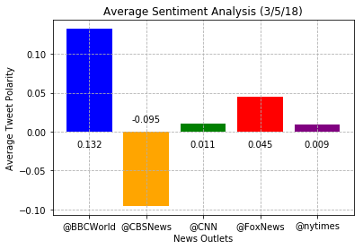

# Observations
1) BBC World News tends to use much more positive language than the other measured news outlets
2) CBS News tends to use much more negative language than the other measured news outlets
3) A majority of tweets are neutral in tone across all news outlets.  This may be because a significant number of tweets are 
   brief updates of fact
# Code


```python
# Dependencies
import pandas as pd
import numpy as np
import matplotlib.pyplot as plt
import json
import requests as req
import tweepy
from vaderSentiment.vaderSentiment import SentimentIntensityAnalyzer

# Tweepy api account information
from config import api_key as api_key
from config import api_secret as api_secret
from config import access_token as access_token
from config import access_secret as access_secret
```


```python
# Use api account info to access twitter api
auth = tweepy.OAuthHandler(api_key,api_secret)
auth.set_access_token(access_token,access_secret)
api = tweepy.API(auth)

# Initialize vader sentiment analyzer
analyzer = SentimentIntensityAnalyzer()
```


```python
news_outlets = ('@BBCWorld','@CBSNews','@CNN','@FoxNews','@nytimes')

scores_by_outlet = {}
df = pd.DataFrame(columns=['News Outlet','Text','Compound Score','Positive Score','Neutral Score','Negative Score'])
for news in news_outlets:
    compound_list = []
    pos_list = []
    neu_list = []
    neg_list = []
    df1 = pd.DataFrame(columns=['News Outlet','Text','Compound Score','Positive Score','Neutral Score','Negative Score'])
    for tweet in tweepy.Cursor(api.user_timeline,id=news,tweet_mode='extended').items(100):
        t_text = json.dumps(tweet._json,indent=3)
        tweet = json.loads(t_text)
        analyzed_tweet = analyzer.polarity_scores(tweet['full_text'])
        compound_list.append(analyzed_tweet['compound'])
        pos_list.append(analyzed_tweet['pos'])
        neu_list.append(analyzed_tweet['neu'])
        neg_list.append(analyzed_tweet['neg'])
        df2 = pd.DataFrame(data=[[news,tweet['full_text'],analyzed_tweet['compound'],analyzed_tweet['pos'],analyzed_tweet['neu'],analyzed_tweet['neg']]],columns=df.columns)
        df1=df1.append(df2,ignore_index=True)
    scores_by_outlet[news] = [compound_list,pos_list,neu_list,neg_list]
    df = df.append(df1)
    
```


```python

for outlet in news_outlets:
    plt.plot(df['Compound Score'][df['News Outlet']==outlet],label=outlet,linestyle='None',marker='o',alpha=0.8,)
plt.legend(loc='lower left',bbox_to_anchor=(1, 0.5))
plt.xlabel('Tweet ID')
plt.ylabel('Compound Sentiment Score')
plt.title('Sentiment Analysis (3/5/18)')
plt.grid(linestyle='--')
plt.show()
```


```python
grouped_df = df.groupby(by='News Outlet')
color_list = ['blue','orange','green','red','purple']
bars = plt.bar([i for i in range(len(news_outlets))],grouped_df['Compound Score'].mean(),tick_label=news_outlets,color=color_list)
for bar in bars:
    if bar.get_height() > 0:
        plt.text(bar.get_x()+bar.get_width()/2,-0.01,'%.3f'%float(bar.get_height()),ha='center',va='top',color='k',fontsize=10)
    else:
        plt.text(bar.get_x()+bar.get_width()/2,0.01,'%.3f'%float(bar.get_height()),ha='center',va='bottom',color='k',fontsize=10)
plt.xlabel('News Outlets')
plt.ylabel('Average Tweet Polarity')
plt.title('Average Sentiment Analysis (3/5/18)')
plt.grid(linestyle='--')
plt.show()
```





```python
df.to_csv('output.csv')
```
